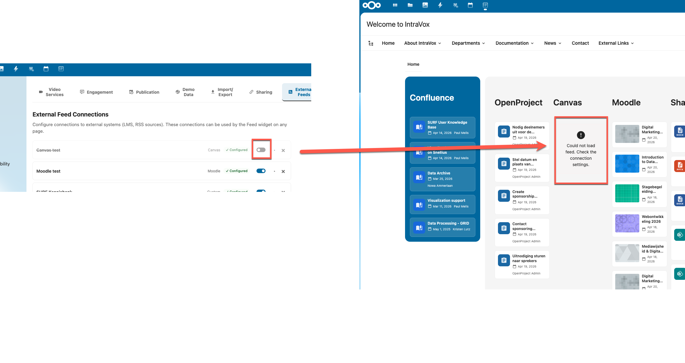

# IntraVox Admin Settings Guide

This guide covers the Nextcloud Admin Settings panel for IntraVox. Access via **Nextcloud Admin Settings** → **IntraVox**.

## Overview

The IntraVox Admin Settings panel has the following tabs:

1. **Video Services** — Configure allowed video embed domains
2. **Demo Data** — Install and manage demo content
3. **External Feeds** — Configure LMS and feed connections for the Feed widget

---

## Video Services Tab

IntraVox includes a Video Widget that allows editors to embed videos from external platforms. Administrators control which platforms are allowed.

### Default Configuration

The following services are enabled by default for privacy-first operation:

| Service | Domain | Privacy Level |
|---------|--------|---------------|
| YouTube (privacy mode) | youtube-nocookie.com | Enhanced - no tracking cookies |
| Vimeo | player.vimeo.com | Standard |

### Managing Video Services

1. Go to **Admin Settings** → **IntraVox**
2. Select the **Video Services** tab
3. Toggle services on/off using the switches

### Service Categories

Services are grouped by category:

#### Privacy-friendly
- **YouTube (privacy mode)** - Uses youtube-nocookie.com, no tracking cookies
- **PeerTube instances** - Federated, open-source video hosting

#### Popular Platforms
- **Vimeo** - Professional video hosting
- **Dailymotion** - Video sharing platform

#### PeerTube Servers
Pre-configured PeerTube instances:
- framatube.org
- peertube.tv
- video.blender.org
- And more...

### Adding Custom Video Servers

For organizations with their own video hosting:

1. Go to **Admin Settings** → **IntraVox** → **Video Services**
2. Scroll to "Add Custom Domain"
3. Enter the domain (e.g., `video.company.com`)
4. Click **Add**

#### Requirements for Custom Domains

| Requirement | Description |
|-------------|-------------|
| HTTPS | Only HTTPS domains are allowed (security) |
| Accessible | Domain must be reachable from users' browsers |
| Iframe allowed | Server must permit iframe embedding (X-Frame-Options) |

### Removing Custom Domains

1. Find the custom domain in the list
2. Click the **X** button next to it
3. The domain is immediately removed from the whitelist

### Blocked Video Behavior

When an editor embeds a video from a non-whitelisted domain:

1. The video displays a "blocked" message showing the domain
2. The video URL is preserved in the page data
3. Once the admin whitelists the domain, the video works automatically
4. Editors cannot bypass the domain whitelist

---

## Video Widget Features

### Supported Video Sources

| Source Type | Description |
|-------------|-------------|
| External embed | YouTube, Vimeo, PeerTube, etc. via URL |
| Local upload | MP4, WebM, OGG files uploaded to Nextcloud |

### Playback Options

Editors can configure these options per video:

| Option | Description | Notes |
|--------|-------------|-------|
| Autoplay | Video starts when page loads | Requires muted |
| Loop | Video repeats continuously | - |
| Muted | No sound playback | Required for autoplay |
| Controls | Show player controls | Recommended on |

### Local Video Upload

1. In the Video Widget editor, click "Upload video"
2. Select a video file (MP4, WebM, or OGG)
3. Video is stored in the page's `_media/` folder
4. Maximum file size is determined by Nextcloud's PHP upload limits

---

## External Feeds Tab

The External Feeds tab lets administrators configure connections to external systems — learning management systems (Canvas, Moodle, Brightspace), project management (Jira, OpenProject), knowledge bases (Confluence), collaboration (SharePoint), and any custom REST API. These connections are used by the [Feed Widget](FEED_WIDGET.md) on IntraVox pages.

> **Why configure feed connections when Nextcloud integration apps exist?**
>
> Many of these systems (OpenProject, Jira, etc.) have their own Nextcloud integration apps. Those apps serve *individual users* — linking files, searching tasks, receiving personal notifications. Feed connections serve a different purpose: they let you show data from these systems on *intranet pages* visible to entire teams or departments. This is organizational awareness, not personal productivity. See the [Architecture design principles](ARCHITECTURE.md#organizational-communication-not-personal-productivity) for details.

### Adding a Connection

1. Go to **Admin Settings** → **IntraVox** → **External Feeds**
2. Click **+ Add connection**
3. Fill in the connection details (for non-LMS types, advanced options like endpoint path, response mapping, and custom headers are behind the **Advanced options** toggle)
4. Click **Save connections**

### Testing a Connection

After saving, click **Test connection** on any connection card to verify the credentials and endpoint work. The result shows:
- **Connection OK — N items** if the connection works
- An error message describing the issue (authentication, permissions, network) if it fails

Connections must be saved before testing (the server needs the stored configuration to make the API call).

### Removing a Connection

Click the **×** button on a connection card. A confirmation dialog shows the connection name — removal takes effect after clicking **Save connections**.

### Enabling and Disabling Connections

Each connection has an **active/inactive toggle** in the connection header. Use this to temporarily disable a connection without deleting it.

**When a connection is disabled:**
- The toggle appears as off (grey) and the connection card is visually dimmed
- Existing widgets using this connection show the message: *"This connection is currently disabled by an administrator."*
- The connection is not available for new widgets in the widget editor
- All connection settings (tokens, URLs, mappings) are preserved

**When a connection is re-enabled:**
- All widgets that were configured with this connection automatically resume showing data
- No reconfiguration of widgets is needed — they keep their connectionId reference
- Data appears after the next refresh (up to 15 minutes due to server-side caching, or immediately after a page reload)

Toggling the active state saves immediately — no need to click **Save connections** separately.



### Exporting and Importing Connections

Use the **Export** and **Import** buttons at the bottom of the External Feeds tab to transfer connection configurations between Nextcloud instances.

**Export** downloads all connections as `intravox-feed-connections.json`. This includes configuration only — **API tokens, client secrets, and client IDs are never exported** for security reasons.

**Import** opens a preview dialog showing:
- All connections found in the file
- Which ones already exist (matched by name, shown as duplicates)
- How many new connections will be added

After confirming, the new connections are added with empty token fields. Enter API tokens and click **Save connections**.

### Connection Fields

| Field | Description | Required |
|-------|-------------|----------|
| **Name** | Display name for this connection (e.g., "Canvas University") | Yes |
| **Type** | Platform type: Canvas, Moodle, Brightspace, Jira, Confluence, SharePoint, OpenProject, or Custom | Yes |
| **Base URL** | The root URL of the system (e.g., `https://canvas.example.com`) | Yes |
| **Active** | Enable or disable this connection | Yes |

For **LMS types** (Canvas, Moodle, Brightspace), additional fields appear:

| Field | Description |
|-------|-------------|
| **API Token (admin fallback)** | A shared API token used as fallback when users haven't connected their own account |
| **User authentication** | How users authenticate — see [Authentication Modes](#user-authentication-modes) below |

For **REST API types** (Jira, Confluence, OpenProject, Custom), additional fields appear:

| Field | Description |
|-------|-------------|
| **Endpoint path** | API path appended to the base URL (pre-filled by preset) |
| **Auth method** | Bearer token, Basic auth, API key (custom header), or No authentication |
| **API Token** | The API token or credentials. Format depends on auth method (see below) |
| **Response mapping** | JSON field mapping for title, URL, excerpt, date, image, author (pre-filled by preset) |
| **Custom request headers** | Extra HTTP headers sent with every request (e.g., `OCS-APIRequest: true`) |

### Auth Method Details (REST API types)

| Auth method | Token format | Example |
|-------------|-------------|---------|
| **Bearer token** | Plain API token | `ghp_abc123...` |
| **Basic auth** | `username:password` (auto-encoded to base64) | `apikey:abc123...` (OpenProject) |
| **API key** | Plain key + custom header name | Key: `abc123`, Header: `X-API-Key` |
| **No authentication** | — | Public APIs |

### User Authentication Modes

| Mode | Description | Use case |
|------|-------------|----------|
| **Admin token only (shared)** | All users see the same data via the admin API token | Simple setup, no personalization needed |
| **OAuth2 (per-user, personalized)** | Each user connects their own account via OAuth2 | Full personalization, users only see their own courses |
| **Both (OAuth2 with admin fallback)** | Users who connect see personalized data; others see shared data | Gradual rollout, best of both worlds |

### OAuth2 Configuration

When using OAuth2 or Both mode, additional fields appear:

| Field | Description |
|-------|-------------|
| **OAuth2 Client ID** | The client ID from the LMS Developer Key / OAuth2 app |
| **OAuth2 Client Secret** | The client secret (stored encrypted) |
| **Redirect URI** | Shown automatically — copy this into the LMS OAuth2 configuration |
| **OIDC auto-connect** | Enable if the LMS uses the same identity provider as Nextcloud (see below) |

### Setting Up OAuth2 per LMS

#### Canvas

1. In Canvas, go to **Admin** → **Developer Keys**
2. Click **+ Developer Key** → **API Key**
3. Enter a name (e.g., "IntraVox")
4. Set the **Redirect URI** to the value shown in IntraVox Admin Settings
5. Click **Save** and note the Client ID and Client Secret
6. Set the key to **ON** (it defaults to OFF)
7. Enter the Client ID and Client Secret in IntraVox

#### Moodle

Moodle requires the [local_oauth2 plugin](https://moodle.org/plugins/local_oauth2) to act as an OAuth2 provider:

1. Install the `local_oauth2` plugin on your Moodle instance
2. Configure an OAuth2 client in Moodle with the Redirect URI from IntraVox
3. Enter the Client ID and Client Secret in IntraVox

**Alternative: manual tokens.** If installing the OAuth2 plugin is not possible, set the authentication mode to **Both** and leave OAuth2 fields empty. Users can then enter their personal Moodle web service token manually in the Feed widget editor. They can generate this token in Moodle under **Preferences** → **Security keys**.

#### Brightspace

1. In Brightspace, go to **Admin** → **Manage Extensibility** → **OAuth 2.0**
2. Click **Register an app**
3. Enter a name (e.g., "IntraVox") and set the **Redirect URI** to the value shown in IntraVox Admin Settings
4. Set the scope to `core:*:*` (or more granular scopes as needed)
5. Click **Register** and note the Client ID and Client Secret
6. Enter the Client ID and Client Secret in IntraVox

**Alternative: manual tokens.** Set the authentication mode to **Both** and leave OAuth2 fields empty. Users can then enter a personal bearer token from their Brightspace Account Settings.

### Setting Up OpenProject

OpenProject uses Basic authentication with the API v3. The preset pre-fills the endpoint, auth method, and response mapping.

1. In OpenProject, go to **My Account** → **Access tokens**
2. Click **+ API token** and copy the token (shown only once)
3. In IntraVox Admin Settings → External Feeds, click **+ Add connection**
4. Select type **OpenProject**
5. Enter the **Base URL** (e.g., `https://openproject.example.com`)
6. Enter the **API Token** as `apikey:<your-token>` (e.g., `apikey:7def51d5...`)
7. Click **Save connections**

The Feed widget will then show a **Content type** dropdown with options: All work packages, Open, Overdue, Milestones, and Recently updated.

### OIDC Auto-Connect

When enabled, IntraVox attempts to use the user's existing Nextcloud SSO token to access the LMS API — without any user interaction. This works when:

- Nextcloud and the LMS are connected to the **same identity provider** (e.g., Keycloak, Azure AD, Authentik)
- The Nextcloud `user_oidc` app is installed with `store_login_token` enabled
- The identity provider token has the correct audience/scope for the LMS API

This is the most seamless experience for end users but requires a shared SSO infrastructure.

### Security Notes

- API tokens and OAuth2 client secrets are encrypted at rest using Nextcloud's ICrypto service
- Per-user OAuth2 tokens (Canvas, Moodle, Brightspace) are stored encrypted in the database and automatically refreshed when expired
- When a Nextcloud user is deleted, all their stored LMS tokens are automatically cleaned up
- The admin API token is never exposed to end users — it is only used server-side

---

## Demo Data Tab

### Installing Demo Data

1. Go to **Nextcloud Admin Settings** → **IntraVox**
2. Select the **Demo Data** tab
3. Click **Install** next to the language you want to set up
4. The GroupFolder and permission groups are created automatically if they don't exist

### Status Indicators

The Admin Settings panel shows:

| Badge | Meaning |
|-------|---------|
| **Installed** | Demo data is installed and ready |
| **Not installed** | No content exists for this language |
| **Empty folder** | Folder exists but is empty |
| **Full intranet** | Complete demo with all pages |
| **Homepage only** | Basic demo with homepage |

### Available Languages

| Language | Flag | Content Type |
|----------|------|--------------|
| Nederlands | 🇳🇱 | Full intranet |
| English | 🇬🇧 | Full intranet |
| Deutsch | 🇩🇪 | Homepage only |
| Français | 🇫🇷 | Homepage only |

### Reinstalling Demo Data

To reset demo content to its original state:

1. Click **Reinstall** next to the language
2. Confirm the action
3. All existing content for that language will be replaced with fresh demo data

> **Warning**: Reinstalling will delete all customizations made to the demo content.

### Clean Start

The **Clean Start** button deletes all content for a language and creates a fresh empty homepage. This is an irreversible destructive operation — you must type `DELETE` in the confirmation dialog to proceed.

---

## Security Considerations

### Video Embeds
- Only whitelisted domains can be embedded
- All external videos use HTTPS
- Iframe sandboxing is applied
- Blocked videos show domain name for transparency

### Recommendations
1. Only enable video services your organization trusts
2. Prefer privacy-friendly options (YouTube privacy mode, PeerTube)
3. Review custom domains before adding
4. Regularly audit enabled services

---

## Troubleshooting

### Videos Not Playing

1. Check if the domain is whitelisted in Admin Settings
2. Verify the video URL is correct
3. Check browser console for errors
4. Ensure the video service allows embedding

### Demo Data Not Installing

1. Verify PHP memory_limit is at least 256MB
2. Check Nextcloud logs for errors
3. Ensure GroupFolders app is enabled
4. Try installing via command line:
   ```bash
   sudo -u www-data php occ intravox:import-demo-data --language=en
   ```

### Custom Domain Not Working

1. Verify the domain uses HTTPS
2. Check if the video server allows iframe embedding
3. Test the video URL directly in a browser
4. Check for CORS or X-Frame-Options restrictions
