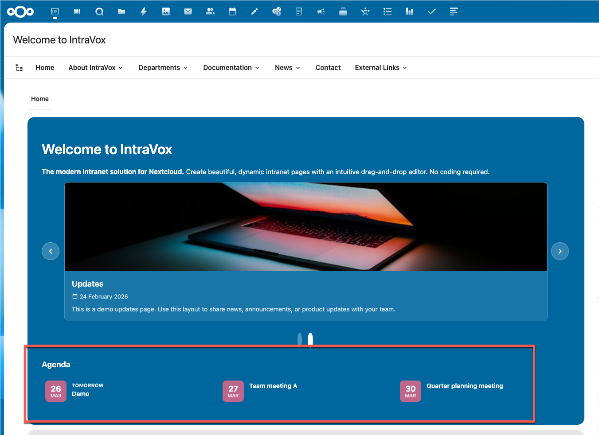
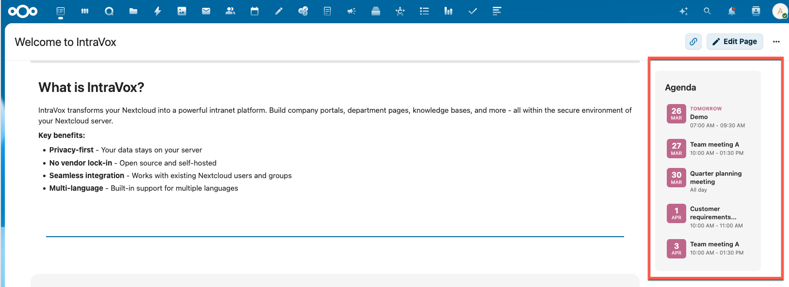
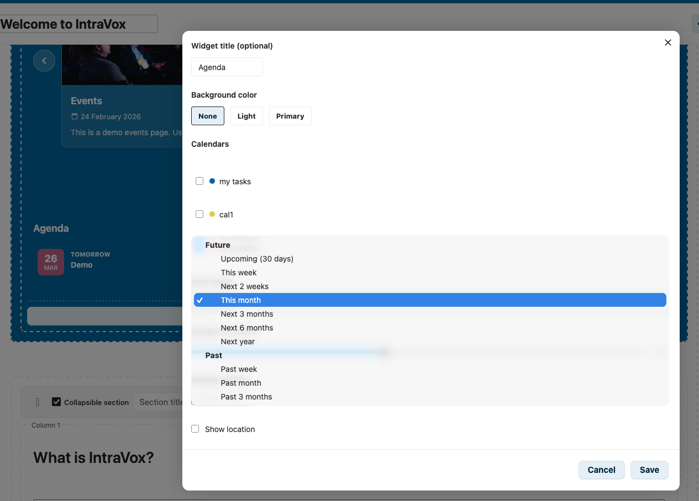

# Calendar Widget

The Calendar Widget displays upcoming (or past) events from Nextcloud calendars and external ICS feeds on your intranet pages. Events are shown with colored date badges, support recurring events, and the layout adapts automatically to the available space.

*Calendar widget with colored date badges, responsive multi-column layout, and background themes*

## Features

- **Multi-calendar support** — Select multiple Nextcloud calendars for a merged view
- **External ICS feeds** — Add ICS calendar URLs from any source (Moodle, Canvas, Brightspace, Google Calendar, etc.). Events are visible to all page visitors without requiring individual calendar subscriptions
- **LMS deep links** — Events from LMS feeds link directly to the event in the source system (Canvas, Brightspace, Moodle)
- **Colored date badges** — Each event shows a date badge in the calendar's color (purple for external feeds)
- **Recurring events** — RRULE patterns are automatically expanded into individual occurrences
- **Responsive grid** — 1, 2, or 3 columns depending on available space
- **Clickable events** — Nextcloud events open in Calendar app, external events open in the source system
- **Past events** — Show events from the past (past week, month, or 3 months)
- **Background themes** — None, Light, or Primary background with automatic contrast

## Layout

The widget uses a responsive grid that adapts to the container width using CSS container queries:

| Container width | Columns | Typical placement |
|----------------|---------|-------------------|
| < 300px | 1 column | Side column |
| 300-499px | 1 column | Narrow main content |
| 500-799px | 2 columns | Main content area |
| 800px+ | 3 columns | Wide content / full width |

No manual column configuration is needed — the layout adapts automatically.

## Configuration

### Adding the Widget

1. Click **+ Add Widget** in edit mode
2. Select **Calendar** from the widget picker
3. The editor opens automatically — select calendars and configure options
4. Click **Save** to apply

### Settings

| Setting | Description | Default |
|---------|-------------|---------|
| **Widget title** | Optional title above the widget | *(empty)* |
| **Background color** | None, Light, or Primary | None |
| **Calendars** | Checkbox list of available Nextcloud calendars (personal + shared) | *(none selected)* |
| **External ICS feeds** | Add up to 5 external ICS calendar URLs (HTTPS only) | *(none)* |
| **Date range** | Time period to show events from | Upcoming (30 days) |
| **Number of events** | Maximum events to display (1-20) | 5 |
| **Show time** | Display event start/end time | Enabled |
| **Show location** | Display event location | Disabled |

### Date Range Options

**Future:**

| Option | Period |
|--------|--------|
| Upcoming (30 days) | Now → 30 days ahead |
| This week | Monday → Sunday of current week |
| Next 2 weeks | Now → 14 days ahead |
| This month | 1st → last day of current month |
| Next 3 months | Now → 3 months ahead |
| Next 6 months | Now → 6 months ahead |
| Next year | Now → 1 year ahead |

**Past:**

| Option | Period |
|--------|--------|
| Past week | 7 days ago → now |
| Past month | 30 days ago → now |
| Past 3 months | 3 months ago → now |

## Calendar Selection

The editor shows all Nextcloud calendars available to the current user:

- Personal calendars
- Calendars shared with the user directly
- Calendars shared with groups the user belongs to

> **Note:** ICS subscriptions (added via "New subscription from link" in Nextcloud Calendar) are not shown in the calendar selector. Use the **External ICS feeds** field instead — this ensures all page visitors see the same events, regardless of their individual Nextcloud subscriptions.

Each calendar appears with its color dot and display name. Select multiple calendars for a merged view — events from all selected calendars are combined and sorted chronologically.

### Shared Calendar Setup

To make a calendar available in the widget:

1. Open **Nextcloud Calendar** app
2. Click the three-dot menu on a calendar → **Edit calendar**
3. Under **Share calendar**, add users or groups (e.g., "IntraVox Users")
4. The calendar will now appear in the widget editor for those users

## External ICS Feeds

Add external ICS calendar URLs to display events from any system that provides an ICS feed. This is the recommended way to integrate LMS calendars (Moodle, Canvas, Brightspace).

### How It Works

- The editor provides an **External ICS feeds** section below the calendar selector
- Paste an HTTPS URL to an ICS feed and click **Add**
- Up to 5 feeds per widget
- Events from external feeds are **visible to all page visitors** (authenticated and public share), unlike Nextcloud calendar subscriptions which are per-user
- External events are shown with a purple date badge to distinguish them from Nextcloud events
- Results are cached for 30 minutes to reduce load on external servers

### LMS ICS URLs

| LMS | How to get the ICS URL |
|-----|----------------------|
| **Canvas** | Calendar > Calendar Feed (copy URL) |
| **Moodle** | Calendar > Export calendar > Get calendar URL |
| **Brightspace** | Calendar > Subscribe (copy URL) |
| **Google Calendar** | Calendar settings > Integrate calendar > Secret address in iCal format |

### Event Deep Links

When you click an external event, it opens the source system:

| Source | Link behavior |
|--------|--------------|
| **Canvas** | Opens the event in Canvas Calendar (Canvas provides URL in ICS) |
| **Brightspace** | Opens the event detail page in Brightspace (URL constructed from UID) |
| **Moodle** | Opens the calendar day view in Moodle (URL constructed from UID) |
| **Other ICS sources** | Opens the feed domain homepage |

### Security

- Only HTTPS URLs are accepted
- ICS feeds are fetched server-side (no direct browser requests to external servers)
- Feed content is cached and parsed using Sabre VObject
- Private/confidential events are filtered out

## Event Display

Each event shows:

- **Date badge** — Day number and month abbreviation in a colored square (calendar color)
- **Proximity label** — "Today" or "Tomorrow" shown above the title when applicable
- **Event title** — Up to 2 lines, wraps instead of truncating
- **Time** — Start and end time, or "All day" for all-day events
- **Location** — Shown below time when enabled

### Clicking Events

- **Nextcloud events** — Open the Nextcloud Calendar app on the day view for that date
- **External ICS events** — Open the event in the source system (see [Event Deep Links](#event-deep-links))
- **Public shared pages** — Nextcloud events are not clickable (Calendar app requires login). External events remain clickable and open in a new tab

### Recurring Events

Events with recurrence rules (RRULE) — such as weekly meetings or monthly reviews — are automatically expanded into individual occurrences within the selected date range. Each occurrence appears as a separate event with its correct date.

## Background Colors

The widget supports three background styles:

| Style | Appearance |
|-------|------------|
| **None** | Transparent, no padding |
| **Light** | Light gray background with padding |
| **Primary** | Primary theme color (e.g., dark blue) with white text |

Text colors automatically adjust for proper contrast on each background.

## Tips

- **Calendar colors**: Use distinct colors in Nextcloud Calendar for easy visual distinction in merged views
- **Date range**: Shorter ranges (this week, 2 weeks) work well for busy calendars; longer ranges (3-6 months) for planning/overview pages
- **Event limit**: Show 5-10 events for sidebar widgets, up to 20 for main content areas
- **Recurring events**: Weekly meetings will show multiple occurrences — adjust the event limit accordingly
- **Shared calendars**: Create a dedicated "Organization Events" calendar shared with all users for company-wide events
- **LMS integration**: Use External ICS feeds for school calendars — all students and staff see the same events without needing individual subscriptions
- **Mix sources**: Combine Nextcloud calendars with external ICS feeds in one widget for a unified overview

## Screenshots

*2-column layout in main content with timed and all-day events*

*Compact 1-column layout in side column*

*Widget editor with calendar selection and date range options*

*Responsive 3-column grid in full-width row*

## Requirements

- IntraVox 1.2.0 or higher (external ICS feeds require unreleased version)
- Nextcloud Calendar app installed (for Nextcloud calendar selection)
- At least one calendar or external ICS feed configured
