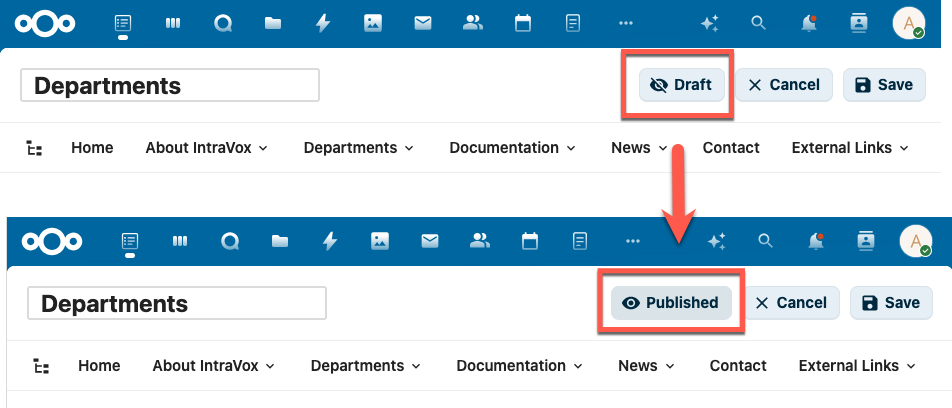
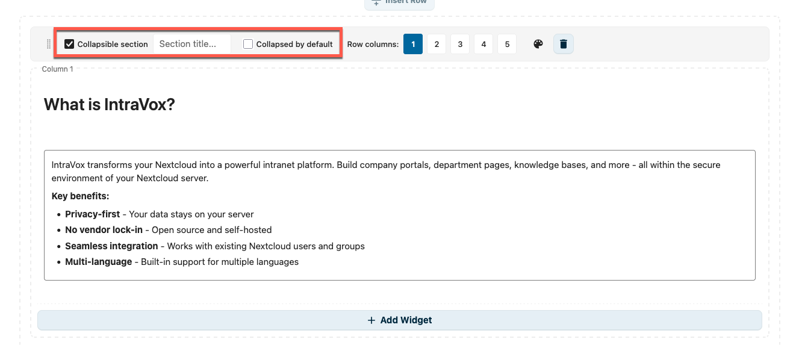
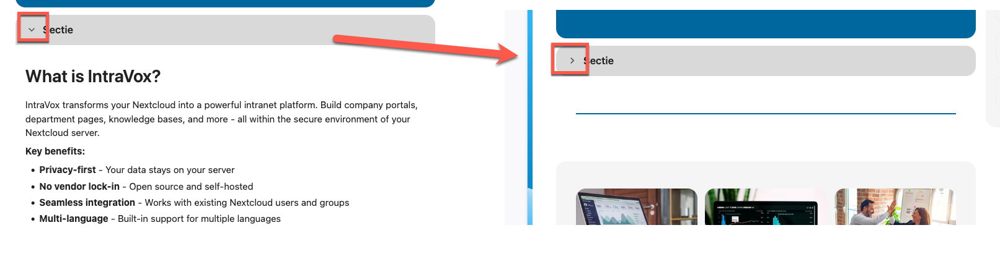
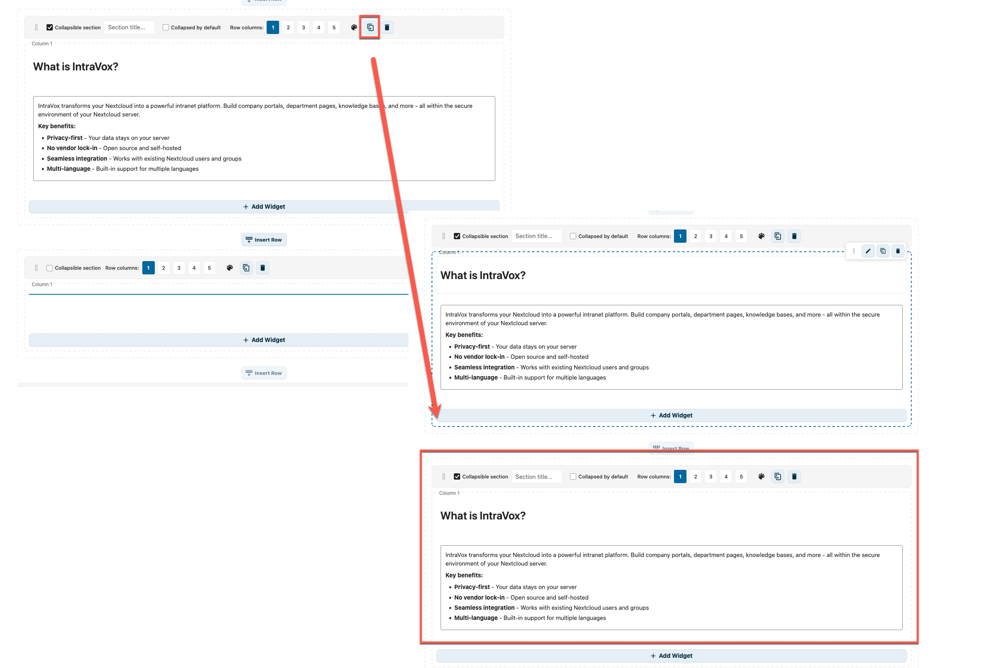
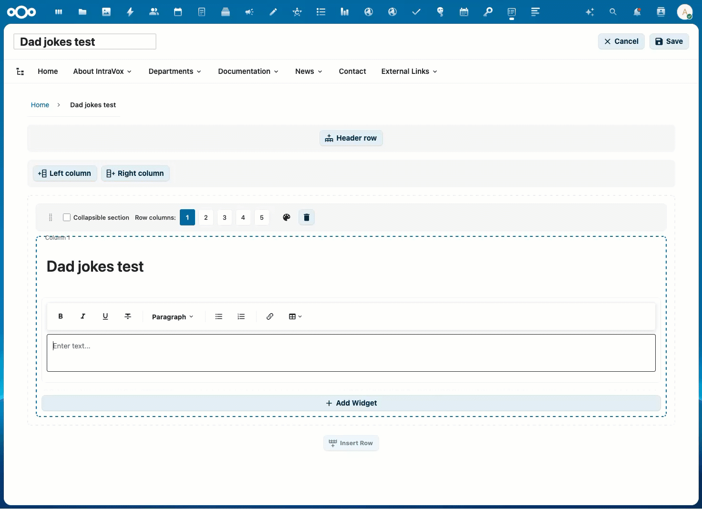
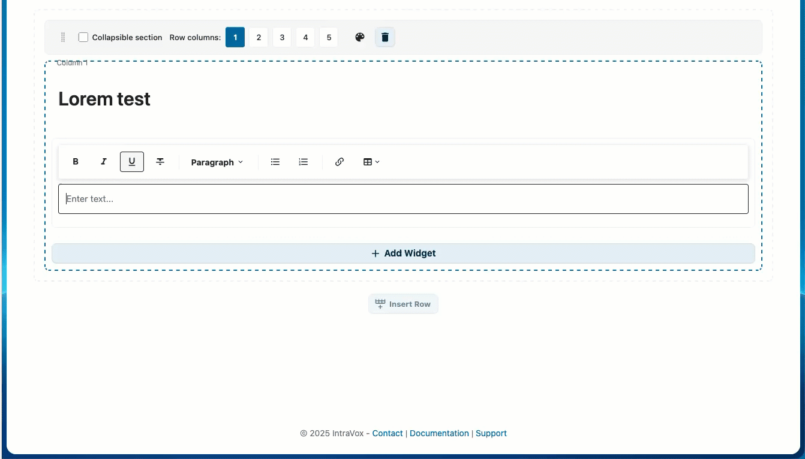

# IntraVox Editor Guide

This guide is for content editors who create and maintain pages in IntraVox.

## Prerequisites

To edit content, you need:
- A Nextcloud account
- Editor permissions (assigned by your administrator)
- Access to the relevant IntraVox sections

## Editing Basics

### Entering Edit Mode

1. Navigate to the page you want to edit
2. Click the **Edit** button (pencil icon) in the toolbar
3. The page switches to edit mode

### Edit Mode Interface

```
┌─────────────────────────────────────────────────────────────┐
│  [Save] [Cancel]                              Edit Mode     │
├─────────────────────────────────────────────────────────────┤
│  ┌──────────────┐  ┌────────────────────────────────────┐  │
│  │   Widget     │  │                                    │  │
│  │   Palette    │  │         Page Canvas                │  │
│  │              │  │                                    │  │
│  │  [Heading]   │  │   [Row 1]                         │  │
│  │  [Text]      │  │   ┌─────────────────────────┐     │  │
│  │  [Image]     │  │   │  Widget (editable)      │     │  │
│  │  [Links]     │  │   └─────────────────────────┘     │  │
│  │  [Divider]   │  │                                    │  │
│  │              │  │   [Row 2]                         │  │
│  │  [Add Row]   │  │   ┌──────────┐ ┌──────────┐       │  │
│  └──────────────┘  │   │ Widget 1 │ │ Widget 2 │       │  │
│                    │   └──────────┘ └──────────┘       │  │
│                    └────────────────────────────────────┘  │
└─────────────────────────────────────────────────────────────┘
```

### Saving Changes

- Click **Save** to save your changes
- Click **Cancel** to discard changes and exit edit mode
- Changes are not visible to others until you save

The Save and Cancel buttons stay fixed at the top of the page when you scroll down, so you can always reach them — even on long pages.


*The toolbar stays visible at the top while scrolling through a long page in edit mode*

### Page Locking

When you start editing a page, IntraVox automatically locks it to prevent other users from making changes at the same time. Other users see who is editing and cannot enter edit mode until you save, cancel, or the lock expires.

- Locks auto-expire after **15 minutes** of inactivity
- A heartbeat keeps the lock alive while you are actively editing
- Locks are released when you save, cancel, navigate away, or close the tab
- If your lock expires (e.g. lost connection), you receive a warning to save your work

**IntraVox Admins** can force-unlock a page if a lock was left behind (e.g. after a browser crash). They see an "Unlock" button next to the lock indicator.

### Draft and Published Status

Pages have a status: **Draft** or **Published**. This controls who can see the page.



*In edit mode, the Draft/Published button is shown in the toolbar. Click it to toggle between Draft and Published.*

**How it works:**

| Status | Visible to editors | Visible to readers | In search | In RSS feed | Via public share link |
|--------|-------------------|-------------------|-----------|-------------|----------------------|
| **Published** | Yes | Yes | Yes | Yes | Yes |
| **Draft** | Yes | No | No | No | No |

- **Editors** are users with write permission on the page folder (IntraVox Admins, IntraVox Editors, and users with write access via GroupFolder ACL)
- **Readers** are users with read-only permission (regular IntraVox Users)
- A draft page is completely invisible to readers — it does not appear in navigation, search results, the page tree, RSS feeds, or public share links

**New pages start as Draft.** When you create a new page (blank or from a template), it is automatically set to Draft and opens in edit mode. This way you can build your page before making it visible to readers.

**Toggling the status:**
1. Enter edit mode
2. Click the **Draft** or **Published** button in the toolbar (with the eye icon)
3. The status changes immediately — save the page to apply

**Best practices:**
- Use Draft to prepare new pages or major updates before publishing
- Remember that setting a published page to Draft makes it immediately invisible to readers
- Only editors (users with write permission) can see and change the page status

## Page Structure

### Rows

Pages are organized in rows. Each row can have:
- 1-5 columns
- A background color
- Multiple widgets
- Collapsible section (with title, default collapsed/expanded)

Pages can also have a **header row** (full-width banner at the top) and optional **side columns** (left or right sidebar).

**Adding a row:**
1. Click "Add Row" at the bottom of the page
2. Select the number of columns
3. The new row appears at the bottom

**Configuring a row:**
1. Hover over the row
2. Click the settings icon
3. Change columns or background color

#### Collapsible Sections

Rows can be made collapsible, allowing users to expand and collapse content sections. This is useful for FAQ pages, long content, or optional details.



*Edit mode: enable "Collapsible section", set a section title, and optionally check "Collapsed by default"*

**Setting up a collapsible row:**
1. Hover over the row and click the settings icon
2. Check **Collapsible section**
3. Enter a **Section title** (displayed as the clickable header)
4. Optionally check **Collapsed by default** to hide content on page load



*View mode: users click the arrow to toggle the section open or closed*

**Best practices:**
- Use descriptive section titles so users know what to expect
- Use "Collapsed by default" for supplementary content that not everyone needs
- Keep frequently accessed content expanded by default

**Duplicating a row:**

You can duplicate a complete row, including all its columns and widgets.



*Click the copy icon in the row controls to duplicate the row*

1. Hover over the row
2. Click the copy icon (next to the delete icon)
3. A copy of the row appears directly below, with all widgets duplicated
4. Edit the copy independently — changes do not affect the original

This is useful for pages with repeating layouts, such as department cards or FAQ sections.

**Deleting a row:**
1. Hover over the row
2. Click the delete icon
3. Confirm deletion

### Columns

Rows can have 1-5 columns:

| Layout | Description |
|--------|-------------|
| 1 column | Full width content |
| 2 columns | Split 50/50 |
| 3 columns | Three equal columns |
| 4 columns | Four equal columns |
| 5 columns | Five equal columns |

### Side Columns

Pages can have optional side columns:
- Left sidebar
- Right sidebar

Enable in page settings.

## Widgets

Widgets are the building blocks of page content.


*The widget palette showing all available widget types*

### Adding Widgets

1. In the widget palette, click the widget type
2. Drag it to the desired location on the page
3. Or click to add to the first available column

### Widget Types

#### Heading

Titles and section headers.

**Options:**
- Level: H1 (largest) to H6 (smallest)
- Content: The heading text

**Best practices:**
- Use H1 for page title (one per page)
- Use H2 for main sections
- Use H3-H4 for subsections

#### Text

Rich text content with formatting.

**Formatting options:**
- **Bold** (Ctrl+B)
- *Italic* (Ctrl+I)
- Underline (Ctrl+U)
- Bullet lists
- Numbered lists
- Links

**Dummy text generator (Easter Egg):**

Need placeholder text while designing your page? Type a special command on an empty line and press **Enter** to generate dummy content — inspired by Microsoft Word's `=rand()` command.



*Dad jokes with rich formatting: headings, numbered lists, bold setup and italic punchlines*



*Lorem Ipsum showcase: headings, paragraphs, blockquotes, lists, tables, and inline marks*

| Command | Description | Example |
|---------|-------------|---------|
| `=dadjokes()` | Generate dad jokes | `=dadjokes(3,5)` → 3 sections of 5 jokes |
| `=lorem()` | Rich Lorem Ipsum showcase | `=lorem(6,3)` → 6 sections with varied formatting |

**Parameters:** `=(command)(sections, items)` — both optional, default is 3 sections with 3 items each. Maximum is 20 for both values.

**How it works:**
1. Click in a text widget in edit mode
2. Type `=dadjokes()` or `=lorem()` on an empty line
3. Press **Enter**
4. The command is replaced with generated content

**Rich formatting:**

Both commands generate richly formatted content that showcases the text widget's capabilities:

`=dadjokes()` generates:
- **Section headings** (e.g., "Dad Jokes #1", "Dad Jokes #2")
- **Numbered lists** with each joke as a list item
- **Bold** setup text and *italic* punchlines

`=lorem()` rotates through 6 formatting patterns to demonstrate all widget features:

| Pattern | Elements used |
|---------|-------------|
| Heading + paragraph | `<h2>` heading, **bold** and *italic* text |
| Blockquote | Indented quote block |
| Bullet list | `<ul>` with **bold** fragments |
| Table | 3-column table with header, bold categories, italic statuses |
| Ordered list | `<h3>` heading + `<ol>` numbered list with *italic* |
| Mixed inline | `code`, <u>underline</u>, ~~strikethrough~~, **bold**, *italic* |

With `=lorem(6,3)` you get one of each pattern — perfect for demonstrating the full text widget to users.

**Multilingual support:**

Both commands automatically adapt to the user's Nextcloud language:

| Language | Dad jokes heading | Lorem headings |
|----------|------------------|----------------|
| English | Dad Jokes | Section, Key Points, Overview, Steps, Additional Notes |
| Nederlands | Flauwe Grappen | Sectie, Kernpunten, Overzicht, Stappen, Aanvullende Opmerkingen |
| Deutsch | Flachwitze | Abschnitt, Kernpunkte, Übersicht, Schritte, Zusätzliche Hinweise |
| Français | Blagues de Papa | Section, Points Clés, Aperçu, Étapes, Notes Complémentaires |

Each language has its own collection of ~80 dad jokes. Table column headers and status labels are also localized. If no translation is available for the user's language, English is used as fallback.

All content is built into IntraVox (no internet connection required) and is randomly shuffled each time, so you get different content every time.

#### Image

Photos, diagrams, and graphics with optional clickable links.

**Options:**
- Image source: Select from IntraVox media folder or upload new
- Alt text: Description for accessibility
- Object fit: Cover, contain, or auto
- Link (optional): Make the image clickable
  - Link to page: Navigate to an IntraVox page
  - External URL: Open an external website

**Image sizes:**
- Small: Thumbnail size
- Medium: Half width
- Large: Full width
- Custom: Specify pixel width

**Best practices:**
- Use descriptive alt text
- Optimize images before upload (< 500KB)
- Use appropriate aspect ratios
- Use clickable images for navigation cards and banners

#### Video

Embed videos from external platforms or upload local videos.

**Supported platforms:**
- YouTube (privacy-enhanced mode)
- Vimeo
- PeerTube instances
- Local video upload (MP4)

**Options:**
- Video URL: Paste a video URL from a supported platform
- Upload: Upload a video file to Nextcloud storage
- Title: Display title above the video
- Autoplay: Start video automatically (muted)
- Loop: Repeat video when finished

**Best practices:**
- Use privacy-friendly platforms when possible
- Keep uploaded videos under 100MB for performance
- Always add a descriptive title
- Check that the video domain is whitelisted by your administrator

#### Links

Collections of links displayed as cards or lists.

**Options:**
- Title: Link title
- Description: Short description
- URL: Destination (page or external)
- Icon: Optional icon
- Target: Same window or new tab
- Columns: 1-4 columns for card layout

**Best practices:**
- Group related links together
- Use descriptive titles
- Indicate external links

#### File

Link to a downloadable file.

**Options:**
- Path: File path within IntraVox storage
- Name: Display name for the file link

**Best practices:**
- Use descriptive file names
- Keep file paths organized in folders

#### Divider

Visual separators between content sections.

**Options:**
- Style: Solid, dashed, or transparent
- Color: Line color (or inherit)
- Height: Line thickness or space height

#### Spacer

Adds vertical space between content sections.

**Options:**
- Height: 10-200 pixels (default: 20)

#### News

Dynamic news feed showing the latest pages.

**Layout options:**
- List: Vertical list of articles
- Grid: Card grid with configurable columns
- Carousel: Auto-scrolling slider

**Options:**
- Limit: Maximum number of articles (default: 5)
- Show image, date, excerpt: Toggle visibility
- Excerpt length: Characters to show
- Sort by: Modified date, created date, or title
- Autoplay interval (carousel only): Seconds between slides

For detailed documentation, see [NEWS_WIDGET.md](NEWS_WIDGET.md).

#### People

User directory widget showing team members.

**Layout options:**
- Card: Profile cards with avatar and details
- List: Compact list view
- Grid: Avatar grid with configurable columns

**Selection modes:**
- Filter: Show users matching filter criteria (recommended for portability)
- Manual: Select specific users by ID

**Options:**
- Columns: 1-4 columns
- Limit: Maximum users to display
- Show fields: Toggle avatar, name, role, department, phone, email, etc.
- Sort by: Display name, last login, etc.

For detailed documentation, see [PEOPLE_WIDGET.md](PEOPLE_WIDGET.md).

#### Calendar

Display upcoming events from shared Nextcloud calendars with colored date badges and responsive grid layout.

**Options:**
- Calendars: Select one or more calendars (merged view with color coding)
- Date range: Future (this week to next year) or past (past week to past 3 months)
- Limit: Maximum number of events to display (1-20)
- Show time: Toggle event time visibility
- Show location: Toggle event location visibility

**Features:**
- Recurring events are automatically expanded into individual occurrences
- Events are clickable and open in Nextcloud Calendar
- Layout adapts automatically: 1 column in side columns, 2-3 columns in wider areas

For detailed documentation, see [CALENDAR_WIDGET.md](CALENDAR_WIDGET.md).

### Editing Widgets

1. Click on a widget to select it
2. Use the toolbar or properties panel to edit
3. Changes appear immediately

### Moving Widgets

**Drag and drop:**
1. Click and hold a widget
2. Drag to new position
3. Release to place

**Between columns:**
- Drag widgets between columns in the same row

**Between rows:**
- Drag widgets to different rows

### Deleting Widgets

1. Select the widget
2. Click the delete icon (trash)
3. Widget is removed immediately

## Working with Media

### Uploading Images

**Via the Editor (recommended):**
1. Add or edit an Image widget
2. Click "Upload" in the image editor
3. Select an image from your computer
4. The image is automatically uploaded to the `_media/` folder

**Via Nextcloud Files:**
1. Open Nextcloud Files
2. Navigate to IntraVox folder > your language > `_media/`
3. Upload your image
4. Return to IntraVox and select the image

### Uploading Videos

**Local video upload:**
1. Add a Video widget
2. Click "Upload video"
3. Select an MP4 file from your computer
4. The video is uploaded to the `_media/` folder

**External video:**
1. Add a Video widget
2. Paste a video URL (YouTube, Vimeo, PeerTube)
3. The video is embedded from the external platform

### Media Guidelines

| Type | Recommended Size | Format |
|------|-----------------|--------|
| Hero images | 1920x600 px | JPG |
| Content images | 800x600 px | JPG/PNG |
| Icons | 64x64 px | PNG/SVG |
| Logos | 200x100 px | PNG/SVG |
| Videos | 1920x1080 px max | MP4 (H.264) |

### Media Optimization

Before uploading:
1. Resize to appropriate dimensions
2. Compress to reduce file size
3. Use JPG for photos, PNG for graphics
4. Keep image files under 500KB
5. Keep video files under 100MB for best performance

## Navigation

### Page Structure View

The Page Structure panel shows all pages in a tree view, making it easy to navigate and manage your content hierarchy.


*Page structure showing the hierarchical organization of pages*

### Editing Navigation

1. Click **Edit Navigation** in the toolbar (requires admin permission)
2. The navigation editor opens

### Navigation Structure

```
Navigation
├── Home (links to homepage)
├── About
│   ├── Our Company
│   └── Team
├── Departments (dropdown)
│   ├── HR
│   ├── Sales
│   └── IT
└── External Links
    └── Company Website (external URL)
```

### Adding Navigation Items

1. Click "Add Item"
2. Enter title
3. Select destination:
   - Page: Link to IntraVox page (by uniqueId)
   - URL: External website
   - None: Parent menu only
4. Set target (same window or new tab)
5. Save navigation

### Navigation Types

**Megamenu:** Large dropdown showing all items at once
**Dropdown:** Cascading menus that expand on hover

### Best Practices

- Keep navigation depth to 5 levels maximum
- Use clear, concise labels
- Group related items together
- Test on mobile devices

## Footer

### Editing Footer

1. Click **Edit Footer** in the toolbar
2. Enter footer content using Markdown
3. Save changes

### Footer Content

Typical footer includes:
- Copyright notice
- Links to legal pages
- Contact information

Example:
```markdown
© 2025 Company Name - [Contact](#) | [Privacy](#) | [Help](#)
```

## Creating New Pages

New pages are always created as **Draft** and open directly in edit mode, so you can start building your content right away. The page is invisible to readers until you set the status to Published and save.

### From Navigation

1. Edit navigation
2. Add new item with desired title
3. Leave uniqueId empty
4. Save navigation
5. Navigate to the new item
6. IntraVox creates the page automatically (as Draft, in edit mode)

### Page Files

Pages are stored as JSON files:
```
IntraVox/
└── en/
    └── section/
        └── new-page.json
```

## Best Practices

### Content Guidelines

1. **Clear headings**: Use descriptive headings
2. **Short paragraphs**: Break up long text
3. **Visual hierarchy**: Use consistent styling
4. **Call to action**: Guide users to next steps
5. **Fresh content**: Update regularly

### Consistency

1. Use the same heading levels across pages
2. Maintain consistent image sizes
3. Follow your organization's style guide
4. Use approved terminology

### Accessibility

1. Always add alt text to images
2. Use proper heading hierarchy (H1 → H2 → H3)
3. Ensure sufficient color contrast
4. Make link text descriptive ("Read the policy" not "Click here")

### Performance

1. Optimize images before upload
2. Don't overload pages with widgets
3. Use appropriate image sizes
4. Test load times

## Troubleshooting

### Can't Enter Edit Mode

- Check you have edit permissions
- Refresh the page
- Contact administrator

### Changes Not Saving

- Check internet connection
- Try again after a few seconds
- Check for validation errors
- Contact IT support

### Images Not Appearing

- Verify image was uploaded to the `_media/` folder
- Check image path is correct
- Ensure image format is supported
- Try re-selecting the image

### Videos Not Playing

- Check that the video URL is from a whitelisted platform
- For local videos: Verify the file was uploaded correctly
- For external videos: Check the URL is correct and publicly accessible
- If blocked: Contact your administrator to whitelist the video domain

### Widget Not Working

- Check widget configuration
- Try removing and re-adding
- Clear browser cache
- Report issue to administrator

## Keyboard Shortcuts

| Shortcut | Action |
|----------|--------|
| Ctrl+S | Save page |
| Ctrl+B | Bold text |
| Ctrl+I | Italic text |
| Ctrl+U | Underline text |
| Escape | Cancel edit / close dialog |
| Delete | Remove selected widget |

## Getting Help

- **Technical issues**: Contact IT support
- **Content questions**: Ask your content lead
- **Feature requests**: Submit via your organization's process
- **Documentation**: See other guides in the docs folder
