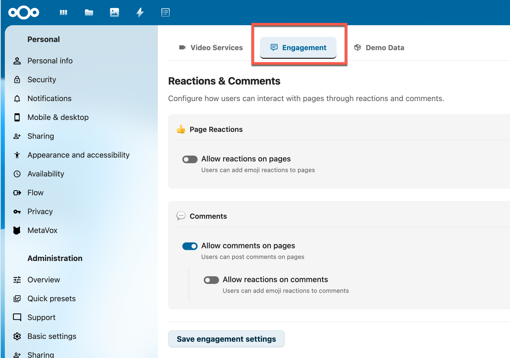
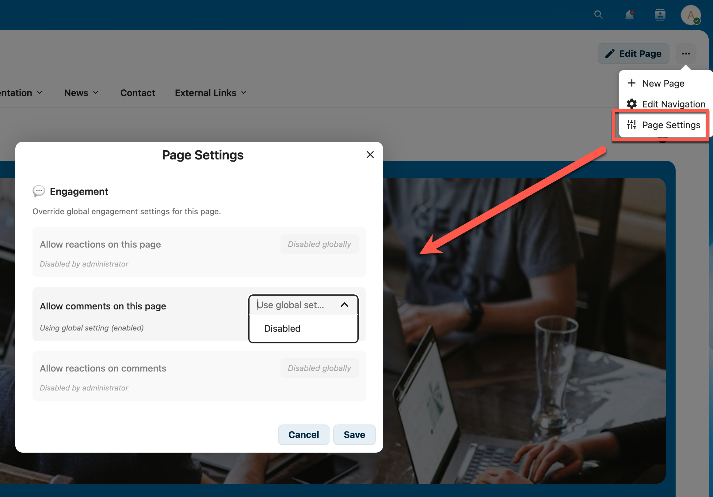

# Engagement Administration Guide

Configuration guide for IntraVox's engagement features (reactions and comments).

**Audience:** Intranet administrators and content managers

**Related documentation:**
- [Engagement User Guide](ENGAGEMENT_GUIDE.md) - End-user documentation
- [Engagement Architecture](ENGAGEMENT_ARCHITECTURE.md) - Technical details
- [Admin Settings Guide](ADMIN_SETTINGS.md) - Other admin settings

---

## Overview

IntraVox provides two levels of control for engagement features:

1. **Global Settings** - Master switches for the entire intranet (admin only)
2. **Page Settings** - Per-page overrides (editors with write access)



*The Engagement tab in IntraVox Admin Settings*

---

## Global Settings

### Accessing Global Settings

1. Log in as a Nextcloud administrator
2. Go to **Settings** (gear icon in top-right)
3. Select **IntraVox** in the Administration section
4. Click the **Engagement** tab

### Available Options

#### Page Reactions

| Setting | Default | Description |
|---------|---------|-------------|
| Allow reactions on pages | On | Users can add emoji reactions to pages |

When disabled, no reaction buttons appear on any page.

#### Comments

| Setting | Default | Description |
|---------|---------|-------------|
| Allow comments | On | Users can post comments on pages |
| Allow reactions on comments | On | Users can react to individual comments |

Note: "Allow reactions on comments" only appears when "Allow comments" is enabled.

### How Global Settings Work

Global settings act as **master switches**:

- **When enabled globally**: Feature is available by default, but can be disabled per page
- **When disabled globally**: Feature is off everywhere, page settings cannot override

```
Global: ON  + Page: (inherit) = Feature ON
Global: ON  + Page: OFF       = Feature OFF
Global: OFF + Page: (any)     = Feature OFF (cannot be enabled)
```

---

## Page Settings

Editors with write access to a page can disable engagement features for specific pages.

### Accessing Page Settings

1. Open the page you want to configure
2. Click **Edit** to enter edit mode
3. Click the **Settings** button (gear icon) in the toolbar
4. Find the **Engagement** section



*Page-specific engagement settings in the Page Settings modal*

### Available Options

Each setting has two states:

| State | Description |
|-------|-------------|
| Use global setting | Follow the administrator's global setting |
| Disabled | Turn off this feature for this page only |

Note: Page settings can only **disable** features. If a feature is globally disabled, the page setting shows "Disabled globally" and cannot be changed.

### Settings Logic

| Global Setting | Page Setting | Result |
|----------------|--------------|--------|
| Enabled | Use global setting | Enabled |
| Enabled | Disabled | Disabled |
| Disabled | (locked) | Disabled |

---

## Common Scenarios

### Scenario 1: Standard Intranet

**Goal:** Enable engagement everywhere by default

**Configuration:**
- Global: All features ON
- Pages: Leave as "Use global setting"

### Scenario 2: Disable Comments on Policy Pages

**Goal:** Allow reactions but no comments on official documents

**Configuration:**
- Global: All features ON
- Policy pages: Set "Allow comments" to Disabled

### Scenario 3: Read-Only Intranet

**Goal:** No user interaction, content consumption only

**Configuration:**
- Global: All features OFF
- Pages: No changes needed (globally disabled)

### Scenario 4: Announcement Pages

**Goal:** Allow reactions but no discussions

**Configuration:**
- Global: All features ON
- Announcement pages: Disable comments

---

## Best Practices

### For Administrators

1. **Start with defaults** - Enable all features initially
2. **Monitor usage** - Check if users engage with the features
3. **Communicate changes** - Inform users when disabling features globally
4. **Use page overrides** - Prefer page-level disabling over global disabling

### For Content Managers

| Content Type | Reactions | Comments | Rationale |
|--------------|-----------|----------|-----------|
| News articles | On | On | Encourage engagement |
| Policy documents | Off | Off | Official, no discussion needed |
| Announcements | On | Off | Acknowledge without debate |
| Knowledge base | On | On | Q&A and feedback valuable |
| Archive pages | On | Off | Historical, no new discussion |

---

## Troubleshooting

### Users Report Missing Features

1. Check global settings are enabled
2. Check page-specific settings
3. Verify users have read access to the page
4. Check browser console for JavaScript errors

### Cannot Change Settings

**Admin Settings:**
- Verify you have Nextcloud administrator rights

**Page Settings:**
- Verify you have edit (write) access to the page
- Check if feature is globally disabled (shows "Disabled globally")

### Settings Not Taking Effect

1. Ask users to refresh the page (Ctrl+F5)
2. Clear Nextcloud cache: `sudo -u www-data php occ maintenance:repair`
3. Check Nextcloud logs for errors

---

## API Reference

For automation or integration purposes:

### Get Current Settings

```
GET /apps/intravox/api/settings/engagement
```

Response:
```json
{
  "allowPageReactions": true,
  "allowComments": true,
  "allowCommentReactions": true
}
```

### Update Settings (Admin only)

```
PUT /apps/intravox/api/settings/engagement
Content-Type: application/json

{
  "allowPageReactions": true,
  "allowComments": true,
  "allowCommentReactions": true
}
```

---

## Storage Details

### Global Settings

Stored in Nextcloud's `oc_appconfig` table:

| App | Key | Value |
|-----|-----|-------|
| intravox | allowPageReactions | "1" or "0" |
| intravox | allowComments | "1" or "0" |
| intravox | allowCommentReactions | "1" or "0" |

### Page Settings

Stored in each page's JSON file in the `settings` object:

```json
{
  "settings": {
    "allowReactions": null,
    "allowComments": false,
    "allowCommentReactions": null
  }
}
```

Values: `null` (inherit), `false` (disabled)
