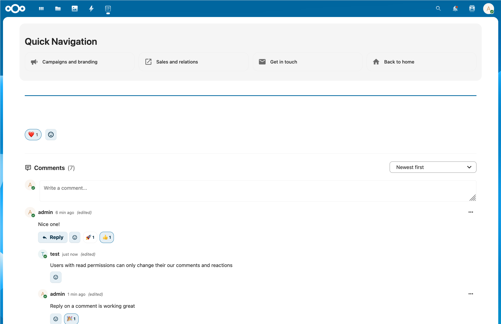

# Engagement Guide

IntraVox allows you to interact with pages through **reactions** and **comments**. This guide explains how to use these features.

**Audience:** All IntraVox users

---

## Overview

Engagement features let you:
- React to pages with emojis to show your appreciation
- Leave comments to share your thoughts
- Reply to other people's comments
- React to comments

*Example of reactions and comments on an IntraVox page*

---

## Reactions

Reactions are a quick way to respond to a page without writing a comment.

### Adding a Reaction

1. Scroll to the bottom of any page
2. Find the reaction bar with emoji buttons
3. Click an emoji to add your reaction

Available reactions:

| | | | | | |
|:---:|:---:|:---:|:---:|:---:|:---:|
| 👍 | 👎 | ❤️ | 🎉 | 😊 | 😢 |
| 😮 | 😂 | 🤔 | 👏 | 🙏 | 💪 |
| ✅ | ⭐ | 🔥 | 💯 | 👀 | 🚀 |

### Changing Your Reaction

Click a different emoji to change your reaction. Your previous reaction is automatically removed.

### Removing Your Reaction

Click the same emoji again to remove your reaction entirely.

### Viewing Who Reacted

Hover over any reaction count to see a list of people who reacted with that emoji.

---

## Comments

Comments let you share your thoughts and have discussions about page content.

### Writing a Comment

1. Scroll to the comments section below the page content
2. Click the text field that says "Write a comment..."
3. Type your message
4. Click **Send** or press `Ctrl+Enter` to post

### Replying to a Comment

1. Find the comment you want to reply to
2. Click the **Reply** button below the comment
3. A text field appears below that comment
4. Type your reply
5. Click **Reply** or press `Ctrl+Enter` to post

Replies appear indented below the original comment, making conversations easy to follow.

### Deleting Your Comment

1. Find your comment
2. Click the delete icon (trash can)
3. Confirm the deletion

You can only delete comments you wrote yourself.

### Sorting Comments

Use the dropdown menu at the top of the comments section:
- **Newest first**: Most recent comments appear at the top
- **Oldest first**: Oldest comments appear at the top

---

## Comment Reactions

You can react to individual comments, not just pages.

### Adding a Reaction to a Comment

1. Find the comment you want to react to
2. Click the emoji button (smiley face) next to the comment
3. Select your reaction from the picker

### Removing a Comment Reaction

Click the same emoji again to remove your reaction.

---

## Tips for Good Engagement

### Be Respectful
Keep your comments professional and constructive. Remember that colleagues will read what you write.

### Stay On Topic
Comment about the page content. If you have unrelated questions, use other communication channels.

### Be Concise
Short, clear comments are most effective. Get to the point quickly.

### Use Reactions Wisely
A quick emoji reaction can show appreciation without adding to the comment count. Use reactions when you agree but don't have anything new to add.

### Reply Thoughtfully
When replying to someone, make sure you're adding value to the conversation.

---

## Frequently Asked Questions

### Why can't I see the reaction buttons?

Reactions may be turned off for this specific page or for the entire intranet. This is a setting controlled by your administrator or content managers.

### Why can't I comment on this page?

Comments may be disabled for certain pages, such as official policy documents or announcements. Contact your intranet administrator if you have questions.

### Can I use my own emojis?

The available reaction emojis are set by IntraVox. Custom emojis are not currently supported.

### Are my comments visible to everyone?

Yes, comments are visible to all users who have access to the page. Be mindful of what you post.

### Can I edit a comment after posting?

No, comments cannot be edited after posting. You can delete your comment and post a new one if needed.

### How do I report inappropriate comments?

Contact your intranet administrator or IT department to report inappropriate content.

### Who can delete my comments?

You can delete your own comments. Administrators can also delete any comment if necessary.

---

## Need Help?

If you have questions about engagement features:
- Contact your IT department
- Reach out to your intranet administrator
- Ask your department's communication team
