# Feed Widget

The Feed Widget displays content from external sources on your intranet pages. It supports RSS/Atom feeds and admin-configured connections to any REST API — including LMS platforms (Canvas, Moodle, Brightspace), project management (Jira, OpenProject), knowledge bases (Confluence), HR systems (AFAS), service desks (TOPdesk), and more.

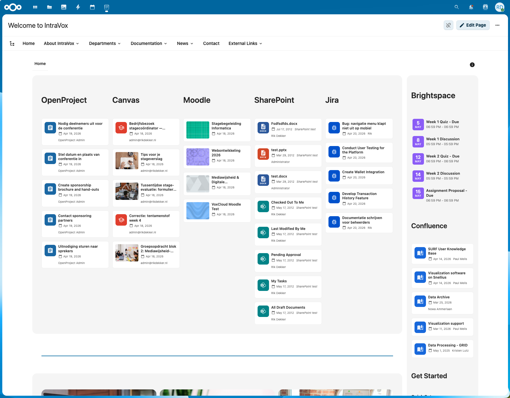

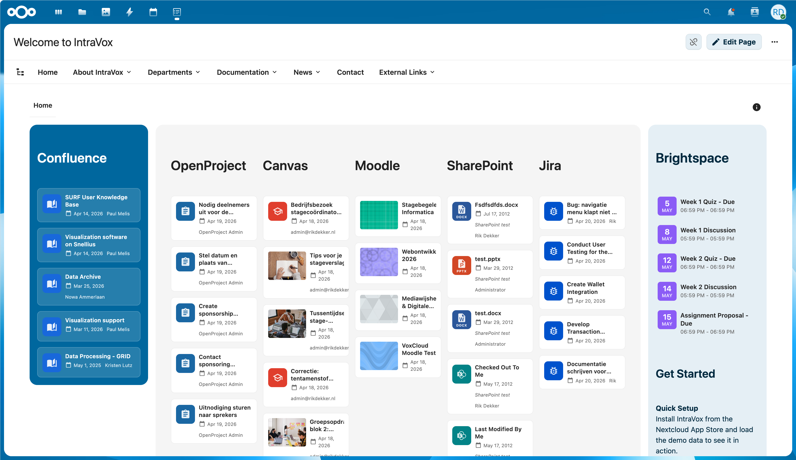

## Features

- **Two source types** — RSS/Atom feed (paste a URL) or Connection (admin-configured)
- **Presets for popular systems** — Jira, Confluence, SharePoint, OpenProject, Canvas, Moodle, Brightspace, AFAS, TOPdesk, or fully custom
- **LMS content types** — News/announcements (with forum selector), Available Courses, Assignments, and Upcoming Deadlines
- **Jira content types** — All issues, Open, Recently updated, Recently created, Bugs — with project selector
- **OpenProject content types** — All work packages, Open, Overdue, Milestones, or Recently updated
- **Two layouts** — List or Grid view (2-4 columns)
- **Personalized content** — Users connect their own LMS account to see only their courses, deadlines, and announcements
- **OAuth2 integration** — One-click account linking with Canvas, Moodle, and Brightspace via popup flow
- **Manual token fallback** — Users can paste an API token for Moodle or Brightspace without requiring OAuth2 setup
- **OIDC auto-connect** — Zero-click personalization when Nextcloud and the LMS share the same identity provider
- **Configurable display** — Show/hide images, dates, excerpts, source name, and author
- **Live preview** — See how the feed looks while configuring, with real data
- **Automatic language negotiation** — External APIs receive the user's language preference via the `Accept-Language` HTTP header
- **15-minute server-side cache** — Reduces API calls to external systems
- **Public share support** — Feed widgets work on publicly shared IntraVox pages

## Source Types

### RSS / Atom Feed

The simplest source type. Enter a feed URL and the widget fetches and displays the items.

**How to use:**

1. Add a Feed widget to your page
2. Select **RSS / Atom feed** as the source type
3. Enter the feed URL (e.g., `https://example.com/feed.xml`)
4. Click **Preview** to verify the feed works
5. Click **Save**

The widget automatically detects RSS 2.0 and Atom feed formats. Images are extracted from feed enclosures, `media:content`, `media:thumbnail`, or inline `` tags.

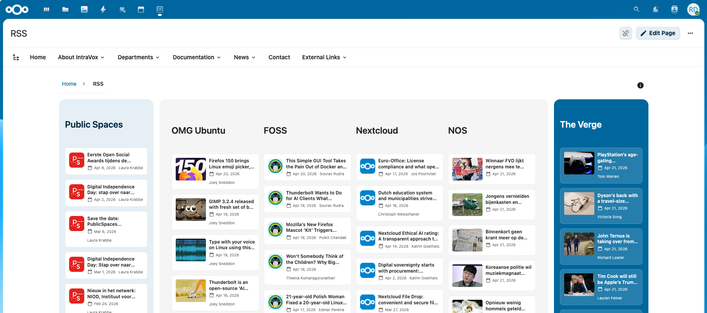

### Canvas LMS

Displays personalized content from a Canvas LMS instance. Supports both shared (admin token) and personalized (per-user OAuth2) access.

**Content types:**

| Content type | What it shows | API used |
|---|---|---|
| **News / Announcements** (default) | Course announcements with title, message, author, and date. Optionally filtered by course. | `/api/v1/announcements` |
| **My Courses** | The user's enrolled courses with course code and link | `/api/v1/courses` |
| **Upcoming Deadlines** | Assignment deadlines for the next 30 days across all courses | `/api/v1/calendar_events` |

**Personalization:**
When the connection uses OAuth2 (`authMode: oauth2` or `both`), each user connects their own Canvas account. The widget then shows only content from courses the user is enrolled in.

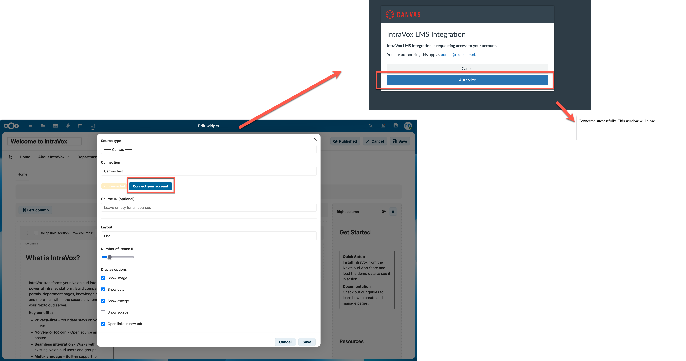

**Setup requirements:**
- Administrator configures a Canvas connection in IntraVox Admin Settings (see [Admin Settings Guide](ADMIN_SETTINGS.md))
- For OAuth2: a Developer Key must be created in Canvas Admin

### Moodle

Displays content from a Moodle instance. Supports both shared (admin token) and personalized (per-user OAuth2/manual token) access.

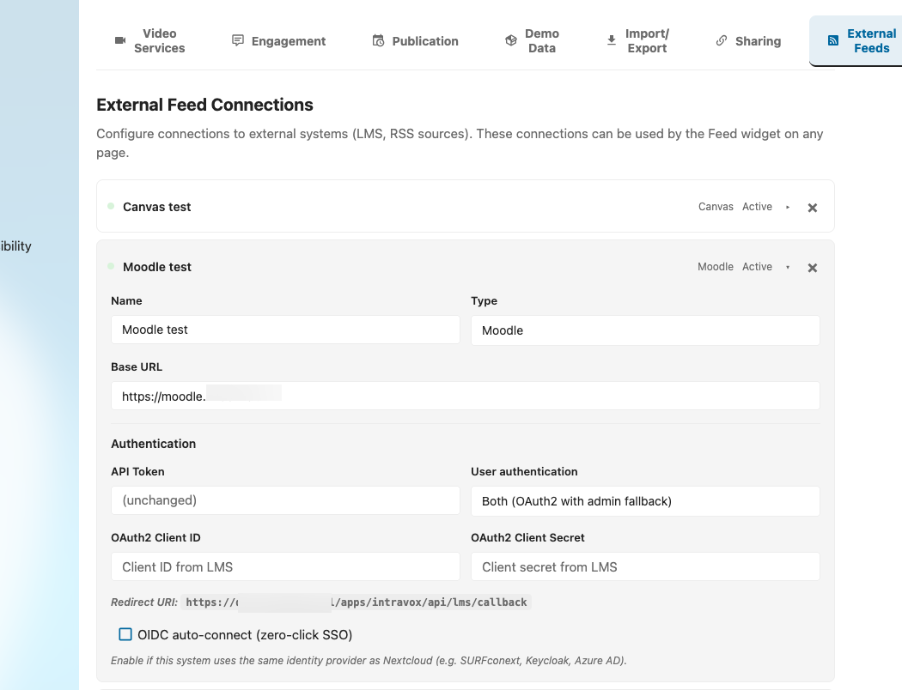

**Content types:**

| Content type | What it shows | API used |
|---|---|---|
| **News / Announcements** (default) | Forum discussions. Optionally filtered by course and forum. | `mod_forum_get_forum_discussions` / `core_course_get_courses` |
| **Available Courses** | Course catalog — all available courses (admin token) or enrolled courses (per-user token) | `core_enrol_get_users_courses` / `core_course_get_courses` |
| **Assignments** | Assignments overview per course with deadlines | `mod_assign_get_assignments` |
| **Upcoming Deadlines** | Upcoming calendar events across all courses | `core_calendar_get_calendar_upcoming_view` |

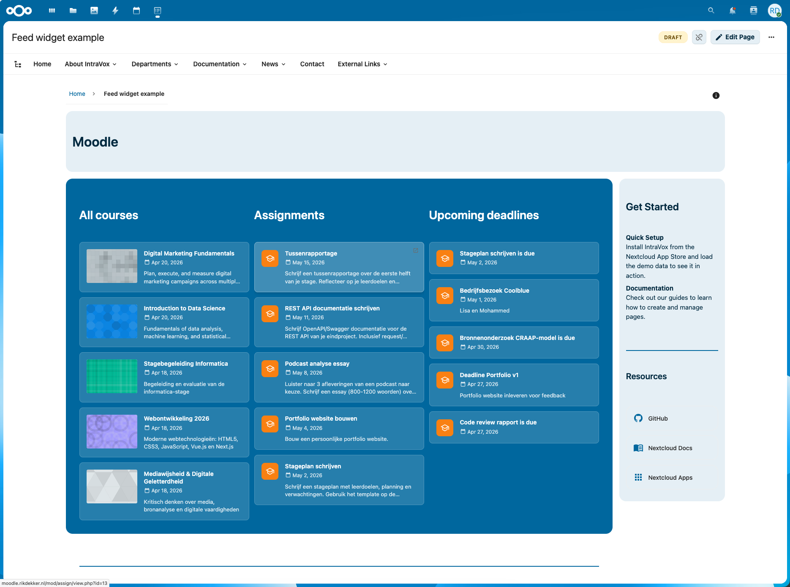

**Forum selector:** When "News / Announcements" is selected and a course is chosen, a forum selector appears. This lets admins pick a specific forum (e.g., "Announcements" or "General Discussion") instead of showing all forums in the course.

**Personalization options:**
1. **OAuth2** — Requires the [local_oauth2 plugin](https://moodle.org/plugins/local_oauth2) installed on Moodle
2. **Manual token** — Users paste their personal web service token (generated in Moodle under Preferences > Security keys)

**Setup requirements:**
- Administrator configures a Moodle connection in IntraVox Admin Settings
- Moodle web services must be enabled with the REST protocol activated
- For manual tokens: the web service must expose `core_course_get_courses`, `core_enrol_get_users_courses`, `core_calendar_get_calendar_upcoming_view`, `core_webservice_get_site_info`, `mod_forum_get_forums_by_courses`, `mod_forum_get_forum_discussions`, and `mod_assign_get_assignments` functions

**Note:** "Available Courses" replaces the previous "My Courses" label to reflect that this is organizational content (course catalog), not personal data. Existing widgets using the old `my-courses` value continue to work.

### Brightspace (D2L)

Displays personalized content from a Brightspace (Desire2Learn) instance.

**Content types:**

| Content type | What it shows | API used |
|---|---|---|
| **News / Announcements** (default) | News items from a specific org unit, or organization-level news | `/d2l/api/le/1.67/{orgUnitId}/news/` |
| **My Courses** | The user's enrolled courses (active enrollments) | `/d2l/api/lp/1.43/enrollments/myenrollments/` |
| **Upcoming Deadlines** | Calendar events for the next 30 days | `/d2l/api/le/1.67/calendar/events/myEvents/` |

**Personalization options:**
1. **OAuth2** — Register an OAuth2 app in Brightspace Admin under Manage Extensibility
2. **Manual token** — Users paste a personal bearer token from Brightspace Account Settings

**Setup requirements:**
- Administrator configures a Brightspace connection in IntraVox Admin Settings
- For OAuth2: register an OAuth2 application in Brightspace with the redirect URI shown in IntraVox

### OpenProject

Displays work packages from an OpenProject instance. Uses the OpenProject API v3 with Basic authentication (`apikey:<token>`).

**Content types:**

| Content type | What it shows | API filter |
|---|---|---|
| **All work packages** (default) | All work packages, sorted by last updated | None |
| **Open work packages** | Only work packages with an open status | Status operator `o` |
| **Overdue** | Open work packages past their due date | Due date before today + open status |
| **Milestones** | Milestone-type work packages (releases, deadlines) | Type = Milestone |
| **Recently updated** | Work packages updated in the last 7 days | Updated in last 7 days |

**Setup:**

1. In OpenProject, go to **My Account** → **Access tokens** → **+ API token**

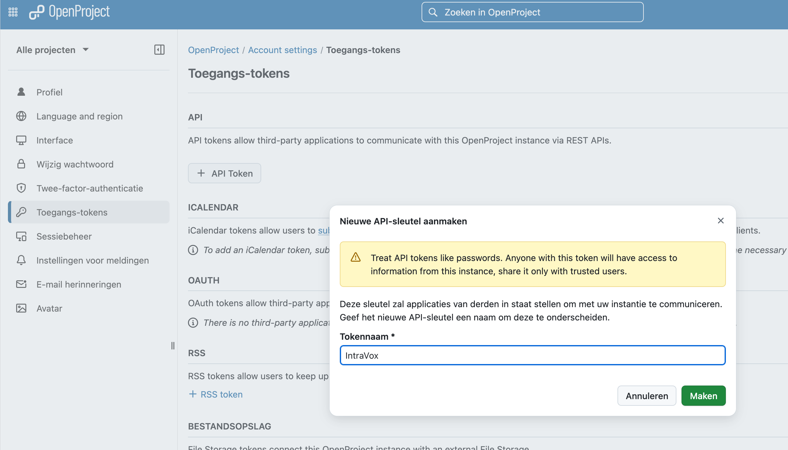

2. Copy the token (shown only once)
3. In IntraVox Admin Settings, add a connection with type **OpenProject**
4. Enter the Base URL (e.g., `https://openproject.example.com`)
5. The endpoint, auth method (Basic), and response mapping are pre-filled by the preset
6. Enter the API token as `apikey:<your-token>` (e.g., `apikey:abc123def456...`)
7. Save the connection

**Links:** Work package links in the feed open directly in OpenProject's web interface (e.g., `https://openproject.example.com/work_packages/42`), not the API.

**Note:** The Milestone content type filters by the work package type with ID `2` (the default "Milestone" type in OpenProject). If your instance uses a different type ID for milestones, use the REST API (custom) type instead and configure the filter manually.

### Jira

Displays issues from a Jira instance. Supports both Jira Data Center (on-premises) and Jira Cloud (Atlassian Cloud).

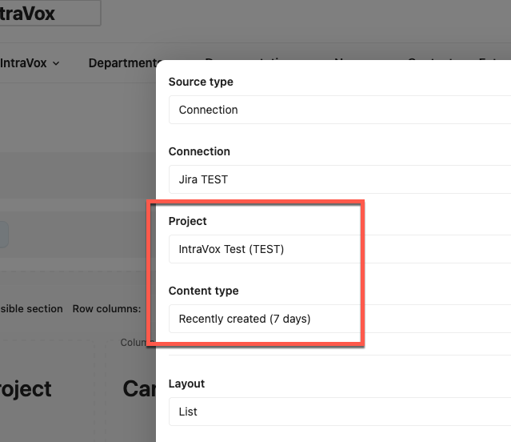

**Content types:**

| Content type | What it shows | JQL filter |
|---|---|---|
| **All issues** (default) | All issues, sorted by last updated | `updated >= -30d ORDER BY updated DESC` |
| **Open issues** | Issues that are not done | `status != Done` |
| **Recently updated (7 days)** | Issues updated in the last week | `updated >= -7d` |
| **Recently created (7 days)** | Issues created in the last week | `created >= -7d` |
| **Bugs** | Bug-type issues only | `type = Bug` |

**Project selector:** A dropdown lets you filter by a specific Jira project. The available projects are fetched automatically from the Jira API.

**Cloud vs. Data Center:**

| | Jira Data Center | Jira Cloud |
|---|---|---|
| **Auth method** | Bearer token (PAT) | Basic auth (email:api-token) |
| **API version** | v2 (`/rest/api/2/search`) | v3 (`/rest/api/3/search/jql`) |
| **Auto-detected** | Yes, from Base URL | Yes, `.atlassian.net` URLs |

The preset auto-detects Cloud vs. Data Center based on the Base URL and adjusts the API version and auth method accordingly. For Jira Cloud, an **Atlassian account email** field appears automatically for the Basic auth `email:api-token` format.

**Setup:**

1. **Jira Data Center:** Create a Personal Access Token in Jira (Profile → Personal Access Tokens)
2. **Jira Cloud:** Create an API token at [id.atlassian.com/manage-profile/security/api-tokens](https://id.atlassian.com/manage-profile/security/api-tokens)
3. In IntraVox Admin Settings, add a connection with type **Jira**
4. Enter the Base URL (e.g., `https://jira.example.com` or `https://your-org.atlassian.net`)
5. The auth method, endpoint, and response mapping are auto-configured by the preset
6. Enter your token (Cloud: also fill in your Atlassian email)
7. Save the connection

**Links:** Issue links open directly in the Jira web interface (e.g., `https://jira.example.com/browse/PROJ-123`), not the API URL.

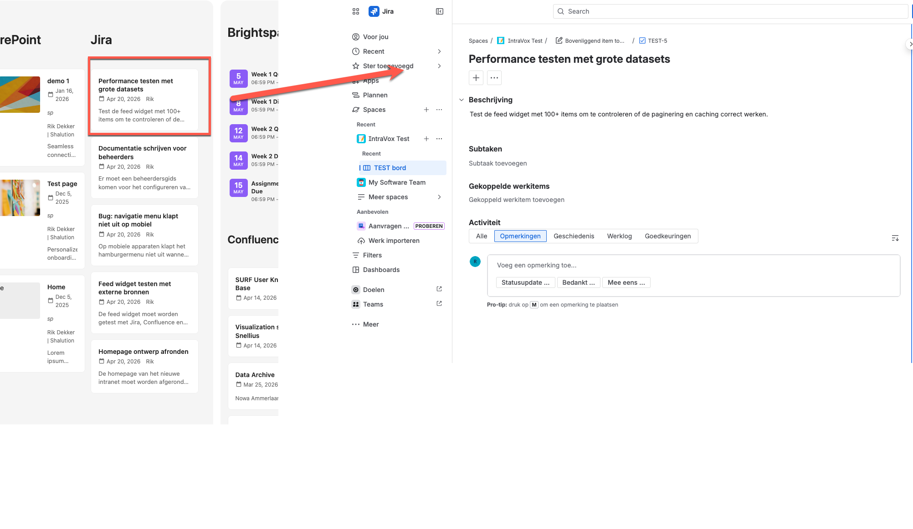

### Confluence

Displays recently modified pages from a Confluence instance. Uses Bearer token authentication with the Confluence REST API.

The preset configures the endpoint (`/rest/api/content`) and response mapping automatically. Pages are sorted by last modified date.

### SharePoint (Microsoft Graph)

Displays pages, news posts, documents, or list items from a SharePoint site via the Microsoft Graph API. Uses OAuth2 client credentials (app-only) authentication.

**Content types:**

| Content type | What it shows |
|---|---|
| **All pages** (default) | All site pages sorted by last modified |
| **News posts** | SharePoint news posts only |
| **Documents** | Files from a specific document library |
| **List items** | Items from a specific SharePoint list |

**Setup — Microsoft Entra app registration:**

1. Go to [Microsoft Entra admin center](https://entra.microsoft.com) → **App registrations** → **+ New registration**

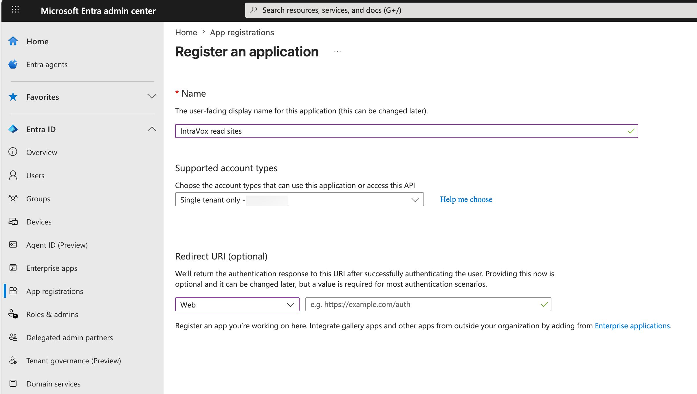

2. Add **API permissions**: `Sites.Read.All` (Application) and `User.Read` (Delegated), then grant admin consent

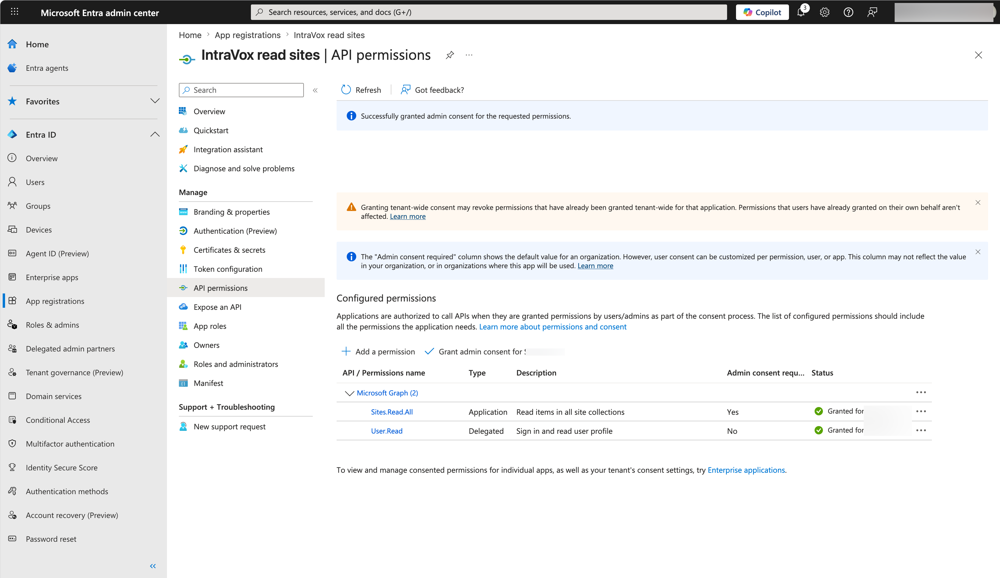

3. Create a **Client secret** under Certificates & secrets

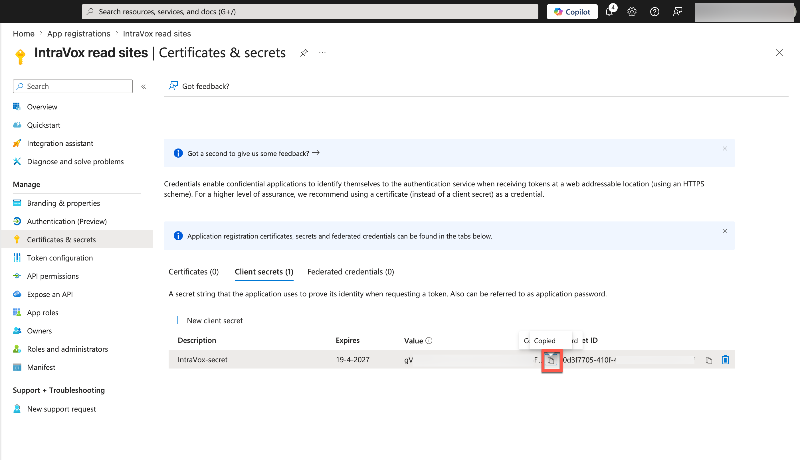

4. Copy the **Application (client) ID** and **Directory (tenant) ID** from the Overview page

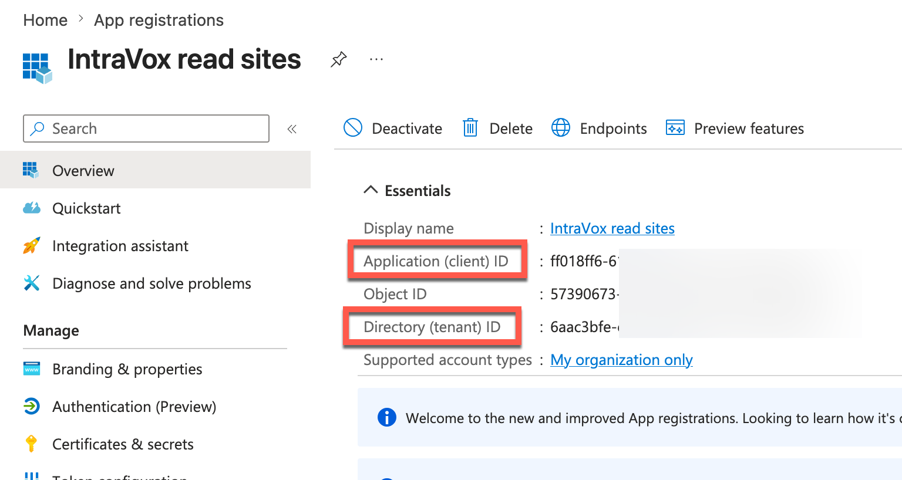

5. In IntraVox Admin Settings, add a connection with type **SharePoint (Graph API)** and enter the Client ID, Client Secret, Tenant ID, and your SharePoint site URL

### How Feed Widgets complement Nextcloud integration apps

Many external systems that IntraVox connects to — OpenProject, Jira, Canvas LMS, Moodle — also have dedicated Nextcloud integration apps (e.g., `integration_openproject`, `integration_jira`). These are **complementary, not competing**. Each serves a different audience and purpose:

| | Nextcloud integration app | IntraVox Feed Widget |
|---|---|---|
| **Audience** | Individual user | Team, department, or organization |
| **Purpose** | Take action (link files, create items, manage tasks) | Build awareness (see what's happening at a glance) |
| **Context** | Dashboard widget, unified search, file sidebar | Embedded in intranet page alongside news, calendar, people |
| **Visibility** | Only the authenticated user | Everyone with page access, including public shares |
| **Layout** | Fixed widget format | Configurable list or grid, 1-20 items |

**Example: OpenProject.** The `integration_openproject` app lets individual developers link Nextcloud files to work packages, search for tasks, and receive personal notifications. The IntraVox Feed Widget shows a project status overview on a department intranet page — visible to managers, stakeholders, and team members who may not even have OpenProject accounts. One is for *working in* the system, the other is for *communicating about* the work.

The same principle applies to all supported systems. A university can use the Moodle integration app for students to access their personal courses, while using IntraVox's Feed Widget to show upcoming deadlines on a faculty intranet page for all staff.

See the [Architecture documentation](ARCHITECTURE.md#organizational-communication-not-personal-productivity) for the design principle behind this approach.

#### Why there is no "Nextcloud" source type

The Nextcloud Dashboard is a *personal productivity overview* — it shows my mail, my tasks, my recent files, my Talk mentions, my notifications. IntraVox is an *organizational communication platform* — it shows company news, team updates, shared resources, and data from external systems.

IntraVox deliberately does not duplicate what the Dashboard already provides:

| Personal data | Where it belongs | Why not in IntraVox |
|---|---|---|
| My recent files | Dashboard (Recommendations widget) | Personal productivity, algorithmic per-user |
| My Talk mentions | Dashboard (Talk widget) | Personal messaging |
| My Deck cards | Dashboard (Deck widget) | Personal task management |
| My mail | Dashboard (Mail widget) | Personal email |
| My notifications | Dashboard (Notifications) | Personal alerts |
| My activity stream | Dashboard (Activity widget) | Personal event log |

**For organizational Nextcloud data** (e.g. shared folder activity from a remote Nextcloud instance), use the **REST API (custom)** source type with the Nextcloud OCS API endpoints. This gives you full control over which data to show and how to authenticate (Bearer token, OAuth2, or custom headers with `OCS-APIRequest: true`).

### REST API (custom)

Connect to any system with a REST/JSON API — Jira, Confluence, OpenProject, ZGW APIs, or any other REST endpoint.

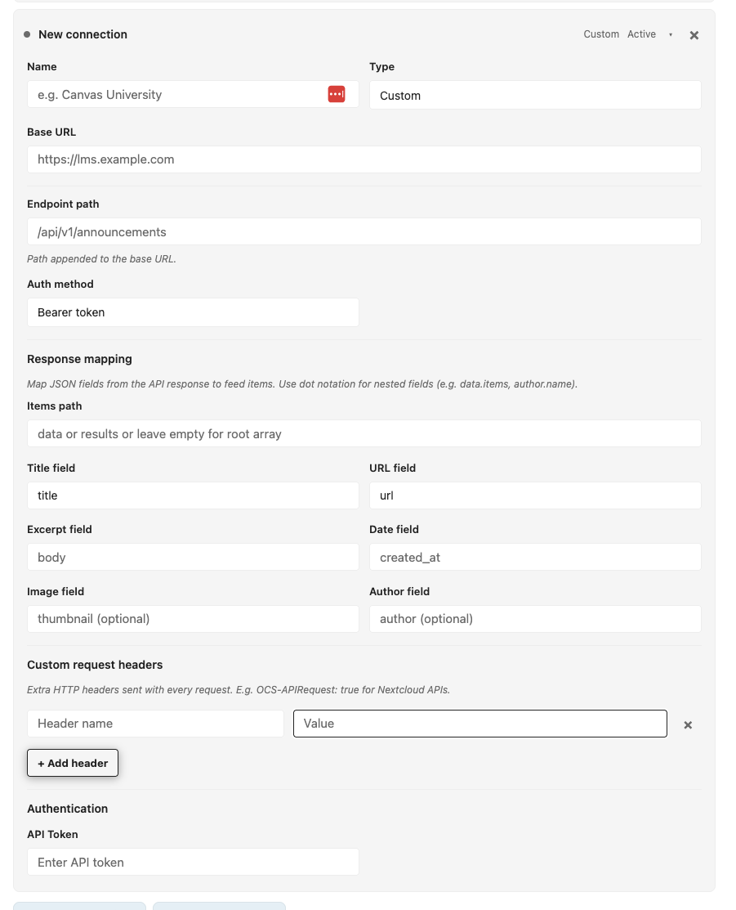

**How to use:**

1. Go to IntraVox **Admin Settings** → Feed Connections
2. Add a connection with type **REST API (custom)**
3. Configure:
   - **Base URL** — the API root (e.g., `https://jira.example.com`)
   - **Endpoint path** — the API path (e.g., `/rest/api/2/search?jql=project=KEY`)
   - **Auth method** — Bearer token, API key (custom header), Basic auth, or No authentication
   - **Response mapping** — map JSON fields to feed items (title, URL, excerpt, date, image, author)
4. Save the connection
5. Add a Feed widget and select your REST API connection

**Response mapping:**

The admin maps JSON fields from the API response to feed item properties using dot-notation paths:

| Feed field | JSON path example | Description |
|-----------|------------------|-------------|
| Items path | `results` or `issues` or `data.items` | Where the array of items lives in the JSON response. Leave empty if the response itself is an array |
| Title | `title` or `fields.summary` | Item title (required) |
| URL | `url` or `_links.webui` | Clickable link. Relative URLs are made absolute using the base URL |
| Excerpt | `body` or `fields.description` | Text excerpt (HTML is stripped, max 300 chars) |
| Date | `created_at` or `history.lastUpdated.when` | Publication/update date |
| Image | `thumbnail` or `avatar_url` | Image URL (optional) |
| Author | `author` or `history.lastUpdated.by.displayName` | Author name (optional) |

**Example configurations:**

| System | Endpoint | Items path | Title | URL |
|--------|----------|-----------|-------|-----|
| Jira | `/rest/api/2/search?jql=ORDER+BY+updated` | `issues` | `fields.summary` | `self` |
| Confluence | `/rest/api/content?spaceKey=WIKI&expand=history.lastUpdated` | `results` | `title` | `_links.webui` |
| OpenProject | `/api/v3/work_packages` | `_embedded.elements` | `subject` | `_links.self.href` (auto-converted to web URL) |
| ZGW (Open Zaak) | `/zaken/api/v1/zaken` | `results` | `omschrijving` | `url` |

**Authentication & personalization:**

REST API connections support the same three authentication levels as LMS connections. This is how security-trimmed, personalized feeds work:

1. **Admin token (shared)** — One API token configured by the admin. All users see the same data, limited to what the service account has access to. Good for public APIs or shared dashboards.

2. **OAuth2 (per-user)** — Each user connects their own account via OAuth2. The API returns only data that user has access to. Fully security-trimmed. Requires the external system to support OAuth2 and the admin to configure Client ID + Secret.

3. **OIDC auto-connect (zero-click SSO)** — If Nextcloud and the external system share the same identity provider (e.g., SURFconext, Keycloak, Azure AD), IntraVox automatically uses the user's existing SSO token. No clicks needed — fully personalized, fully security-trimmed, fully transparent.

The widget resolves tokens in this priority order: OIDC auto-connect → per-user OAuth2 → admin fallback. If no token is available and authMode is `oauth2`, the widget shows a "Connect your account" prompt.

**When to use which auth level:**

| Scenario | Auth level | Example |
|----------|-----------|---------|
| Public API, no login needed | No authentication | SURF Confluence (public spaces) |
| Shared dashboard, same view for everyone | Admin token | Company-wide Jira board |
| Personal feed, each user sees their own data | OAuth2 (per-user) | My Jira tickets, my TOPdesk incidents |
| SSO environment, zero friction | OIDC auto-connect | SURFconext + Jira, Azure AD + M365 |

## Layouts

### List Layout

Displays items in a vertical list with optional image, title, date, excerpt, and source.

### Grid Layout

Shows items in a responsive grid. Configure between 2, 3, or 4 columns.

## Adding the Widget

1. Click **+ Add Widget** in edit mode
2. Select **Feed** from the widget picker
3. Choose a source type from the dropdown
4. Configure the source (URL for RSS, or select a connection for LMS)
5. Adjust layout and display options
6. Click **Save**

Administrators configure feed connections in **Admin Settings → External Feeds**. Presets are available for popular systems:

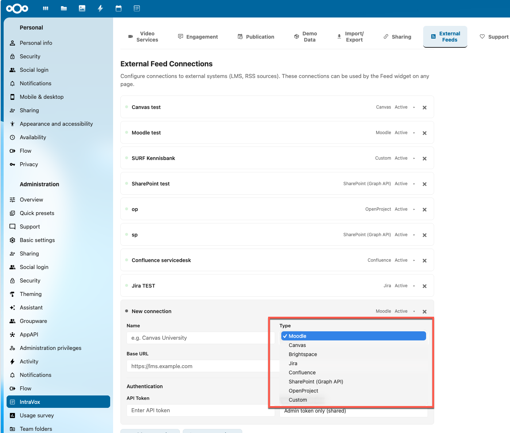

## Configuration

### Source Settings

| Setting | Description | Applies to |
|---------|-------------|------------|
| **Source type** | RSS/Atom feed or Connection (admin-configured) | All |
| **Feed URL** | URL of the RSS or Atom feed | RSS only |
| **Connection** | Admin-configured connection to use | Connections |
| **Content type** | Depends on connection type (see sections above) | LMS, Jira, OpenProject, SharePoint |
| **Project** | Jira project filter (auto-populated dropdown) | Jira |
| **Forum** | Moodle forum filter within a course | Moodle (News) |
| **Course** | Limit results to a specific course | LMS only |
| **Document library / List** | SharePoint library or list selector | SharePoint |

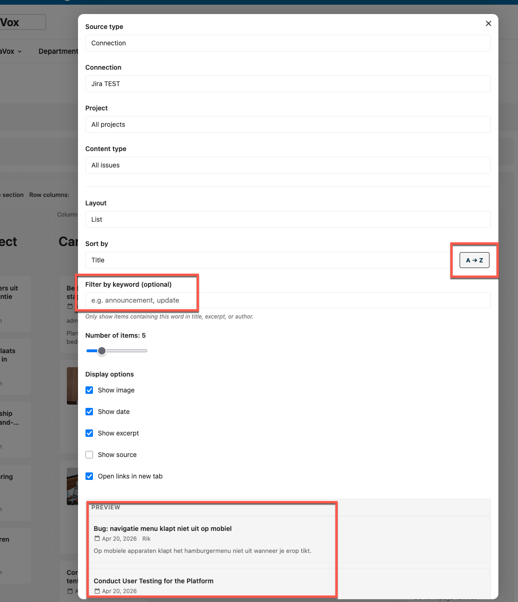

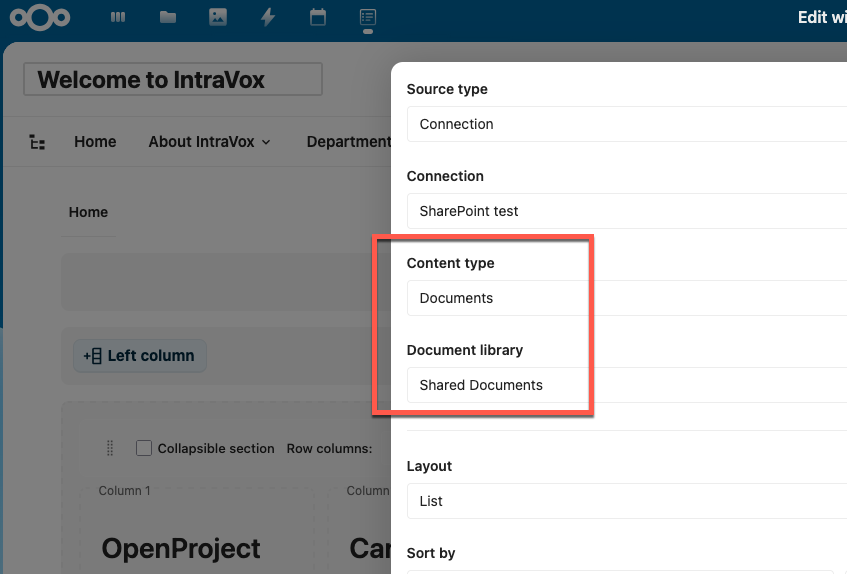

### Sort & Filter

| Setting | Description | Default |
|---------|-------------|---------|
| **Sort by** | Date or Title | Date |
| **Sort order** | Context-dependent toggle: "Newest first / Oldest first" for date, "A → Z / Z → A" for title | Newest first |
| **Filter by keyword** | Only show items containing this word in title, excerpt, or author | *(empty — no filter)* |

Sorting and filtering are applied server-side after caching. The cache stores all items; sort/filter selects from the cached set. This means changing sort/filter is instant (no re-fetch from external API).

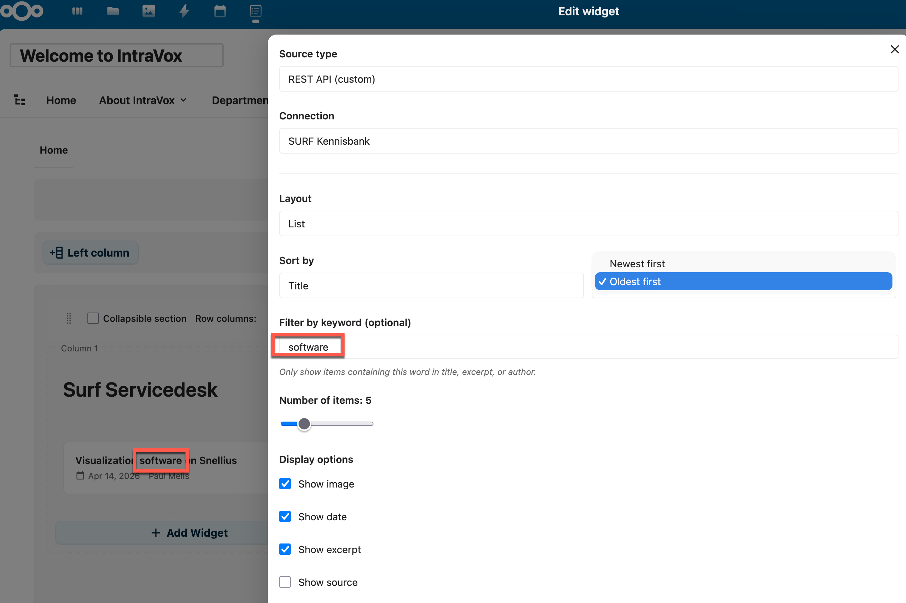

### Language

Feed requests automatically include the `Accept-Language` HTTP header based on the current user's Nextcloud language preference. For example, a user with Dutch (`nl`) as their language setting causes all feed API requests to include:

```
Accept-Language: nl,en;q=0.9
```

This tells the external system to return content in Dutch if available, with English as fallback. This follows the [HTTP content negotiation standard](https://developer.mozilla.org/en-US/docs/Web/HTTP/Headers/Accept-Language) — the same mechanism browsers use.

**How it works:**

- The language is determined per-request from the viewing user's Nextcloud setting (Settings → Personal → Language)
- No admin configuration needed — this is automatic, standard HTTP behavior
- English (`en`) is used as fallback when the user's language is not set or for anonymous/public page visitors
- Systems that respect `Accept-Language` include Jira, Confluence, SharePoint (Microsoft Graph), OpenProject, Moodle, Canvas, and Brightspace
- RSS/Atom feeds receive the header too, though most feeds serve content in a fixed language

**Note:** The language header affects system-generated strings (e.g., issue type names, status labels, UI text from APIs) — not user-created content. A Jira issue's title and description are always in the language they were written in, but field labels like "Bug" vs. "Fout" may change.

### Layout Settings

| Setting | Description | Default |
|---------|-------------|---------|
| **Layout** | List or Grid | List |
| **Columns** | Number of grid columns (2-4) | 3 |
| **Number of items** | Maximum items to display (1-20) | 5 |

### Display Options

| Setting | Description | Default |
|---------|-------------|---------|
| **Show image** | Display item thumbnail or extracted image | Enabled |
| **Show date** | Display publication date | Enabled |
| **Show excerpt** | Display text excerpt | Enabled |
| **Show source** | Display the source/feed name | Disabled |
| **Open links in new tab** | Links open in a new browser tab | Enabled |

## Personalized LMS Content

By default, LMS connections use a shared admin token — all users see the same data. With per-user authentication, each user connects their own account and sees only content they have access to.

### How It Works

The widget resolves tokens in this order:

1. **OIDC auto-connect** — If enabled and Nextcloud + LMS share the same identity provider, the widget uses the user's existing SSO token automatically (zero clicks)
2. **Per-user OAuth2 token** — If the user previously connected via OAuth2
3. **Per-user manual token** — If the user entered an API token manually
4. **Admin fallback** — If `authMode` is `both`, falls back to the shared admin token
5. **No token** — If `authMode` is `oauth2` and the user hasn't connected, shows a "Connect your account" prompt

### Connecting Your Account

When you open a page with a Feed widget that requires authentication:

1. The widget shows a **"Not connected"** badge and a **"Connect your account"** button
2. Click the button — a popup opens with the LMS login page
3. Log in and authorize IntraVox
4. The popup closes automatically and the widget loads your personalized content

For Moodle or Brightspace without OAuth2, you can also click **"Enter token manually"** and paste your API token.

### Disconnecting

Click the **"Disconnect"** button next to the green "Connected" badge in the widget editor.

## Token Refresh

OAuth2 tokens for Canvas, Moodle, and Brightspace are automatically refreshed when expired — no user action required. If the refresh fails (e.g., access revoked in the LMS), the user is prompted to reconnect.

Manual tokens (Moodle and Brightspace) do not expire automatically.

## Tips

- **Live preview** — The editor shows a live preview of the feed while you configure it. Changes to source, filters, layout, and display options are reflected immediately
- **Content types** — Use "Available Courses" to show the course catalog, "Assignments" for assignment overviews, "Upcoming Deadlines" for calendar events, or "News" for announcements
- **Course filter** — Shown for "News" and "Assignments" content types. Leave empty for all courses, or select a specific course
- **Forum selector** — When "News" is selected with a specific course, pick a specific forum (e.g., "Announcements") instead of all forums
- **Jira project filter** — Select a specific Jira project from the dropdown, or leave on "All projects" for a cross-project view
- **Multiple feeds** — Add multiple Feed widgets to a page for different sources or content types (e.g., one for Canvas deadlines, one for Brightspace announcements, one for RSS)
- **Public pages** — Feed widgets on publicly shared pages use the admin token (if available). Per-user tokens are not used for anonymous visitors

## Error Messages

The widget shows specific error messages based on what went wrong:

| Message | Meaning | Action |
|---------|---------|--------|
| "This connection is currently disabled by an administrator" | The connection exists but has been set to inactive | No action needed — the widget resumes automatically when the admin re-enables the connection |
| "Connection no longer exists" | The admin-configured connection was deleted | Reconfigure the widget with a different connection |
| "Authentication required" | No valid API token or OAuth2 token available | Connect your account or ask the admin to configure a token |
| "Access denied" | The API token lacks permissions for this content | Check the connection credentials in Admin Settings |
| "Too many requests" | The external API rate limit was hit | Wait and try again — the widget caches results to avoid this |
| "Could not load feed" | Generic connection error | Check the connection URL and credentials in Admin Settings |
| "Source temporarily unavailable" | The circuit breaker opened after repeated failures | The external system is down — the widget retries automatically after 5 minutes |

## Troubleshooting

| Problem | Solution |
|---------|----------|
| "No items found" | Check the feed URL or verify the LMS has content in the selected course |
| "Failed to load feed" | Verify the connection URL and credentials in Admin Settings |
| Canvas shows "Missing context_codes" | This is fixed in v1.2.0 — the widget now fetches courses automatically |
| OAuth2 popup blocked | Allow popups for your Nextcloud domain in browser settings |
| "Connect your account" not showing | The connection must have `authMode` set to `oauth2` or `both` in Admin Settings |
| Stale data | The widget caches results for 15 minutes. Wait or clear the Nextcloud cache |
