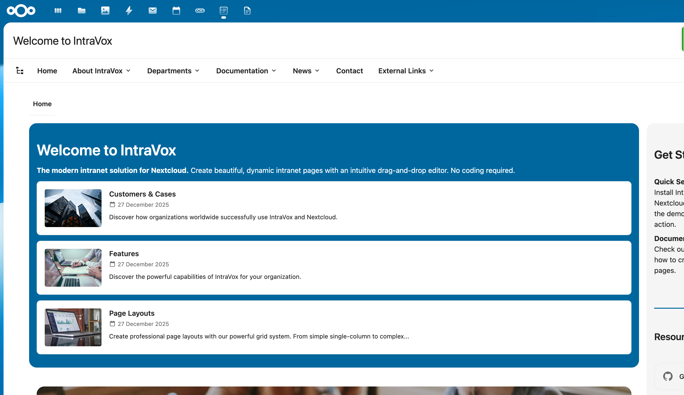
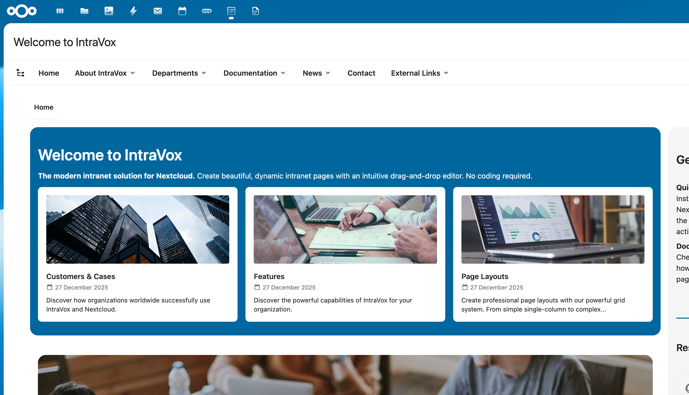
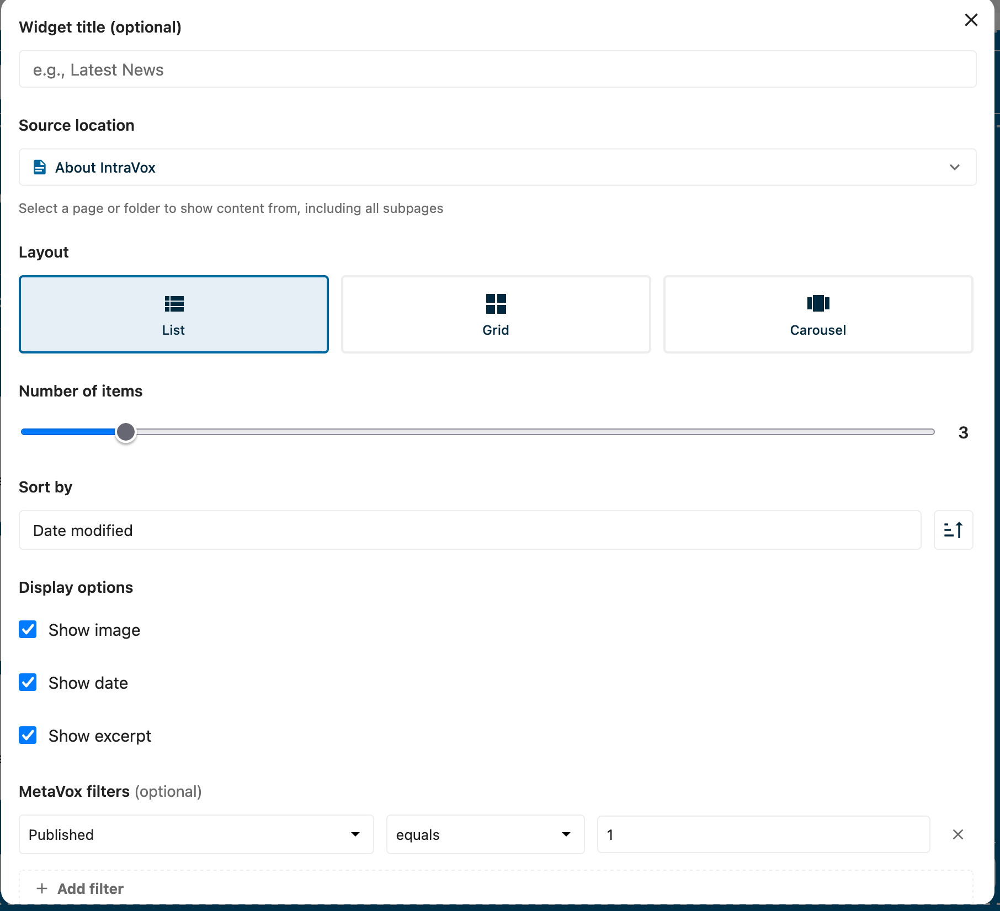
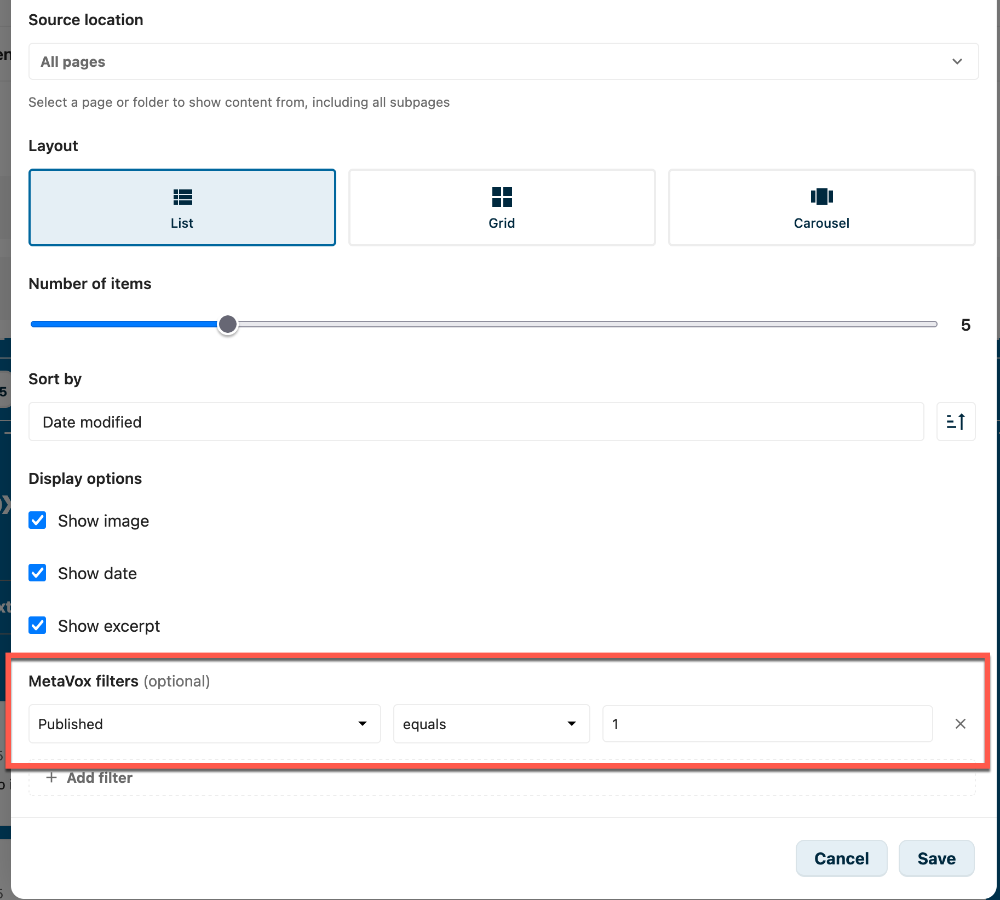
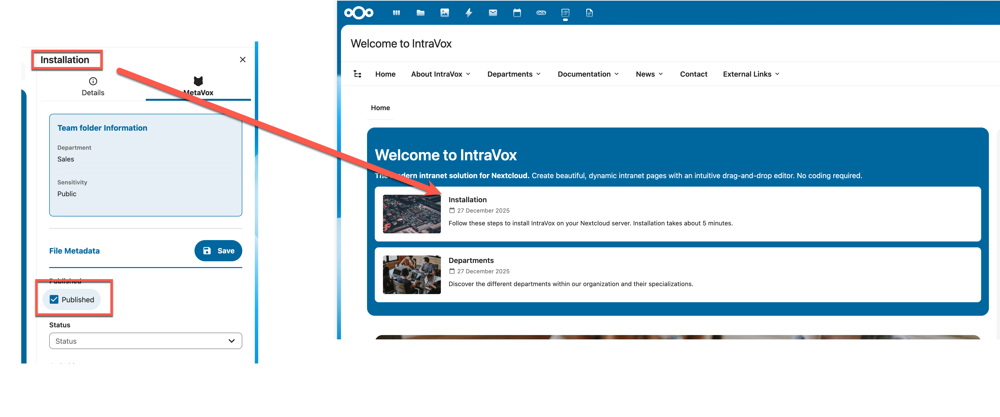

# News Widget

The News Widget displays a dynamic list of pages from a selected location in your IntraVox site. It's perfect for showcasing news articles, blog posts, announcements, or any collection of related content.

## Features

- **Multiple layouts**: List, Grid, or Carousel view
- **Source selection**: Show pages from any folder or section
- **MetaVox filtering**: Filter pages based on metadata fields (requires MetaVox app)
- **Customizable display**: Toggle image, date, and excerpt visibility
- **Sorting options**: Sort by date modified or title
- **Autoplay carousel**: Configurable interval for automatic rotation

## Layouts

### List Layout

Displays items in a vertical list with thumbnail, title, date, and excerpt.

### Grid Layout

Shows items in a responsive grid with 2, 3, or 4 columns.

### Carousel Layout

A rotating slideshow with navigation arrows and dot indicators. Supports autoplay with configurable interval.

## Configuration

To add a News Widget to your page:

1. Click **+ Add Widget** in edit mode
2. Select **News** from the widget picker
3. Configure the widget settings

### Settings

| Setting | Description |
|---------|-------------|
| **Widget title** | Optional title displayed above the widget |
| **Source location** | Select a page or folder to show content from (includes all subpages) |
| **Layout** | Choose between List, Grid, or Carousel |
| **Columns** | For Grid layout: 2, 3, or 4 columns |
| **Autoplay interval** | For Carousel layout: seconds between slides (0 = disabled) |
| **Number of items** | Maximum items to display (1-20) |
| **Sort by** | Date modified or Title |
| **Sort order** | Ascending or Descending |
| **Show image** | Display the page's featured image |
| **Show date** | Display the modification date |
| **Show excerpt** | Display a text excerpt from the page |

## MetaVox Integration

When the [MetaVox](https://apps.nextcloud.com/apps/metavox) app is installed and configured, you can filter News Widget results based on metadata fields.

### Adding Filters

1. Click **+ Add filter** in the MetaVox filters section
2. Select a metadata field from the dropdown
3. Choose an operator (equals, contains, is not empty)
4. Enter a value to filter on

### Filter Operators

| Operator | Description |
|----------|-------------|
| **equals** | Exact match |
| **contains** | Partial match (text fields) |
| **is not empty** | Field has any value |

### Checkbox Fields

For checkbox/boolean metadata fields:
- Use `1` for checked/true
- Use `0` for unchecked/false

### Multiple Filters

When using multiple filters, you can choose:
- **Match all**: All filters must match (AND logic)
- **Match any**: At least one filter must match (OR logic)

## Publication Date Filtering

The News Widget can automatically filter pages based on publication and expiration dates. This allows you to schedule content to appear and disappear automatically.

### How it Works

When enabled, pages are filtered based on two MetaVox date fields:
- **Publish date**: The page becomes visible on this date
- **Expiration date**: The page is hidden after this date

A page is visible when:
- The publish date is empty OR the publish date is today or in the past
- AND the expiration date is empty OR the expiration date is in the future

| Publish date | Expiration date | Today      | Visible? |
|--------------|-----------------|------------|----------|
| (empty)      | (empty)         | -          | Yes      |
| 2025-01-01   | (empty)         | 2025-01-15 | Yes      |
| 2025-02-01   | (empty)         | 2025-01-15 | No       |
| (empty)      | 2025-01-20      | 2025-01-15 | Yes      |
| (empty)      | 2025-01-10      | 2025-01-15 | No       |
| 2025-01-01   | 2025-01-31      | 2025-01-15 | Yes      |

### Setup

#### Step 1: Create MetaVox Fields

First, create two date fields in MetaVox:

1. Open the MetaVox app
2. Create a new field for the publish date (e.g., "Publish date")
3. Create a new field for the expiration date (e.g., "Expiration date")
4. Set both fields to type "Date"

#### Step 2: Configure Field Names in Admin Settings

1. Go to **Settings** → **IntraVox**
2. Open the **Publication** tab
3. Enter the exact MetaVox field names:
   - **Publish date field**: The name of your publish date field
   - **Expiration date field**: The name of your expiration date field
4. Click **Save publication settings**

> **Note**: The field names must match exactly with the names in MetaVox, including capitalization.

#### Step 3: Enable in News Widget

1. Edit a page containing a News Widget
2. Click on the News Widget to open the editor
3. Check **Show only published pages**
4. Save the page

### Warnings

The News Widget editor will show warnings when:

- **MetaVox is not installed**: Publication filtering requires the MetaVox app
- **Fields not configured**: The admin needs to configure the publication date fields in Settings → IntraVox → Publication

### Date Formats

The following date formats are supported:
- `YYYY-MM-DD` (e.g., 2025-01-15)
- `DD-MM-YYYY` (e.g., 15-01-2025)
- `MM/DD/YYYY` (e.g., 01/15/2025)
- `DD/MM/YYYY` (e.g., 15/01/2025)
- ISO 8601 with time (e.g., 2025-01-15T10:30:00)

### Multilingual Field Names

If you use IntraVox in multiple languages, here are suggested field names:

| Language | Publish date | Expiration date |
|----------|--------------|-----------------|
| English  | Publish date | Expiration date |
| Dutch    | Publicatiedatum | Vervaldatum |
| German   | Veröffentlichungsdatum | Ablaufdatum |
| French   | Date de publication | Date d'expiration |

## Tips

- **Performance**: Limit the number of items for better page load times
- **Images**: Pages need a featured image (first image widget) to display thumbnails
- **Excerpts**: Excerpts are automatically extracted from the first text content on each page
- **Dark backgrounds**: The widget automatically adjusts text colors when placed on dark row backgrounds
- **Publication scheduling**: Use publication dates for time-sensitive content like announcements or events

## Requirements

- IntraVox 0.8.0 or higher
- MetaVox app (optional, for filtering and publication dates)
