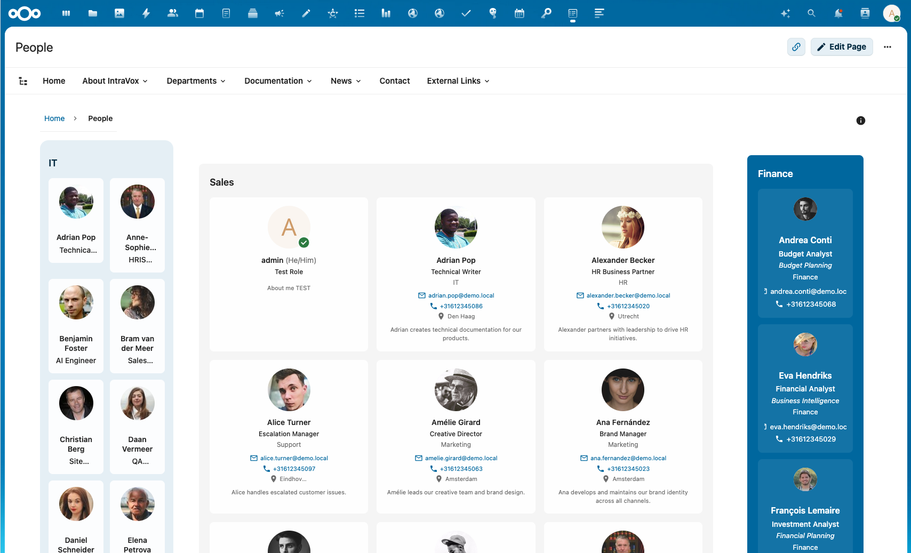
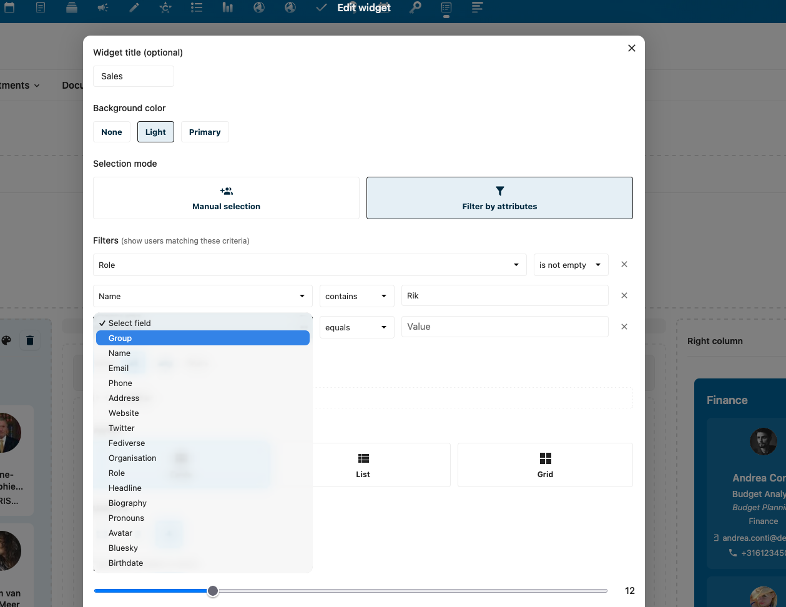
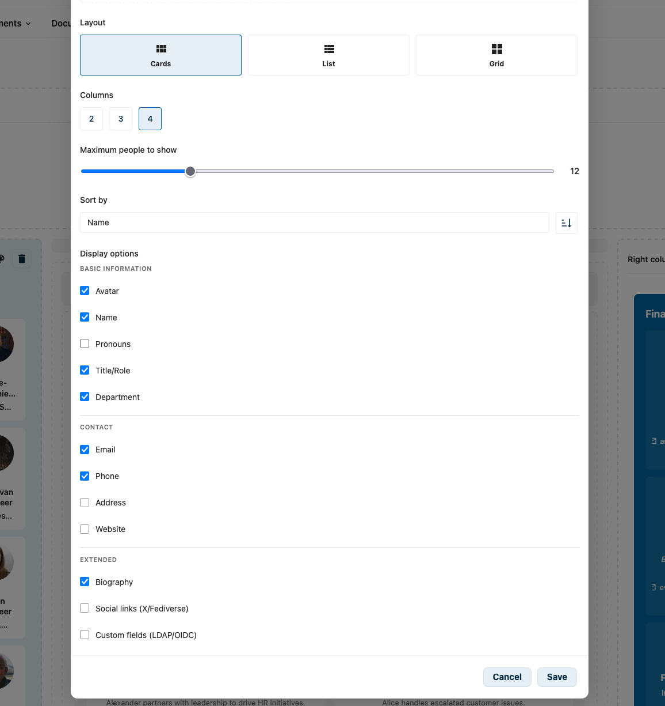
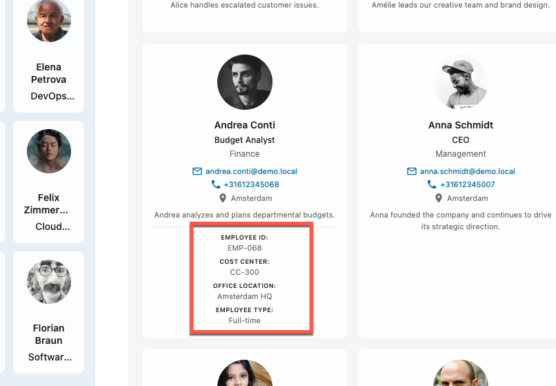

# People Widget

The People Widget displays user profiles from your Nextcloud instance. It's perfect for team pages, organization directories, department overviews, or any page where you want to showcase people.

## Features

- **Multiple layouts**: Card, List, or Grid view
- **Selection modes**: Manual selection or filter-based
- **Group filtering**: Show users from specific groups
- **Field filtering**: Filter by any user profile field
- **Customizable display**: Choose which profile fields to show
- **Sorting options**: Sort by name or email
- **Pagination**: "Show more" button when there are more people than the configured limit
- **Nextcloud integration**: Click avatars to see profiles, email, and availability
- **LDAP/OIDC support**: Custom fields from LDAP or OIDC are automatically detected

## Layouts

### Card Layout

Displays users in detailed cards with avatar, name, title, contact info, and optional biography. Best for showcasing individual team members with rich information.

### List Layout

Compact horizontal layout showing avatar, name, and key details in a row. Ideal for longer lists where space efficiency matters.

### Grid Layout

Minimal grid showing only avatars and names. Perfect for quick visual overviews of teams or departments.

## Configuration

To add a People Widget to your page:

1. Click **+ Add Widget** in edit mode
2. Select **People** from the widget picker
3. Configure the widget settings

### Settings

| Setting | Description |
|---------|-------------|
| **Widget title** | Optional title displayed above the widget |
| **Background color** | None, Light, or Primary color background |
| **Selection mode** | Manual selection or Filter by attributes |
| **Layout** | Card, List, or Grid |
| **Columns** | For Card/Grid layouts: 2, 3, or 4 columns |
| **Maximum people** | Limit the number of displayed users (1-50) |
| **Sort by** | Name or Email |
| **Sort order** | Ascending or Descending |

## Selection Modes

### Manual Selection

Select specific users to display:

1. Choose "Manual selection" mode
2. Search for users by name or email
3. Click to add users to the selection
4. Drag to reorder (order is preserved when sorting is disabled)

### Filter by Attributes

Automatically show users matching certain criteria:

1. Choose "Filter by attributes" mode
2. Click **+ Add filter**
3. Select a field (Group, Name, Email, Organisation, Role, etc.)
4. Choose an operator and value
5. Add more filters as needed

#### Available Filter Fields

Fields are organized in logical order matching the Display Options:

| Category | Fields |
|----------|--------|
| **Group** | Nextcloud group membership |
| **Basic Information** | Name, Pronouns, Role, Headline, Organisation |
| **Contact** | Email, Phone, Address, Website |
| **Extended** | Biography, Twitter/X, Fediverse |
| **Custom** | Additional LDAP/OIDC fields (Bluesky, Birthdate, etc.) |

#### Filter Operators

| Operator | Description | Available for |
|----------|-------------|---------------|
| **equals** | Exact match | All fields |
| **contains** | Partial match | Text fields |
| **does not contain** | Excludes partial match | Text fields |
| **is one of** | Match any of multiple values | Group field |
| **is not empty** | Field has any value | All fields |
| **is empty** | Field has no value | All fields |

#### Multiple Filters

When using multiple filters, choose how they combine:

- **Match all**: All filters must match (AND logic)
- **Match any**: At least one filter must match (OR logic)

#### Example: Show Marketing Team

1. Add filter: **Group** → **is one of** → select "Marketing"
2. Result: Shows all users in the Marketing group

#### Example: Show Managers

1. Add filter: **Role** → **contains** → "Manager"
2. Result: Shows users with "Manager" in their role field

#### Example: Exclude Interns

1. Add filter: **Role** → **does not contain** → "Intern"
2. Result: Shows users without "Intern" in their role

## Display Options

Control which information is shown for each user. Options are grouped into categories:

### Basic Information

| Field | Description | Default |
|-------|-------------|---------|
| **Avatar** | User profile picture | On |
| **Name** | Display name | On |
| **Pronouns** | User's pronouns (if set) | Off |
| **Role** | Official job title | On |
| **Headline** | Personal tagline | Off |
| **Department** | Department or team | On |

### Contact

| Field | Description | Default |
|-------|-------------|---------|
| **Email** | Email address (clickable) | On |
| **Phone** | Phone number (clickable) | Off |
| **Address** | Physical address | Off |
| **Website** | Personal website | Off |

### Extended

| Field | Description | Default |
|-------|-------------|---------|
| **Biography** | User bio (Card layout only) | Off |
| **Social links** | Twitter/X and Fediverse links | Off |
| **Custom fields** | Additional LDAP/OIDC fields | Off |

> **Note**: Some options are only available for certain layouts. For example, Address, Website, Social links, and Custom fields are hidden in Grid layout due to space constraints.

## Custom Fields (LDAP/OIDC)

When your Nextcloud is connected to LDAP, Active Directory, or OIDC, additional user profile fields may be available. The People Widget automatically detects these fields and makes them available for display.

Common custom fields include:

- Employee ID
- Cost Center
- Office Location
- Employee Type
- Manager
- Bluesky handle
- Birthdate

Enable "Custom fields (LDAP/OIDC)" in Display Options to show these fields on user cards. The widget automatically formats field names for readability (e.g., `employee_id` becomes "Employee Id").

## Pagination

When there are more users matching your filters than the configured "Maximum people to show" limit, the widget displays a pagination footer:

- Shows the count: "Showing 12 of 47 people"
- **Show more** button to load additional users
- Continues until all matching users are displayed

This allows you to set a reasonable initial limit while still providing access to the full list.

## Avatar Popup Menu

Clicking on a user's avatar opens Nextcloud's standard contact menu, providing:

- **View profile**: Opens the user's Nextcloud profile page
- **Email**: Send an email to the user
- **Show availability**: View the user's calendar availability (requires Calendar app)
- **User status**: See current status and custom message

This is standard Nextcloud functionality and works the same as avatar clicks elsewhere in Nextcloud.

## User Profile Fields

The People Widget displays data from Nextcloud user profiles. The available fields depend on your Nextcloud configuration:

### Standard Fields

These fields are available in all Nextcloud installations:

- Display name
- Email
- Phone
- Address
- Website
- Twitter/X handle
- Fediverse handle
- Organisation
- Role (job title)
- Headline (personal tagline)
- Biography
- Pronouns

### LDAP/Active Directory Fields

If your Nextcloud is connected to LDAP or Active Directory, additional fields may be available depending on your LDAP configuration. Common examples:

- Employee ID
- Department
- Manager
- Office location
- Cost center

### OIDC Fields

If using OpenID Connect for authentication, additional profile claims may be mapped to user fields.

## Group-Based Filtering

The most common use case is filtering by group membership:

### Single Group

Show all users from one group:

1. Add filter: **Group** → **equals** → select group

### Multiple Groups

Show users from any of several groups:

1. Add filter: **Group** → **is one of** → select multiple groups

### Combined with Other Filters

Show users from a group with additional criteria:

1. Add filter: **Group** → **equals** → "Engineering"
2. Add filter: **Role** → **contains** → "Lead"
3. Set to **Match all**
4. Result: Shows Engineering Leads only

## Background Colors

The People Widget supports three background color options:

| Option | Description |
|--------|-------------|
| **None** | Transparent background, blends with page |
| **Light** | Light gray background for subtle separation |
| **Primary** | Dark blue background (uses Nextcloud's primary color) |

When using a dark background (Primary), text colors automatically adjust for proper contrast.

## Tips

- **Performance**: Limit the number of users for better page load times, especially with many profile fields enabled
- **Privacy**: Consider which fields to display publicly. Phone numbers and addresses are disabled by default
- **Groups**: Create Nextcloud groups specifically for widget display (e.g., "Leadership Team", "Support Staff")
- **Profile completeness**: Encourage users to complete their Nextcloud profiles for richer People Widgets
- **Layouts**: Use Grid for large teams, Cards for small featured teams, List for directories
- **Pagination**: Set a reasonable limit (12-20) and let users load more if needed

## Requirements

- IntraVox 0.9.13 or higher
- Users must have Nextcloud accounts
- Group filtering requires users to be members of Nextcloud groups
- Calendar app required for "Show availability" in avatar popup
