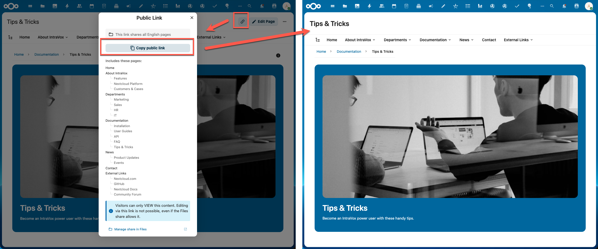
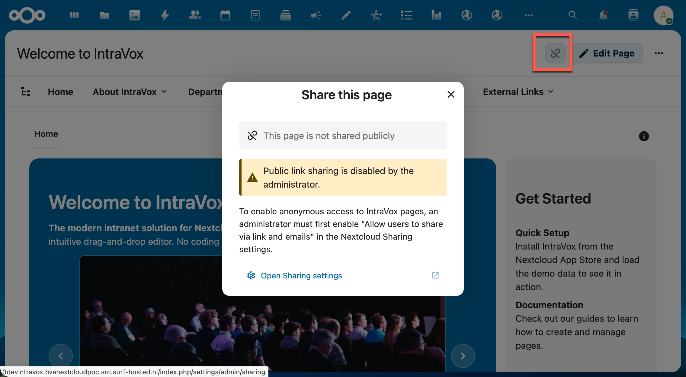
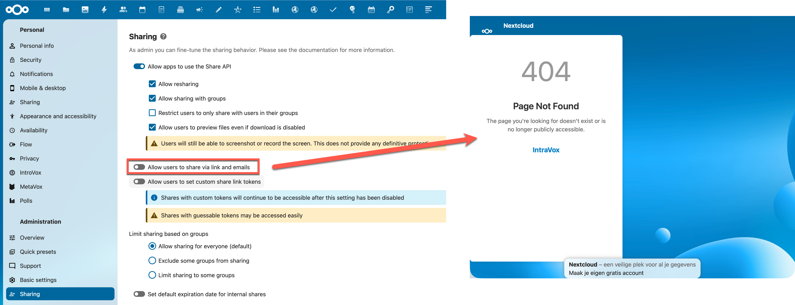
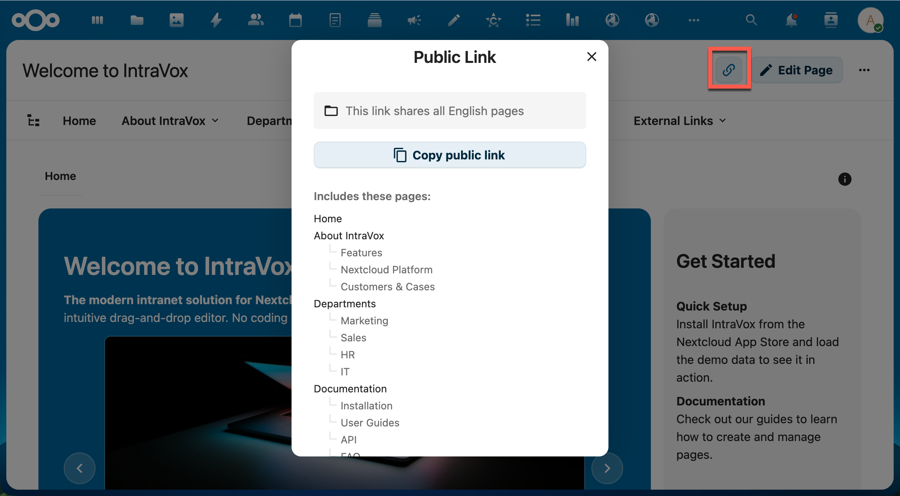
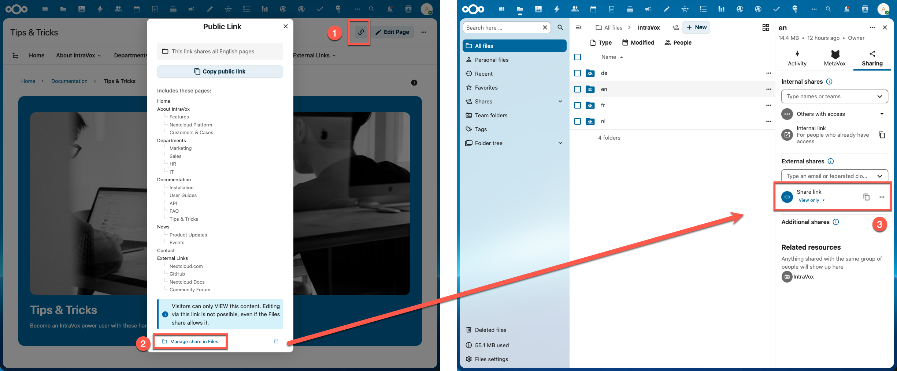
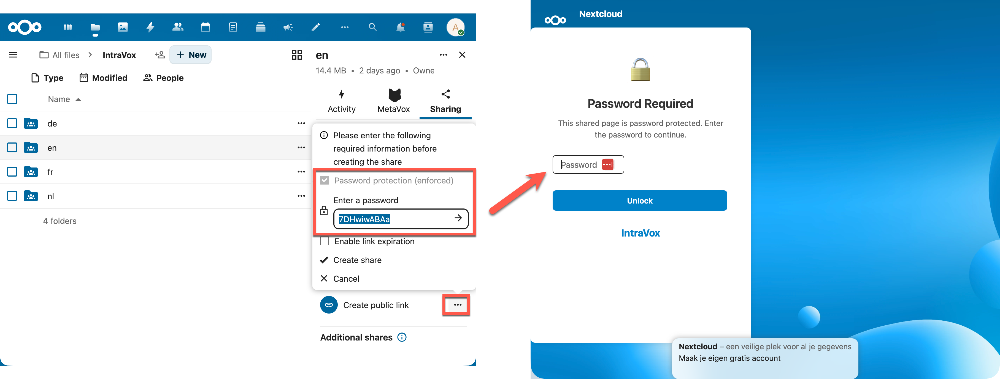
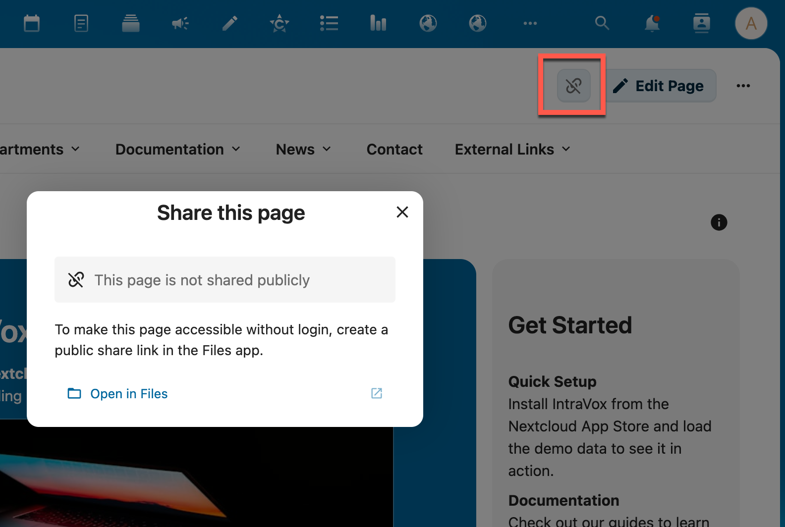

# Public Sharing

IntraVox pages can be shared with people who don't have a Nextcloud account. This guide explains how public sharing works, how to set it up, and what anonymous visitors can see.

**Audience:** IntraVox administrators and editors

---

## Overview

Public sharing allows you to make IntraVox pages accessible without login. Visitors see a clean, read-only view of your content — they cannot edit, comment, or react.

IntraVox uses Nextcloud's built-in share link system. You create a share link in the Files app on the IntraVox folder, and IntraVox automatically detects it and makes the content available.

*Left: The share dialog showing which pages are included. Right: The public view visitors see.*

---

## Prerequisites

Public sharing requires one Nextcloud setting to be enabled:

**Administration > Sharing > "Allow users to share via link and emails"**

If this setting is disabled, IntraVox will show a warning when you click the share button:

*When link sharing is disabled by the administrator, IntraVox shows a warning with a link to the Sharing settings.*

If link sharing is disabled while share links already exist, those links will stop working and visitors will see a 404 page:

*Left: The Nextcloud admin setting. Right: Existing share links return a 404 when disabled.*

---

## Creating a Share Link

Share links are created in the **Nextcloud Files app**, not in IntraVox itself.

### Step 1: Open the IntraVox folder in Files

Navigate to **Files > IntraVox** (your GroupFolder) and find the folder or page you want to share.

### Step 2: Create a share link

1. Click the share icon on the folder or file
2. Click **"Share link"** to create a public link
3. Optionally set a password, expiration date, or other settings

> **Note about passwords:** If you set a password on the share link, it is only shown once at creation time. After that, the password is stored as a bcrypt hash and cannot be retrieved. Make sure to note the password before closing the dialog. You can always set a new password in the Files app.

### Step 3: Verify in IntraVox

Go back to IntraVox and open a page within the shared scope. The share button in the top-right corner will now appear in the theme color, indicating the page is publicly shared.

*The share button (highlighted) shows the theme color when a share link exists. Click it to see the Public Link dialog with "Copy public link" button and a list of included pages.*

### Managing the Share

Click **"Manage share in Files"** at the bottom of the Public Link dialog to open the Files app where you can adjust settings like password protection, expiration dates, or remove the share entirely.

*Click "Manage share in Files" in IntraVox (left) to open the share settings in the Files app (right).*

---

## Share Scope

The scope of a share depends on what you share in the Files app:

| What you share | Scope | Example |
|---|---|---|
| A single page file (.json) | Only that page | Sharing `about.json` gives access to just the About page |
| A subfolder | That section and all sub-pages | Sharing `Departments/` gives access to Departments, Marketing, Sales, HR, IT |
| The language root folder | All pages in that language | Sharing `nl/` gives access to everything in Dutch |

The Public Link dialog shows exactly which pages are included in the share.

Anonymous visitors can only navigate between pages within the share scope. They cannot access pages outside of it, even if they try to guess URLs.

---

## Password-Protected Shares

If you set a password on a share link in the Files app, IntraVox fully respects this. Both the share dialog and the visitor experience reflect the password requirement.

*Left: Setting a password when creating a share link in the Files app. Right: The password challenge screen visitors see before accessing the content.*

### Indicator in the Share Dialog

When a share link has a password, the Public Link dialog in IntraVox shows a **"Password protected"** badge between the scope indicator and the copy button. This lets editors know that visitors will need a password to access the link.

The password itself is never shown — it is stored as a bcrypt hash and cannot be retrieved after creation. The badge includes a hint: *"Visitors must enter a password to access this link. Manage in Files."*

To change or remove the password, click **"Manage share in Files"** at the bottom of the dialog.

### Visitor Experience

When an anonymous visitor opens a password-protected share link, they see a password challenge screen before any content is loaded. This screen is rendered server-side (no JavaScript required) and shows:

- A lock icon
- "Password Required" heading
- A password input field with submit button
- An error message if the password is incorrect

After entering the correct password, the visitor is redirected to the shared content. The password is stored in the server-side PHP session, so the visitor can navigate freely between all pages within the share scope without entering the password again.

If the session expires (e.g., the visitor returns later), they will need to enter the password again.

### Security

- Passwords are verified using Nextcloud's `IHasher` (bcrypt) — the plain-text password is never stored
- Failed password attempts trigger brute force protection (max 10 attempts per minute per IP)
- A random delay (100–300ms) is added on failed attempts to prevent timing attacks
- The session key is scoped per share token (`intravox_share_pw_{token}`)

---

## Pages Without a Share Link

If no share link exists for a page, the share button appears in a muted color. Clicking it opens a dialog explaining how to create a share link:

*When no share link exists, IntraVox shows guidance with a direct link to the Files app.*

---

## What Anonymous Visitors See

Visitors accessing a shared link see a clean, read-only page:

- Page title and content (text, images, videos, tables, etc.)
- Navigation bar with pages within the share scope
- Breadcrumb navigation
- Page tree browser for finding pages
- Footer content (if configured)

The following features are **not available** for anonymous visitors:

- Editing pages
- Comments and reactions
- Version history
- Page settings
- Creating or deleting pages
- Access to pages outside the share scope

---

## Security

- **Read-only enforcement**: Even if the Nextcloud share grants write permissions, anonymous visitors always have read-only access in IntraVox
- **Password protection**: Share link passwords are fully respected — visitors must authenticate before any content is served (see [Password-Protected Shares](#password-protected-shares))
- **Rate limiting**: Public endpoints are limited to 60 requests per minute per IP address
- **Brute force protection**: Repeated failed access attempts are throttled by Nextcloud (both invalid tokens and wrong passwords)
- **Password brute force**: Password attempts are separately rate-limited (10 per minute per IP) with random delays
- **Scope enforcement**: Each page request is validated against the share scope — no access outside the shared folder
- **Session-based auth**: Password verification is stored server-side in the PHP session — the password is never sent to the browser or exposed in API responses
- **No metadata leakage**: Internal file paths, author information, and permissions are stripped from public responses

---

## Admin Overview

Administrators can see all active share links in **IntraVox Admin Settings > Sharing** tab. This overview shows:

- The scope of each share (page, folder, or language root)
- The file path
- Creation and expiration dates
- A direct link to manage each share in the Files app

This is useful for auditing which content is currently accessible without login.

---

## Quick Reference

| Action | Where |
|---|---|
| Enable/disable link sharing | Administration > Sharing settings |
| Create a share link | Files app > IntraVox folder > Share |
| Copy the public URL | IntraVox page > Share button > Copy public link |
| Manage share settings | IntraVox page > Share button > Manage share in Files |
| See all active shares | IntraVox Admin Settings > Sharing tab |
| Set/change password | Files app > Share settings |
| Set expiration date | Files app > Share settings |
| Check if share has password | IntraVox page > Share button (shows "Password protected" badge) |
