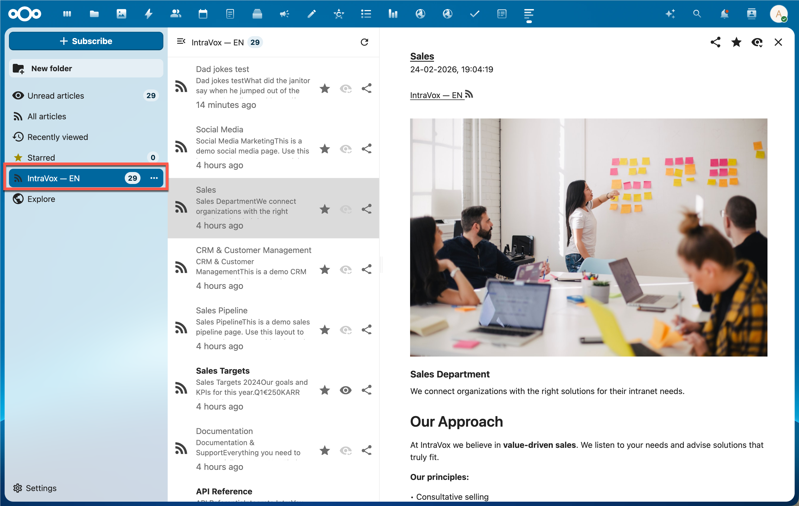
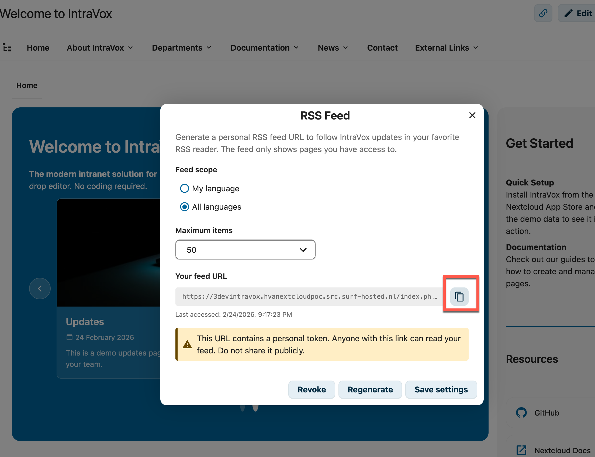
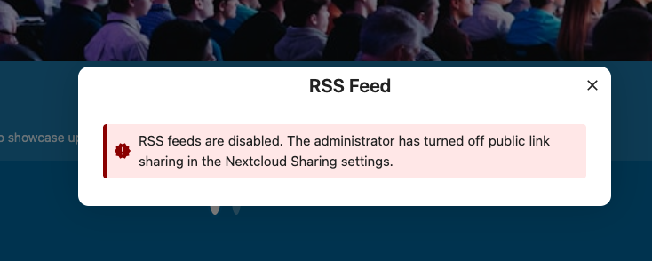

# IntraVox RSS Feed

IntraVox provides a personal RSS feed for each user, allowing them to follow intranet page updates in any RSS reader.



*IntraVox feed displayed in Nextcloud News with page content and images*

## Overview

- Each user can generate a personal feed token via the IntraVox UI
- The feed URL is public (no login required) but secured by a 64-character alphanumeric token
- Feed items include page titles, descriptions, full HTML content, and images
- The feed respects the user's page access permissions

## User Setup

### Generating a Feed URL

1. Open IntraVox
2. Click the three dots menu (⋯) in the top-right corner
3. Select **RSS Feed**


4. Choose your preferred settings:
   - **Feed scope**: "My language" or "All languages"
   - **Maximum items**: 10, 20, 30, or 50
5. Click **Generate Feed URL**



6. Copy the URL and add it to your RSS reader

### Feed Scope

| Scope | Description |
|-------|-------------|
| **My language** | Only pages from your current Nextcloud language folder (e.g., `en/`, `nl/`) |
| **All languages** | Pages from all available language folders |

When using "My language", the feed dynamically uses your current Nextcloud language setting. If you change your Nextcloud language, the feed automatically shows pages from the new language.

### Managing Your Feed

| Action | Description |
|--------|-------------|
| **Save settings** | Update scope and limit without changing the URL |
| **Regenerate** | Create a new token (old URL stops working) |
| **Revoke** | Delete the token entirely |

## Technical Details

### Feed Format

The feed is an RSS 2.0 feed with the following extensions:
- `atom:link` — Self-referencing feed URL
- `content:encoded` — Full page HTML content with inline images
- `media:thumbnail` — Page thumbnail image
- `media:content` — Page image metadata
- Standard `enclosure` — Page image for readers that support it

### Feed URL Structure

```
https://{nextcloud}/index.php/apps/intravox/feed/{token}
```

Where `{token}` is a 64-character alphanumeric string unique to each user.

### Media URL Structure

Images in the feed are served through a token-authenticated media endpoint:

```
https://{nextcloud}/apps/intravox/feed/{token}/media/{pageId}/{filename}
```

This allows RSS readers to display images without requiring Nextcloud authentication.

### Caching and Conditional Requests

The feed supports efficient polling:

| Header | Description |
|--------|-------------|
| `ETag` | MD5 hash of the feed content |
| `Last-Modified` | Timestamp of the most recently modified page |
| `Cache-Control` | `public, max-age=300, must-revalidate` (5 minutes) |

RSS readers that send `If-None-Match` or `If-Modified-Since` headers receive a `304 Not Modified` response when nothing has changed.

### Administrator Setup

The RSS feed requires two things to be configured correctly by the administrator:

1. **Nextcloud link sharing** must be enabled (global setting)
2. **GroupFolder permissions** must include both Read and Share on folders that should appear in the feed

#### Step 1: Enable Link Sharing

The RSS feed is functionally a public share link — it provides anonymous access to IntraVox content via a personal token. Therefore, Nextcloud's global link sharing setting must be enabled:

1. Go to **Nextcloud Admin Settings** → **Sharing**
2. Ensure **"Allow users to share via link and emails"** is enabled

If this setting is disabled:
- Users cannot generate new feed tokens
- Existing feed URLs return a 404 error
- The feed settings dialog shows a clear error message



*When link sharing is disabled by the administrator, the feed settings dialog shows an error message*

When the administrator re-enables link sharing, existing tokens (if not revoked) work again automatically.

#### Step 2: Configure GroupFolder Permissions

The RSS feed endpoint is a public page (no authenticated user session). In this context, GroupFolders requires both **Read** and **Share** permissions for a folder to be visible. Without Share permission, folders are hidden from feed requests and the feed will be empty.

**Base permissions (no ACL):**

If you are not using ACL (Advanced Permissions), set the base permissions for the user group to **Read + Share** on the IntraVox GroupFolder:

1. Go to **Admin** → **GroupFolders** (or **Team Folders**)
2. Find the "IntraVox" folder
3. For each user group, enable both **Read** and **Share** checkboxes

**With ACL (Advanced Permissions):**

If you are using ACL to restrict access to specific subfolders, the Share permission must be set at every level of the folder hierarchy that should be visible in the feed. A subfolder is only accessible if all its parent folders are also visible.

Example setup for a user group that should only see Marketing pages in the feed:

| Path | ACL Rule | Effect |
|------|----------|--------|
| IntraVox root | Read + Share (base permission) | Folder visible |
| `en/` | Read + Share | Language folder visible |
| `en/departments/` | Read + Share | Parent folder visible |
| `en/departments/marketing/` | Read + Share | Marketing pages appear in feed |
| `en/departments/hr/` | Deny all | Hidden from feed and IntraVox |
| `en/departments/sales/` | Deny all | Hidden from feed and IntraVox |

**Important rules:**
- A child folder cannot be visible if its parent folder is hidden
- ACL can only restrict permissions, never exceed the base GroupFolder permissions
- If a user reports an empty feed, check Share permission on the language folder(s) first — this is the most common cause

#### Troubleshooting Empty Feeds

| Symptom | Cause | Fix |
|---------|-------|-----|
| Feed returns empty (no items) | Missing Share permission on language folder | Add Share permission via ACL or base GroupFolder settings |
| Feed returns 404 | Link sharing disabled globally | Enable "Allow users to share via link and emails" in Nextcloud Sharing settings |
| Feed shows some pages but not all | ACL denies access to specific subfolders | Check ACL rules on the subfolder and all parent folders |
| Feed works for admin but not for regular users | Admin group has all permissions, user group missing Share | Add Share permission to the user group |

### Security

| Feature | Description |
|---------|-------------|
| **Token-based auth** | 64-character alphanumeric token |
| **Brute force protection** | Invalid tokens trigger Nextcloud's brute force throttling |
| **Rate limiting** | 30 feed requests per minute, 60 media requests per minute |
| **Timing-safe** | Invalid token responses include a random delay to prevent timing attacks |
| **Access control** | Feed only includes pages the user has permission to view |
| **Sharing policy** | Respects Nextcloud's "Allow users to share via link" admin setting |

### API Endpoints

| Method | Endpoint | Auth | Description |
|--------|----------|------|-------------|
| `GET` | `/apps/intravox/feed/{token}` | Public (token) | Get RSS feed XML |
| `GET` | `/apps/intravox/feed/{token}/media/{pageId}/{filename}` | Public (token) | Get feed media file |
| `GET` | `/apps/intravox/api/feed/token` | Session | Get current user's token info |
| `POST` | `/apps/intravox/api/feed/token` | Session | Generate/regenerate token |
| `DELETE` | `/apps/intravox/api/feed/token` | Session | Revoke token |
| `PUT` | `/apps/intravox/api/feed/config` | Session | Update feed configuration |

### Cross-Language Page Links

Feed items link to pages using the IntraVox hash URL format:

```
https://{nextcloud}/apps/intravox/#page-{uniqueId}
```

When a user clicks a feed link to a page in a different language than their Nextcloud setting, IntraVox automatically searches across all language folders to find the page. This ensures feed links always work regardless of the page's language.
