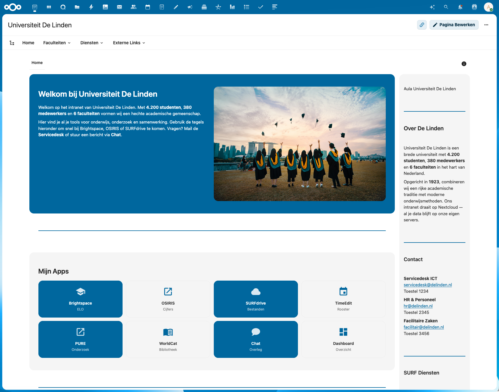
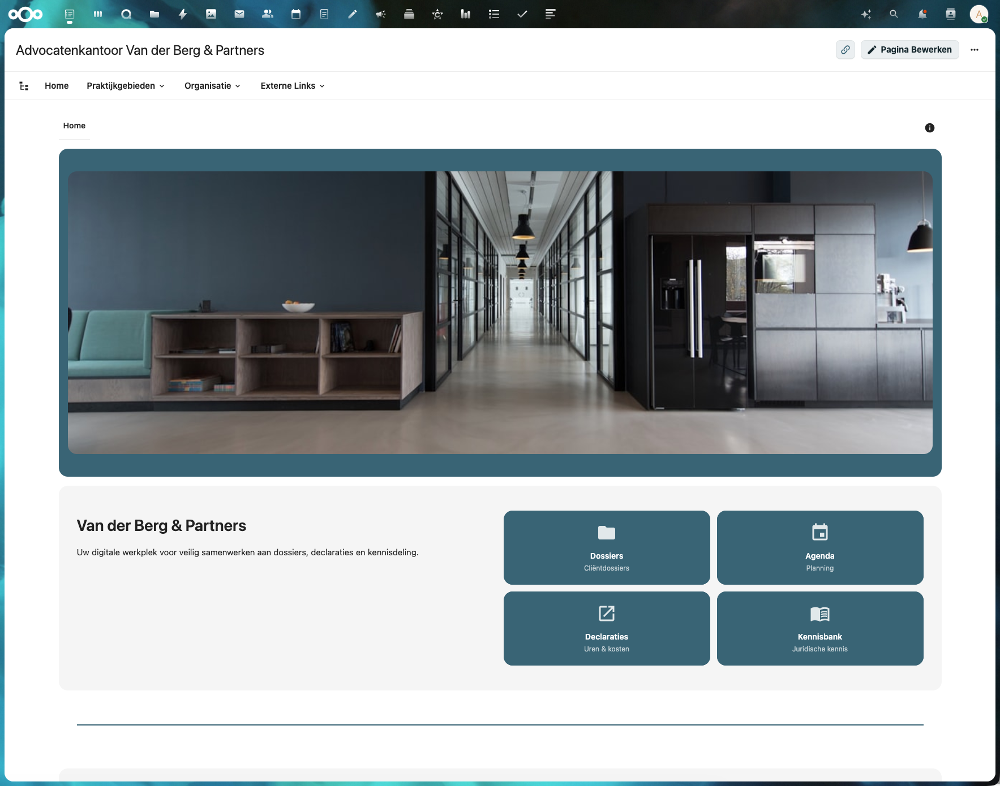
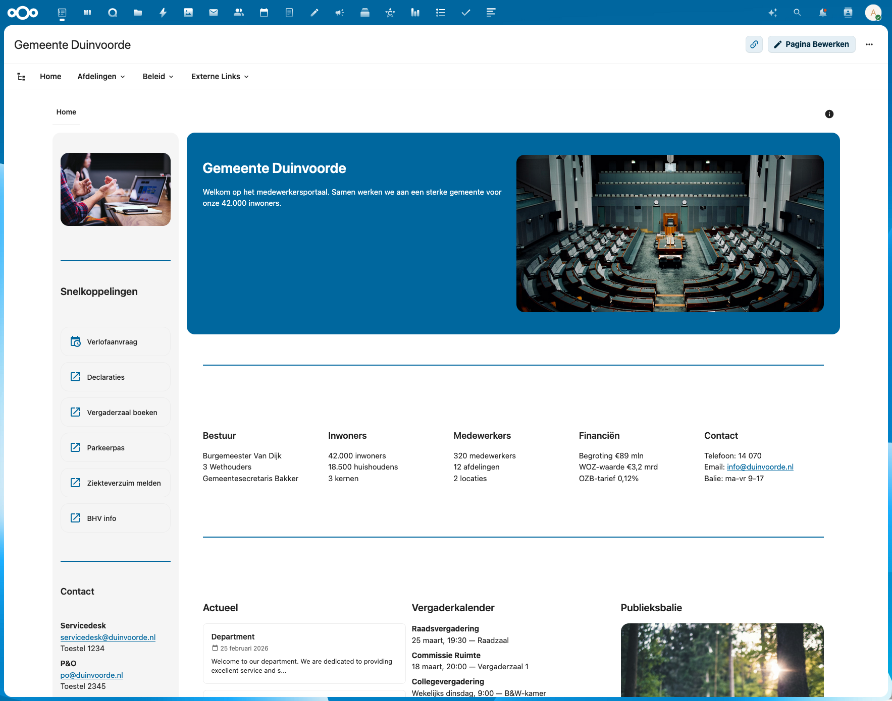
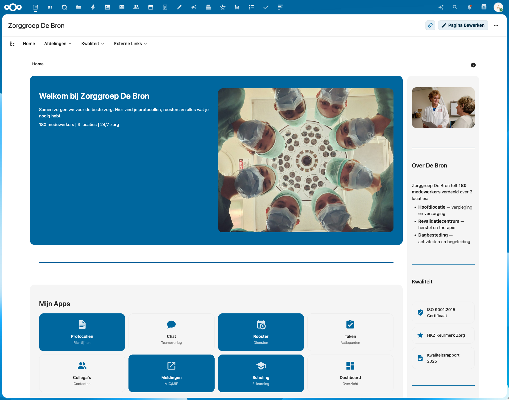
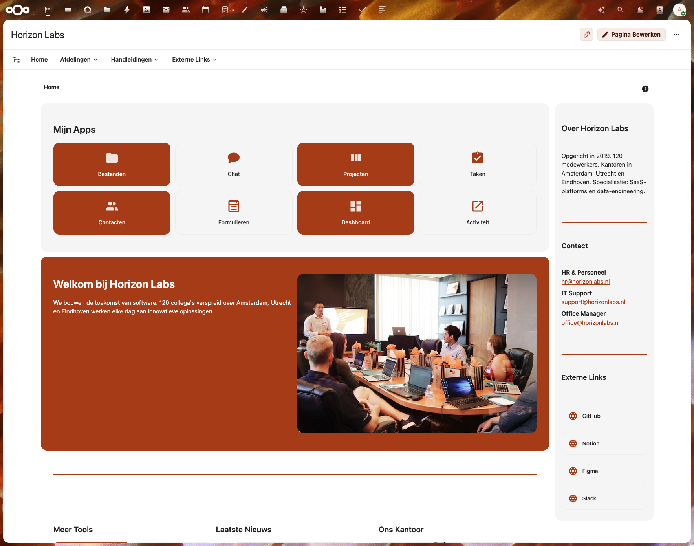

# IntraVox Showcases

## Overview

IntraVox ships with 5 demo showcases that demonstrate the full range of widget types, layout options, and content patterns. Each showcase represents a different organization type with realistic Dutch-language content.

## Showcases

### 1. de-linden — Universiteit De Linden



**Theme:** Higher education — academic, open, knowledge sharing

| Feature | Value |
|---------|-------|
| Columns | 1, 2, 3, 4 |
| Sidebars | Right |
| Header row | No |
| Photos | 4 (campus, library, aula, studenten) |

**Unique widgets:**
- Video widget (YouTube embed: campus tour)
- People widget (grid layout, 3 columns, filter mode)
- Links in both tiles and list layout
- 4-column row with mixed content (text, image, video)

**Content highlights:**
- Dutch university IT systems: Brightspace, OSIRIS, SURFdrive, TimeEdit, PURE, WorldCat
- SURF services in sidebar links (SURFnet, SURFdrive, SURFconext, eduroam)
- Collapsible onboarding and FAQ sections

---

### 2. van-der-berg — Advocatenkantoor Van der Berg & Partners



**Theme:** Legal — professional, premium, confidential

| Feature | Value |
|---------|-------|
| Columns | 1, 2, 3 |
| Sidebars | None |
| Header row | Yes (full-width office photo) |
| Photos | 3 (kantoor-header, vergaderruimte, kantoor) |

**Unique widgets:**
- Header row with full-width image
- News widget (grid layout, 2 columns)
- File widgets (3 downloadable documents)
- Dashed divider style

**Content highlights:**
- Legal practice areas: Ondernemingsrecht, Arbeidsrecht, Vastgoedrecht
- External legal resources: Rechtspraak.nl, KvK, Belastingdienst, Kadaster
- Multiple office locations (Amsterdam, Rotterdam, Den Haag)

---

### 3. gemeente-duin — Gemeente Duinvoorde



**Theme:** Government — transparent, service-oriented

| Feature | Value |
|---------|-------|
| Columns | 1, 2, 3, 5 |
| Sidebars | Left (only showcase with left sidebar) |
| Header row | No |
| Photos | 3 (gemeentehuis, vergadering, balie) |

**Unique widgets:**
- Left sidebar with quick links and contact info
- 5-column row (municipality statistics)
- News widget (list layout)
- Sidebar image at top

**Content highlights:**
- Municipality data: 42.000 inwoners, 320 medewerkers, 12 afdelingen
- Government links: VNG, Overheid.nl, KING, Waarstaatjegemeente.nl
- Council meeting schedule, public service desk hours

---

### 4. de-bron — Zorggroep De Bron



**Theme:** Healthcare — warm, practical, patient-centered

| Feature | Value |
|---------|-------|
| Columns | 1, 2, 4 |
| Sidebars | Right |
| Header row | No |
| Photos | 3 (zorgteam, verpleging, locatie) |

**Unique widgets:**
- People widget (card layout, 2 columns)
- Video widget (healthcare instruction video)
- File widgets (4 protocol documents)
- Dashed divider within content row
- 4-column department overview

**Content highlights:**
- Healthcare departments: Verpleging, Revalidatie, Dagbesteding, Thuiszorg
- Quality certifications: ISO 9001:2015, HKZ Keurmerk
- External healthcare links: RIVM, V&VN, IGJ, Vilans, ActiZ
- MIC/MIP incident reporting, scholingspunten

---

### 5. horizon-labs — Horizon Labs



**Theme:** Tech startup — modern, dynamic, innovative

| Feature | Value |
|---------|-------|
| Columns | 1, 2, 3 |
| Sidebars | Right |
| Header row | No |
| Photos | 2 (team, workspace) |

**Unique widgets:**
- News widget (carousel layout with autoplay)
- `var(--color-primary-element-light)` culture row
- Links tiles with alternating background colors

**Content highlights:**
- Tech tools: Collabora, Diagrammen, Tabellen, Peilingen
- Sprint reviews, hackathons, tech talks
- Offices in Amsterdam, Utrecht, Eindhoven

---

## Widget Coverage Matrix

| Widget | de-linden | van-der-berg | gemeente-duin | de-bron | horizon-labs |
|--------|-----------|-------------|---------------|---------|-------------|
| heading | x | x | x | x | x |
| text | x | x | x | x | x |
| image | x (4) | x (3) | x (3) | x (3) | x (2) |
| links (tiles) | x | x | x | x | x |
| links (list) | x | x | x | x | x |
| divider | x | x | x | x | x |
| divider (dashed) | | x | | x | |
| video | x | | | x | |
| news (list) | | | x | | |
| news (grid) | | x | | | |
| news (carousel) | | | | | x |
| people (grid) | x | | | | |
| people (card) | | | | x | |
| file | | x | | x | |
| collapsible | x | | x | x | x |
| header row | | x | | | |
| left sidebar | | | x | | |
| right sidebar | x | | | x | x |

## Technical Structure

Each showcase follows this file structure:

```
showcases/{name}/
├── export.json          # Full export with content wrapper (for import)
├── {name}.zip           # Ready-to-import ZIP file
├── *.jpg                # Source photos (Unsplash, royalty-free)
└── nl/
    ├── home.json        # Page data (without content wrapper)
    ├── navigation.json  # Megamenu navigation structure
    ├── footer.json      # Footer content
    └── _media/          # Photos for import (copied from root)
        └── *.jpg
```

### Export Format

The `export.json` wraps the page data for import:

```json
{
    "exportVersion": "1.3",
    "schemaVersion": "1.3",
    "exportDate": "2026-03-07T12:00:00.000Z",
    "exportedBy": "IntraVox Showcase - {Name}",
    "requiresMinVersion": "0.8.11",
    "language": "nl",
    "pages": [{
        "_exportPath": "home",
        "uniqueId": "page-...",
        "title": "...",
        "content": { /* full home.json content */ }
    }],
    "navigation": { /* navigation.json */ },
    "footer": { /* footer.json */ },
    "comments": []
}
```

### Background Colors

Showcases only use CSS variables that have proper text contrast handling:

| Variable | Appearance | Text color |
|----------|-----------|------------|
| `var(--color-primary-element)` | Theme primary (dark blue) | White (automatic) |
| `var(--color-primary-element-light)` | Light tint of primary | Dark (automatic) |
| `var(--color-background-hover)` | Light gray | Dark (automatic) |
| `rgba(0,0,0,0.05)` | Subtle gray | Dark |
| (empty string) | Transparent | Dark |

**Note:** Hex colors like `#1a3a5c` are technically supported by the backend but do NOT get automatic text color contrast. Always use CSS variables for proper theming.

### Image Handling

Images must be placed in the `nl/_media/` folder for the import to work correctly. The `src` field in image widgets contains just the filename (e.g., `"campus.jpg"`), not a full path. During import, files from `_media/` are copied to the page's media folder.

### People Widget Portability

People widgets use `selectionMode: "filter"` (not `"manual"`) so they work on any Nextcloud instance regardless of which user accounts exist. They automatically show available users.

## Importing a Showcase

1. Go to **Admin Settings** > **IntraVox** > **Import** tab
2. Upload the `{name}.zip` file
3. Enable "Overwrite existing pages" if replacing
4. Click **Import**
5. The showcase page, navigation, footer, and media are imported

## Creating New Showcases

When creating a new showcase:

1. Use only CSS variables for `backgroundColor` (no hex colors)
2. Place images in `nl/_media/` folder
3. Use `selectionMode: "filter"` for people widgets
4. Ensure all widget `column` values match the row's `columns` count
5. Include `export.json` (with content wrapper) and `nl/home.json` (without)
6. Test import on a clean installation

---

**Last Updated**: 2026-03-07
