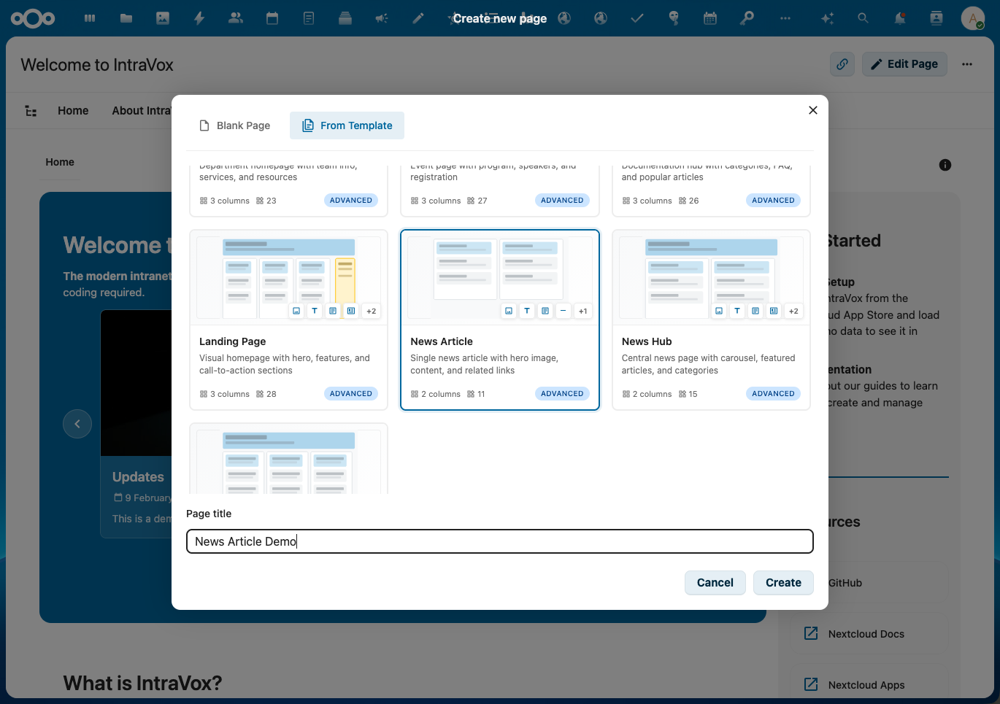

# Page Templates

Page Templates allow you to quickly create new pages with pre-built layouts and content structures. IntraVox includes 7 professional templates installed automatically during setup, and you can create your own custom templates.

## Features

- **Visual preview cards**: See the layout structure before selecting a template
- **Pre-built layouts**: Professional templates with columns, header rows, sidebars, and collapsible sections
- **Widget variety**: Templates use various widgets including heading, text, image, video, news, links, and divider
- **Stock images**: Templates include placeholder images that are copied to your new page
- **Multilingual support**: Template names and descriptions are translated (NL, EN, DE, FR)
- **Custom templates**: Save any page as a reusable template

## Creating a Page from a Template

1. Navigate to the folder where you want to create the new page
2. Click **+ New Page** in the navigation
3. Select a template from the gallery



4. Enter a title for your new page
5. Click **Create**


The page is created with all the template's content, layout, and images copied to the new location.


## Default Templates

IntraVox includes 7 professional templates:

### Department

A department homepage with team information, services overview, and resources.

| Section | Content |
|---------|---------|
| Header | Hero image with welcome message |
| Services | 3-column grid with service descriptions |
| Resources | Document links and contact information |
| Navigation | Links to other departments |

**Complexity**: Moderate | **Columns**: 3 | **Widgets**: 12

### Event

An event page with program schedule, speaker profiles, and registration information.

| Section | Content |
|---------|---------|
| Header | Event banner with title |
| Details | Date, time, location with promotional video |
| Program | Collapsible sections for schedule |
| Speakers | 3-column speaker profiles with photos |
| Registration | Call-to-action with registration link |

**Complexity**: Advanced | **Columns**: 3 | **Widgets**: 15+

### Knowledge Base

A documentation hub with categories, FAQ sections, and popular articles.

| Section | Content |
|---------|---------|
| Header | Knowledge base title and introduction |
| Categories | 3-column grid (Manuals, FAQ, Policies) |
| Popular Articles | News widget showing most viewed content |
| FAQ | Collapsible FAQ sections |
| Contact | Help desk contact information |

**Complexity**: Advanced | **Columns**: 3 | **Widgets**: 15+

### Landing Page

A visual homepage with hero section, features, sidebar, and call-to-action.

| Section | Content |
|---------|---------|
| Hero | Full-width hero image with heading |
| Highlights | News carousel with recent content |
| Features | 3-column feature highlights |
| About | 2-column about section with image |
| Sidebar | Quick links and announcements |
| CTA | Call-to-action section |

**Complexity**: Advanced | **Columns**: 3 | **Widgets**: 18+

### News Article

A single news article layout with hero image, content area, and related links.

| Section | Content |
|---------|---------|
| Header | Article hero image |
| Title | Article heading |
| Content | Main article text |
| Images | 2-column supporting images with captions |
| Related | Related articles links |

**Complexity**: Simple | **Columns**: 2 | **Widgets**: 8

### News Hub

A central news page with carousel, featured articles, and category navigation.

| Section | Content |
|---------|---------|
| Header | Hero banner with news title |
| Carousel | News widget with rotating articles |
| Categories | 4-column category navigation |
| Featured | 2-column featured articles |
| Links | Quick links to news sections |

**Complexity**: Moderate | **Columns**: 4 | **Widgets**: 10

### Project

A project management page with status updates, milestones, team members, and documents.

| Section | Content |
|---------|---------|
| Header | Project title and summary |
| Status | Project status with quick links |
| Objectives | Collapsible project goals |
| Milestones | Collapsible timeline |
| Team | 3-column team member profiles |
| Documents | Document links |

**Complexity**: Moderate | **Columns**: 3 | **Widgets**: 12

## Template Preview Cards

Each template displays a visual preview card showing:

- **Layout schematic**: SVG visualization of the column structure
- **Header row indicator**: Shows if template has a header section
- **Sidebar indicator**: Shows if template has a side column
- **Collapsible indicator**: Shows if template uses collapsible sections
- **Widget badges**: Icons showing which widget types are used
- **Complexity badge**: Simple, Medium, or Advanced
- **Statistics**: Column count and total widget count

## Creating Custom Templates

You can save any existing page as a template:

1. Open the page you want to use as a template
2. Click the **Save as Template** option in the page menu
3. The page is saved to your language's `_templates` folder
4. The template will appear in the "Create new page" dialog

### Template Storage

Templates are stored in the `_templates` folder for each language:

```
IntraVox/
├── en/
│   └── _templates/
│       ├── department/
│       ├── event/
│       └── my-custom-template/
├── nl/
│   └── _templates/
│       └── ...
```

## Administrator Notes

### Installing Default Templates

Default templates are installed automatically when running:

```bash
sudo -u www-data php occ intravox:setup
```

The setup command:
1. Creates `_templates` folders for each language
2. Copies the 7 default templates
3. Copies template images to each template's `_media` folder

### Template Requirements

A valid template must:
- Be located in a `_templates` folder
- Have a `page.json` file with `"isTemplate": true`
- Include referenced images in a `_media` subfolder

### Skipping Existing Templates

The setup command skips templates that already exist. To reinstall a default template:
1. Delete the template folder from `_templates`
2. Run `occ intravox:setup` again

## Translations

Template titles and descriptions are automatically translated based on the user's language setting. Translation keys follow this pattern:

- Title: `template_{template-id}_title`
- Description: `template_{template-id}_description`

For custom templates without translations, the original title from `page.json` is displayed.
