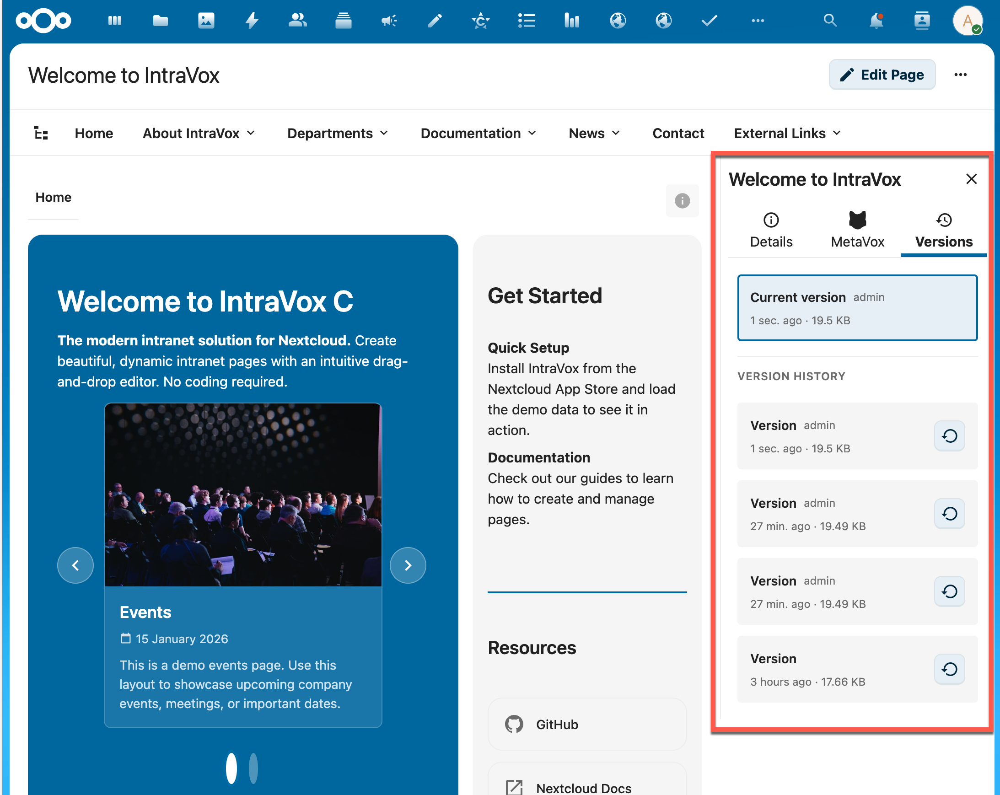
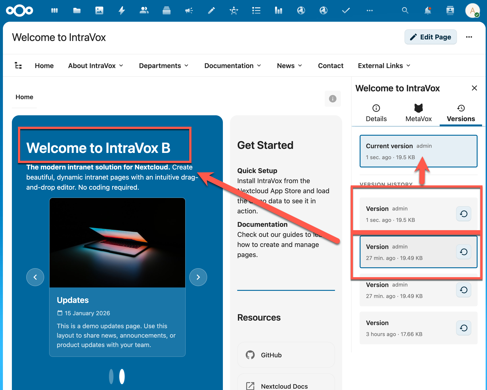
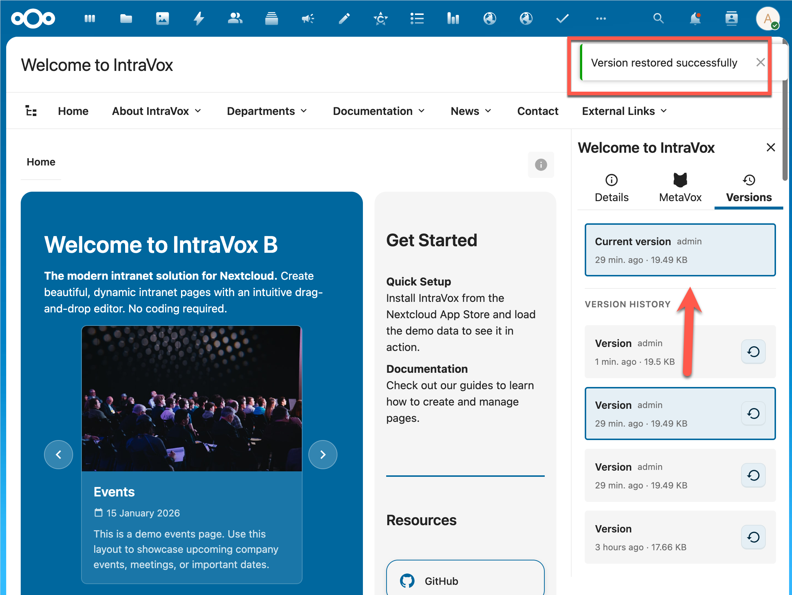

# IntraVox Versioning

IntraVox biedt ingebouwd versiebeheer voor alle pagina's, volledig geïntegreerd met Nextcloud's native versioning systeem en GroupFolders.

## Overzicht

Elke wijziging aan een IntraVox pagina wordt automatisch opgeslagen als een nieuwe versie. Dit maakt het mogelijk om:

- **Versiegeschiedenis bekijken** - Zie alle eerdere versies van een pagina
- **Versies vergelijken** - Bekijk de inhoud van oudere versies
- **Versies herstellen** - Zet een pagina terug naar een eerdere staat
- **Wijzigingen traceren** - Zie wie wanneer wijzigingen heeft gemaakt

## Hoe het werkt

### Technische Architectuur

IntraVox pagina's worden opgeslagen als JSON-bestanden in een Nextcloud GroupFolder. Het versiebeheer maakt gebruik van Nextcloud's ingebouwde `IVersionManager` API:

```
GroupFolder: IntraVox/
├── en/
│   ├── homepage.json          ← Huidige versie
│   └── .versions/
│       └── homepage.json/
│           ├── 1736934521     ← Versie van 15 jan 2026, 10:08
│           ├── 1736932860     ← Versie van 15 jan 2026, 09:41
│           └── ...
├── nl/
│   └── ...
└── _resources/                ← Gedeelde mediabibliotheek
```

### Voordelen van deze aanpak

1. **Consistentie met Nextcloud Files** - Dezelfde versioning als gewone bestanden
2. **Geen extra database** - Versies worden beheerd door Nextcloud zelf
3. **GroupFolder integratie** - Versiebeheer werkt automatisch binnen GroupFolders
4. **Betrouwbaar** - Gebruikt bewezen Nextcloud infrastructuur

## Gebruikersinterface

### Versions Tab

De versiegeschiedenis is beschikbaar via de **Versions** tab in de pagina-sidebar:



*De Versions tab toont de huidige versie bovenaan, gevolgd door de versiegeschiedenis. Elke versie toont de auteur, relatieve tijd ("1 sec. ago", "27 min. ago") en bestandsgrootte.*

### Versie Bekijken

Klik op een versie in de lijst om de inhoud te bekijken:



*Wanneer je een oudere versie selecteert, wordt de pagina-inhoud bijgewerkt om die versie te tonen. De titel in de header geeft aan welke versie je bekijkt.*

### Versie Herstellen

Klik op de **restore knop** (↺) naast een versie om deze te herstellen:



*Na het herstellen verschijnt een succesmelding. De herstelde versie wordt nu de "Current version" en de vorige huidige versie wordt automatisch opgeslagen in de versiegeschiedenis.*

## Versie Informatie

Elke versie toont de volgende informatie:

| Veld | Beschrijving |
|------|-------------|
| **Current version** | Label voor de actieve versie |
| **Auteur** | Gebruiker die de wijziging heeft gemaakt |
| **Relatieve tijd** | Tijd sinds de wijziging ("1 sec. ago", "2 hours ago", "3 days ago") |
| **Bestandsgrootte** | Grootte van het JSON-bestand (bijv. "19.5 KB") |

## Restore Flow

Wanneer je een versie herstelt, gebeurt het volgende:

```
1. Gebruiker klikt "Restore" op versie [X]
   ↓
2. Nextcloud maakt automatisch een backup van de huidige versie
   ↓
3. De geselecteerde versie [X] wordt de nieuwe huidige versie
   ↓
4. Versiegeschiedenis wordt bijgewerkt:
   - [Current] Herstelde versie (was [X])
   - [Version] Backup van vorige current (nieuw aangemaakt)
   - [Version] Andere historische versies
   ↓
5. Pagina-inhoud wordt herladen
   ↓
6. Succesmelding wordt getoond
```

## Integratie met Nextcloud Files

### GroupFolder Versioning

IntraVox maakt gebruik van dezelfde versioning als Nextcloud Files. Dit betekent:

- **Versiebeheer instellingen** worden gerespecteerd (max aantal versies, retentiebeleid)
- **Quota** wordt gedeeld met de GroupFolder quota
- **Beheerders** kunnen versies ook via de Files app bekijken

### Versies in Files App

De JSON-bestanden van IntraVox pagina's zijn ook zichtbaar in de Nextcloud Files app:

1. Ga naar **Files** → **IntraVox** GroupFolder
2. Navigeer naar de taalmap (bijv. `en/`)
3. Klik met rechts op een `.json` bestand
4. Kies **Versies** om de versiegeschiedenis te zien

> **Let op:** Het direct bewerken van JSON-bestanden via de Files app wordt afgeraden. Gebruik altijd de IntraVox editor.

## Configuratie

### Nextcloud Versioning Instellingen

De versioning van IntraVox volgt de algemene Nextcloud instellingen:

- **Versions app** moet geactiveerd zijn
- **GroupFolders** moet geïnstalleerd zijn
- Retentiebeleid wordt bepaald door Nextcloud configuratie

### Aanbevolen Instellingen

Voor optimaal versiebeheer in IntraVox:

```php
// config/config.php
'versions_retention_obligation' => 'auto',  // Automatisch versiebeheer
'version_expire_days' => 365,               // Versies bewaren voor 1 jaar
```

## Best Practices

### Voor Editors

1. **Regelmatig opslaan** - Elke save creëert een herstelpunt
2. **Betekenisvolle wijzigingen** - Groepeer gerelateerde wijzigingen in één save
3. **Controleer voor publicatie** - Bekijk de preview voordat je opslaat

### Voor Beheerders

1. **Monitor quota** - Versies tellen mee voor GroupFolder quota
2. **Retentiebeleid** - Configureer hoelang versies bewaard blijven
3. **Backup strategie** - Versioning is geen vervanging voor backups

## Beperkingen

- **Geen versie-labels** - Anders dan SharePoint ondersteunt Nextcloud geen custom versienummers (1.0, 2.0)
- **Geen major/minor versies** - Alle versies zijn gelijkwaardig
- **Geen vergelijkingsweergave** - Diff-weergave tussen versies is niet beschikbaar
- **Alleen JSON-inhoud** - Media in `_resources` heeft eigen versioning

## Veelgestelde Vragen

### Hoeveel versies worden bewaard?

Dit hangt af van de Nextcloud configuratie. Standaard bewaart Nextcloud versies volgens een exponentieel schema: meer recente versies worden vaker bewaard.

### Telt versioning mee voor mijn quota?

Ja, versies tellen mee voor de GroupFolder quota. Oude versies worden automatisch opgeruimd volgens het retentiebeleid.

### Kan ik versies permanent verwijderen?

Via de Nextcloud Files app kunnen beheerders specifieke versies verwijderen. Dit is niet mogelijk vanuit de IntraVox interface.

### Wat gebeurt er met media bij een restore?

Media (afbeeldingen, video's) in de `_resources` folder hebben hun eigen versioning. Bij het herstellen van een pagina worden media-bestanden niet automatisch teruggezet.

---

*Laatst bijgewerkt: Januari 2026 - IntraVox v0.8.8*
