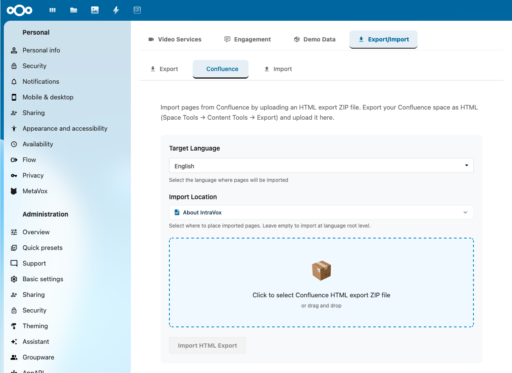

# Confluence-import

Importeer content vanuit Confluence (Cloud, Server of Data Center) naar IntraVox. Dit document beschrijft de import-workflow voor gebruikers, ondersteunde macro's en authenticatie-methoden, de onderliggende implementatie en de stabilisatie-fixes die na de MVP zijn doorgevoerd.

## Inhoudsopgave

1. [Gebruikershandleiding](#gebruikershandleiding)
2. [Ondersteunde macro's](#ondersteunde-macros)
3. [Problemen oplossen](#problemen-oplossen)
4. [Implementatie](#implementatie)
5. [Stabilisatie-fixes](#stabilisatie-fixes)

---

## Gebruikershandleiding

### Vereisten

- Beheerderstoegang tot je IntraVox-installatie
- Confluence-credentials met leesrechten op de space die je wilt importeren
- Een stabiele internetverbinding voor het downloaden van pagina's en bijlagen

### Ondersteunde Confluence-versies

IntraVox ondersteunt import vanuit:

- Confluence Cloud (Atlassian-hosted)
- Confluence Server (v7.x – 8.x)
- Confluence Data Center (Enterprise on-premise)

De importer detecteert je Confluence-versie automatisch op basis van de URL.

### Authenticatie-setup

**Confluence Cloud**

1. Maak een API-token aan via [Atlassian Account Security](https://id.atlassian.com/manage-profile/security/api-tokens). Geef het een label (bv. "IntraVox-import") en kopieer het token direct — het wordt daarna niet meer getoond.
2. Vereiste informatie:
   - Confluence-URL: `https://yoursite.atlassian.net/wiki`
   - E-mail: je Atlassian-account-e-mail
   - API-token

**Confluence Server (v7.9+)**

1. Navigeer in je Confluence-profiel naar "Personal Access Tokens" en maak een token aan met leesrechten.
2. Vereiste informatie:
   - Confluence-URL: `https://confluence.yourcompany.com`
   - Personal Access Token

**Confluence Server (legacy)**

Voor oudere Server-installaties zonder PAT-ondersteuning is basic authentication beschikbaar. Dit is minder veilig — gebruik bij voorkeur PATs.

- Confluence-URL, gebruikersnaam en wachtwoord

### Import-proces



*De Confluence-import staat onder **Instellingen → IntraVox → Export/Import → Confluence**. Kies de doel-taal en parent-pagina, en upload een HTML-export-ZIP vanuit Confluence (Space Tools → Content Tools → Export).*

1. **Open het import-paneel** — IntraVox-beheerpaneel → Instellingen → Export/Import → "Importeren vanuit Confluence".
2. **Configureer verbinding** — voer de Confluence-URL en credentials in. Het systeem detecteert automatisch Cloud vs Server.
3. **Test verbinding** — klik op "Test Connection" en verifieer het success-bericht inclusief de gedetecteerde versie.
4. **Laad spaces** — klik op "Load Spaces" en kies de te importeren space.
5. **Kies doel-taal** — kies welke IntraVox-taalmap (`nl`, `en`, `de`, `fr`) gebruikt wordt.
6. **Kies een parent-pagina** — kies de navigatie-locatie waaronder de geïmporteerde space verschijnt.
7. **Start import** — klik op "Import Space". Voortgang (pagina's geïmporteerd, media gedownload) is real-time zichtbaar. Sluit het browser-venster niet tijdens de import.
8. **Verifieer** — zodra de success-banner verschijnt, schakel naar de doel-taal in de hoofd-weergave en blader door de geïmporteerde pagina's.

### Import-performance

| Pagina's | Geschatte tijd | Opmerkingen |
|----------|----------------|-------------|
| 10 | ~30 seconden | Inclusief image-downloads |
| 50 | 2–3 minuten | Rate limiting kan optreden |
| 100 | 5–7 minuten | Let op timeouts |
| 500+ | 20+ minuten | Overweeg XML-backup-import |

Performance hangt af van het aantal pagina's, het aantal bijlagen, de response-tijd van de Confluence-server en de netwerksnelheid.

### Best practices

**Vóór import**

- Test eerst met een kleine space (5–10 pagina's) om conversie-kwaliteit te verifiëren.
- Ruim oude of gearchiveerde pagina's op in Confluence — je hoeft niet alles te importeren.
- Exporteer de huidige IntraVox-staat als je bestaande content hebt, en houd de Confluence-space bereikbaar tijdens de transitie.

**Na import**

- Controleer pagina-hiërarchie, verifieer dat afbeeldingen en bijlagen zijn geladen, test interne links.
- Maak niet-ondersteunde macro's handmatig opnieuw waar nodig (zie [Ondersteunde macro's](#ondersteunde-macros)).
- Configureer IntraVox-pagina-permissies — Confluence-permissies worden niet geïmporteerd.

---

## Ondersteunde macro's

### Volledig ondersteund

| Confluence-macro | Wordt geconverteerd naar | Opmerkingen |
|------------------|--------------------------|-------------|
| Info-paneel | Tekst-widget met blauwe styling | Titel en content behouden |
| Note-paneel | Tekst-widget met grijze styling | Titel en content behouden |
| Warning-paneel | Tekst-widget met oranje styling | Titel en content behouden |
| Tip-paneel | Tekst-widget met groene styling | Titel en content behouden |
| Error-paneel | Tekst-widget met rode styling | Titel en content behouden |
| Code-block | Tekst-widget met syntax-highlighting | 30+ talen ondersteund |
| Afbeeldingen | Image-widget | Gedownload en embedded |
| Bijlagen | File-widget | Gedownload en gelinkt |
| Expand/Collapse | HTML5 `<details>`-element | Native browser-ondersteuning |

### Gedeeltelijk ondersteund

| Macro | Wordt geconverteerd naar | Beperkingen |
|-------|--------------------------|-------------|
| Table of Contents | Placeholder-tekst | Handmatig opnieuw maken |
| Attachments List | Placeholder-tekst | Individuele bestanden worden geïmporteerd |

### Niet ondersteund

De volgende macro's worden geconverteerd naar een placeholder-tekstblok met de oorspronkelijke macronaam:

- Jira Issue-macro
- Include Page-macro
- Roadmap-macro
- Custom/third-party macro's

### Code-block-talen

De code-macro ondersteunt syntax-highlighting voor JavaScript, TypeScript, Node.js, PHP, Python, Ruby, Perl, Java, C, C++, C#, Go, Rust, Scala, HTML, CSS, SCSS, SASS, SQL, JSON, YAML, XML, Bash, PowerShell en 15+ meer.

---

## Problemen oplossen

### Verbinding mislukt

Mogelijke oorzaken en oplossingen:

- Verifieer dat de Confluence-URL correct en bereikbaar is vanuit je browser.
- Controleer dat credentials geldig zijn; voor Cloud, zorg dat het API-token niet verlopen is.
- Voor Server, verifieer firewall- en netwerk-toegang van de Nextcloud-server naar Confluence.

### Geen spaces in lijst

- Verifieer dat je leesrechten hebt op minstens één space.
- Controleer Confluence-permissies en beheerder-restricties.
- Probeer alternatieve credentials.

### Import faalt halverwege

- Check Confluence rate limits — Cloud staat standaard 100 requests/minuut toe.
- Verifieer een stabiele internetverbinding.
- Probeer een kleinere space eerst om het probleem te isoleren.
- Check IntraVox-server-logs (Nextcloud `nextcloud.log`) voor specifieke errors.

### Ontbrekende afbeeldingen of bijlagen

Veelvoorkomende oorzaken:

- Bijlage-download-URLs niet toegankelijk vanaf de Nextcloud-server
- Netwerk-timeout tijdens download
- Onvoldoende opslag in de doel-GroupFolder

Oplossingen:

- Voer de import opnieuw uit met dezelfde instellingen; bestaande pagina's worden overgeslagen, ontbrekende media opnieuw geprobeerd.
- Upload ontbrekende bijlagen handmatig naar de `_media/`-map van de pagina.
- Check server-logs voor specifieke download-errors.

### Rate limiting

Confluence Cloud beperkt API-requests tot ~100/minuut per gebruiker. Bij het bereiken van de limiet:

- Wacht een minuut en probeer opnieuw — limieten resetten.
- Importeer kleinere spaces achter elkaar in plaats van één grote space.
- Enterprise Atlassian-abonnementen staan hogere limieten toe — neem contact op met Atlassian.

### JavaScript-module-load-error na update

Als je na een IntraVox-update `TypeError: can't access property "call", n[e] is undefined` ziet, heeft je browser oude JavaScript gecached:

- Mac: Cmd + Shift + R
- Windows/Linux: Ctrl + Shift + R

### Macro's tonen als niet-ondersteund

Voor macro's onder "Niet ondersteund" of "Gedeeltelijk ondersteund", maak de content handmatig opnieuw in IntraVox. Als een macro die je veel gebruikt nog niet ondersteund wordt, dien een feature request in op [GitHub Issues](https://github.com/nextcloud/IntraVox/issues).

---

## Implementatie

### Status

Confluence-import is geïmplementeerd voor Cloud-, Server- en Data-Center-edities, met automatische versie-detectie en drie authenticatie-methoden. De MVP is uitgebracht in IntraVox 0.8.0 (december 2025).

### Architectuur

```
Confluence Cloud / Server / DC
         ↓
ConfluenceApiImporter
  - Haalt pagina's op via REST-API
  - Parsed Storage Format (XHTML)
  - Verwerkt macro's (plugin-systeem)
         ↓
IntermediateFormat
  - Genormaliseerde pagina-structuur
  - Content-blokken (heading, html, code, panel, image, etc.)
  - Media-download-lijst
         ↓
AbstractImporter
  - Converteert blokken → IntraVox-widgets
  - Bouwt layout-structuur op
         ↓
Export-JSON + ZIP
  - Standaard IntraVox-export-format
  - Media-bestanden in _media-mappen
         ↓
ImportService
  - Schrijft pagina's naar GroupFolder
  - Importeert navigatie/footer
  - Triggert file-cache-scan
```

### Bestandsstructuur

```
IntraVox/
├── css/
│   └── confluence-panels.css                  # Confluence-paneel-styles
├── lib/Service/Import/
│   ├── IntermediateFormat.php                 # Datastructuren
│   ├── AbstractImporter.php                   # Base-importer-class
│   ├── HtmlToWidgetConverter.php              # HTML → Widget-converter
│   ├── ConfluenceImporter.php                 # Storage-Format-parser
│   ├── ConfluenceApiImporter.php              # REST-API-client
│   └── Confluence/Macros/
│       ├── MacroHandlerInterface.php          # Plugin-interface
│       ├── ConversionContext.php              # Helper-class
│       ├── PanelMacroHandler.php              # Info/Note/Warning/Tip
│       ├── CodeMacroHandler.php               # Code-blokken
│       ├── AttachmentMacroHandler.php         # Afbeeldingen/Bestanden
│       ├── ExpandMacroHandler.php             # Expand/Collapse
│       └── DefaultMacroHandler.php            # Niet-ondersteund fallback
└── src/admin/components/
    └── ConfluenceImport.vue                   # Frontend-component
```

Gewijzigde bestaande bestanden: `lib/Controller/ImportController.php` (3 Confluence-methodes toegevoegd), `appinfo/routes.php` (3 routes geregistreerd), `src/components/AdminSettings.vue` (component embedded).

### API-endpoints

**Test Connection** — `POST /apps/intravox/api/import/confluence/test`

```json
{
  "baseUrl": "https://yoursite.atlassian.net/wiki",
  "authType": "api_token",
  "authUser": "user@example.com",
  "authToken": "your-token"
}
```

Response:

```json
{ "success": true, "version": "cloud", "user": "John Doe" }
```

**List Spaces** — `POST /apps/intravox/api/import/confluence/spaces` (zelfde request-body als test connection)

```json
{
  "success": true,
  "spaces": [
    { "key": "DEMO", "name": "Demo Space", "type": "global", "description": "Voorbeeld-space" }
  ]
}
```

**Import Space** — `POST /apps/intravox/api/import/confluence`

```json
{
  "baseUrl": "https://yoursite.atlassian.net/wiki",
  "authType": "api_token",
  "authUser": "user@example.com",
  "authToken": "your-token",
  "spaceKey": "DEMO",
  "language": "nl"
}
```

Response:

```json
{
  "success": true,
  "stats": { "pagesImported": 25, "mediaFilesImported": 10, "commentsImported": 0 }
}
```

### Macro-handler-systeem

```php
interface MacroHandlerInterface {
    public function supports(string $macroName): bool;
    public function convert(DOMElement $macro, ConversionContext $context): array;
}
```

Geregistreerde handlers (prioriteit-volgorde): PanelMacroHandler → CodeMacroHandler → AttachmentMacroHandler → ExpandMacroHandler → DefaultMacroHandler.

### Confluence-versie-detectie

Cloud-detectie via URL:

```php
if (str_contains($baseUrl, '.atlassian.net')) {
    return 'cloud';
}
```

Server/Data-Center-detectie via API:

```php
GET /rest/api/settings/systemInfo

if ($info['isDataCenter']) {
    return 'datacenter';
} else {
    return 'server';
}
```

### Authenticatie-methoden

1. **API-token (Cloud)** — `Authorization: Basic base64(email:token)`
2. **Personal Access Token (Server v7.9+)** — `Authorization: Bearer <token>`
3. **Basic Auth (Server legacy)** — `Authorization: Basic base64(username:password)`

### Macro-conversie-tabel

| Confluence-macro | IntraVox-widget | Implementatie |
|------------------|------------------|---------------|
| `<ac:structured-macro ac:name="info">` | Tekst | `PanelMacroHandler` → HTML met `.confluence-panel-info`-class |
| `<ac:structured-macro ac:name="note">` | Tekst | `PanelMacroHandler` → `.confluence-panel-note`-class |
| `<ac:structured-macro ac:name="warning">` | Tekst | `PanelMacroHandler` → `.confluence-panel-warning`-class |
| `<ac:structured-macro ac:name="tip">` | Tekst | `PanelMacroHandler` → `.confluence-panel-tip`-class |
| `<ac:structured-macro ac:name="code">` | Tekst | `CodeMacroHandler` → `<pre><code class="language-X">` |
| `<ac:image>` | Image | `AttachmentMacroHandler` → Image-widget met download-tracking |
| `<ac:structured-macro ac:name="expand">` | Tekst | `ExpandMacroHandler` → HTML5 `<details><summary>` |
| Onbekende macro's | Tekst | `DefaultMacroHandler` → placeholder met macronaam |

### Rate limiting

Client-side throttling zit in `ConfluenceApiImporter::enforceRateLimit()` en staat standaard op 100 requests/minuut, gelijk aan de per-gebruiker-limiet van Confluence Cloud. Enterprise-plannen kunnen hogere limieten afspreken.

```php
private function enforceRateLimit(): void {
    $this->requestCount++;

    if ($this->requestCount >= $this->maxRequestsPerMinute && $elapsed < 60) {
        $sleepTime = (int)((60 - $elapsed) * 1000000);
        usleep($sleepTime);
        $this->requestCount = 0;
    }
}
```

### CSS-classes

Confluence-paneel- en code-block-styling staat in `css/confluence-panels.css`:

```css
.confluence-panel-info    { border-left-color: #0065FF; background-color: #E6F2FF; }
.confluence-panel-note    { border-left-color: #6B778C; background-color: #F4F5F7; }
.confluence-panel-warning { border-left-color: #FF991F; background-color: #FFF7E6; }
.confluence-panel-tip     { border-left-color: #00875A; background-color: #E3FCEF; }
.confluence-panel-error   { border-left-color: #DE350B; background-color: #FFEBE6; }

.confluence-code-block {
    background-color: #F4F5F7;
    border: 1px solid #DFE1E6;
    font-family: 'Monaco', 'Menlo', 'Ubuntu Mono', 'Consolas', monospace;
}
```

### Bekende beperkingen

1. **Bijlage-download** — momenteel een placeholder in `ImportController::downloadConfluenceMedia()`. Workaround: handmatige bijlage-upload na import. Pending: page-ID-tracking in `IntermediateFormat` voor bijlage-URLs.
2. **Table of Contents-macro** — alleen placeholder; IntraVox heeft geen ingebouwde TOC-widget. Maak handmatig opnieuw met een links-widget.
3. **Confluence-comments** — niet geïmporteerd. Gebruik in plaats daarvan IntraVox' native comment-systeem.
4. **Pagina-permissies** — niet geïmporteerd. Confluence en IntraVox hebben verschillende permissie-modellen. Configureer GroupFolder-ACL na import.

### Toekomstige uitbreidingen

- Confluence XML-backup-import (offline imports zonder API-toegang)
- Aanvullende macro's: Table of Contents (gegenereerd uit headings), Tabs (accordion-fallback), Jira-issues (link-behoud)
- Volledige bijlage-download met retry-logica en per-bestand-voortgang
- Incrementele sync (track geïmporteerde pagina's op modified date, update alleen gewijzigde pagina's)
- UI-uitbreidingen: pagina-preview vóór import, selectieve pagina-import, scheduling

### Dependencies

- **PHP**: GuzzleHttp/Guzzle (HTTP-client), DOMDocument (XML/HTML-parsing), ZipArchive
- **JavaScript**: @nextcloud/axios, @nextcloud/router, @nextcloud/vue
- **IntraVox-services**: ImportService, PageService, SetupService

### Beveiliging

- Credentials worden bij elke request meegestuurd; toekomstig werk moet ze versleuteld opslaan in Nextcloud-app-config.
- HTML-sanitization is whitelist-based.
- Bestandstype-check voor bijlagen wordt afgedwongen.
- API-endpoints gebruiken `@NoCSRFRequired` (bewust voor het API-oppervlak) maar vereisen authenticatie (`@NoAdminRequired`).

### Referenties

- [Confluence Cloud REST API](https://developer.atlassian.com/cloud/confluence/rest/v1/)
- [Confluence Server REST API](https://docs.atlassian.com/confluence/REST/latest/)
- [Confluence Storage Format](https://confluence.atlassian.com/doc/confluence-storage-format-790796544.html)

---

## Stabilisatie-fixes

De MVP is uitgebracht in december 2025; de volgende kritieke fixes zijn doorgevoerd tijdens initieel productie-gebruik om correcte pagina-structuur, hiërarchie-behoud en navigatie-integratie te waarborgen.

### 1. Uitlijning pagina-map-structuur

**Probleem**: geïmporteerde pagina's maakten platte `page.json`-bestanden in mappen, niet matchend met IntraVox' native patroon.

**Verwacht** (matchend met `PageService::createPageAtPath`):

```
{pageId}/
  {pageId}.json
  _media/
    .nomedia
```

**Fix**: `ImportService.php` (regels 230–348) repliceert nu het exacte patroon uit `PageService.php`. De home-pagina is een special case: `home.json` direct in de taalmap.

### 2. Navigatie-integratie

**Probleem**: geïmporteerde pagina's werden niet toegevoegd aan de site-navigatie en waren onzichtbaar in het menu.

**Fix**: een navigatie-update-pipeline is toegevoegd aan `ImportService.php` (regels 723–849):

- `updateNavigationWithImportedPages()` — orchestreert de navigatie-update
- `buildPageTree()` — bouwt een hiërarchische boom uit de platte geïmporteerde pagina-lijst
- `findNavigationItemPath()` — lokaliseert het parent-item in de navigatie-boom (geeft een pad van indexen terug)
- `getNavigationItemByPath()` — resolveert een pad naar een item-referentie
- `addPagesToNavigation()` — voegt pagina's in op de geresolvede locatie

Algoritme: laad huidige `navigation.json` voor de taal → bouw boom uit geïmporteerde pagina's → vind parent-item-pad → voeg pagina's toe als children van parent → sla geüpdatete navigatie op.

### 3. uniqueId-format (404-errors gefixt)

**Probleem**: geïmporteerde pagina's gebruikten `page_`-prefix, maar `PageService::checkOriginalId()` verwacht `page-`, wat 404's bij het laden veroorzaakte.

**Fix**: `IntermediateFormat.php` regel 57 gewijzigd van `uniqid('page_', true)` naar `uniqid('page-', true)`.

### 4. PHP-reference-syntax-error

**Probleem**: een typed return met `return &$item` veroorzaakte `syntax error, unexpected token "&"` op regel 805.

**Fix**: gerefactord naar pad-gebaseerd traversal (`findNavigationItemPath` geeft indexen terug, `getNavigationItemByPath` resolveert ze), wat het typed-return-by-reference-issue vermijdt. Code in `ImportService.php` regels 803–829.

### 5. Behoud pagina-volgorde

**Probleem**: geïmporteerde pagina's behielden hun Confluence-export-volgorde niet.

**Fix**: volgorde wordt geëxtraheerd uit `index.html` van de Confluence-export. Pagina's krijgen een `confluenceOrder`-veld in hun metadata, behouden in zowel de navigatie-boom als de pagina-structuur. Het sorteer-algoritme respecteert eerst hiërarchie, dan volgorde. Zie `ConfluenceHtmlImporter.php` regels 411–456 en 533–536.

### 6. HTML-opschoning

**Probleem**: sommige pagina's toonden ruwe HTML — wees-`</p>`-tags, breadcrumbs, zoek-formulieren.

**Fix**: geavanceerde parsing in `ConfluenceHtmlImporter.php` (regels 297–416) met DOMDocument en XPath:

- Verwijdert Confluence-navigatie-elementen (breadcrumbs, zoek-formulieren)
- Ruimt wees-tags op (closing tags zonder matching opens)
- Verwijdert lege elementen

### 7. uniqueId-format-consistentie (UUID v4)

**Probleem**: na fix #3 produceerde `uniqid('page-', true)` IDs met embedded dots zoals `page-66b8c12a.87654321`, terwijl native IntraVox-creatie RFC-4122 UUID v4 genereert: `page-a1b2c3d4-e5f6-4789-abcd-ef1234567890`.

**Fix**: `generateUUID()` toegevoegd aan `IntermediatePage` (RFC-4122 compliant). Import gebruikt nu hetzelfde UUID-v4-format als native pagina-creatie. Zie `IntermediateFormat.php` regels 57, 60–76.

Voordelen: consistent ID-format door de hele applicatie, industry-standard uniciteits-garantie, betere leesbaarheid (geen embedded dots).

### Helper-functies toegevoegd tijdens stabilisatie

- `createMediaFolderMarker()` — maakt `.nomedia`-marker-bestand
- `getRelativePath()` — berekent relatief pad tussen twee mappen
- `updateNavigationWithImportedPages()` — orchestreert navigatie-update
- `buildPageTree()` — bouwt hiërarchische boom uit platte pagina-lijst
- `findNavigationItemPath()` / `getNavigationItemByPath()` — pad-gebaseerde navigatie
- `addPagesToNavigation()` — voegt pagina's in in de navigatie-array
- `extractPageOrderFromIndex()` — parsed Confluence-export-volgorde
- `removeUnwantedElements()` / `cleanupHtml()` — DOM-gebaseerde opschoning
- `generateUUID()` (op `IntermediatePage`) — RFC-4122 UUID-v4-generator

### Verificatie-checklist na fixes

Na een harde browser-refresh (Cmd/Ctrl + Shift + R):

- [ ] Importeer een Confluence-HTML-ZIP
- [ ] Verifieer map-structuur `{pageId}/{pageId}.json`
- [ ] Verifieer dat `_media/`-mappen bestaan met `.nomedia`-marker
- [ ] Verifieer dat pagina's verschijnen in navigatie op het juiste niveau
- [ ] Verifieer dat hiërarchie behouden is uit Confluence
- [ ] Verifieer dat pagina-volgorde matched met de Confluence-export-volgorde
- [ ] Verifieer dat pagina's laden zonder 404-errors
- [ ] Verifieer dat parent-child-relaties correct zijn
- [ ] Verifieer dat pagina-titels matchen met de originele Confluence-titels
- [ ] Verifieer dat geen ruwe HTML wordt getoond (`</p>`, zoek-formulieren, breadcrumbs)
- [ ] Verifieer dat uniqueIds UUID-v4-format gebruiken (geen embedded dots)
