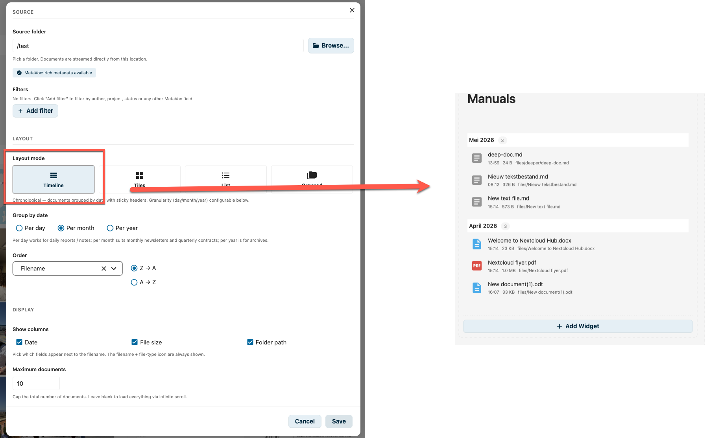
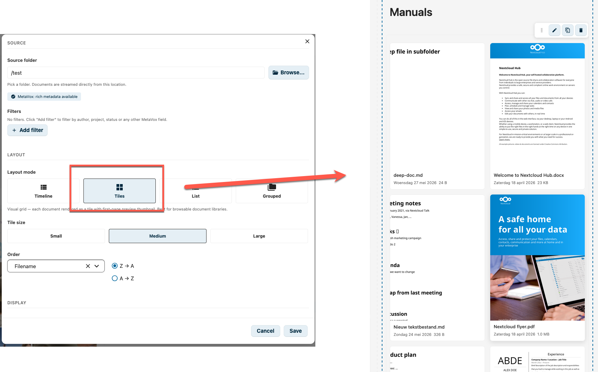
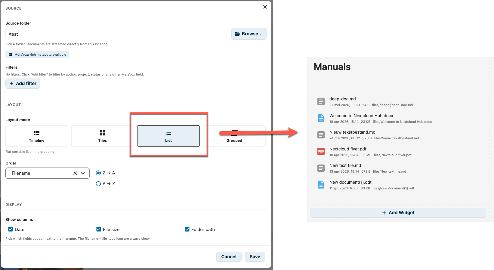
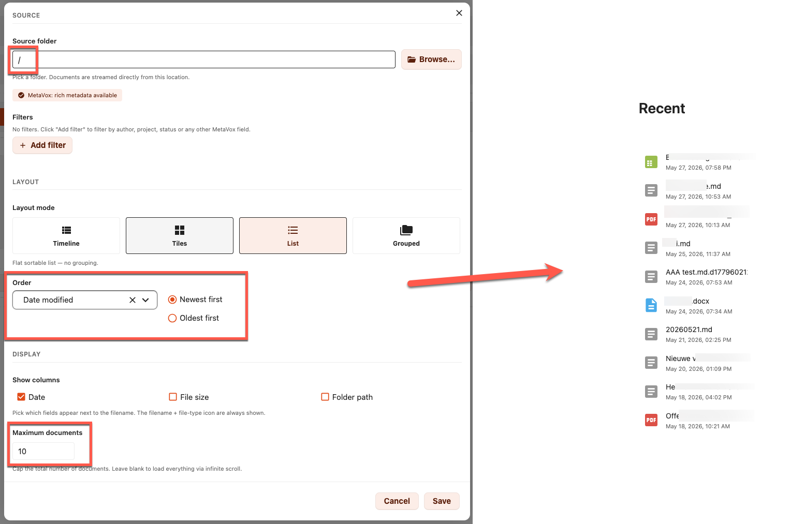
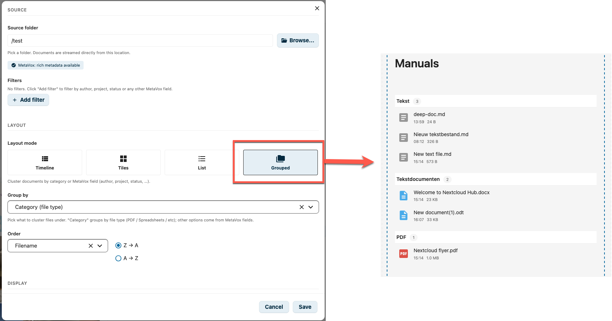
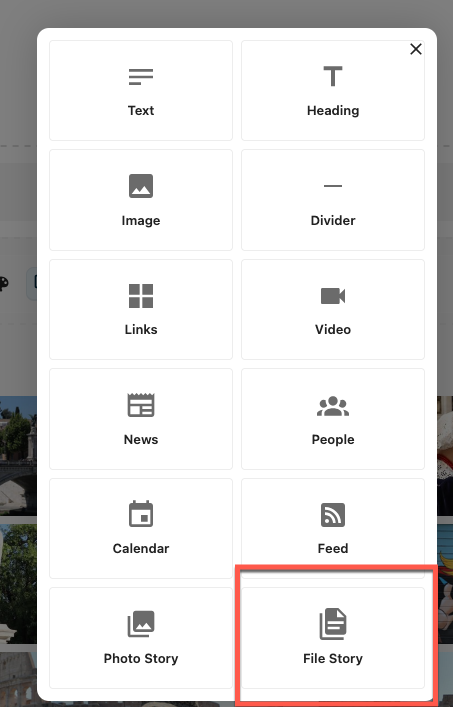
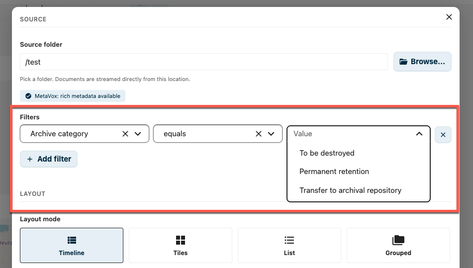
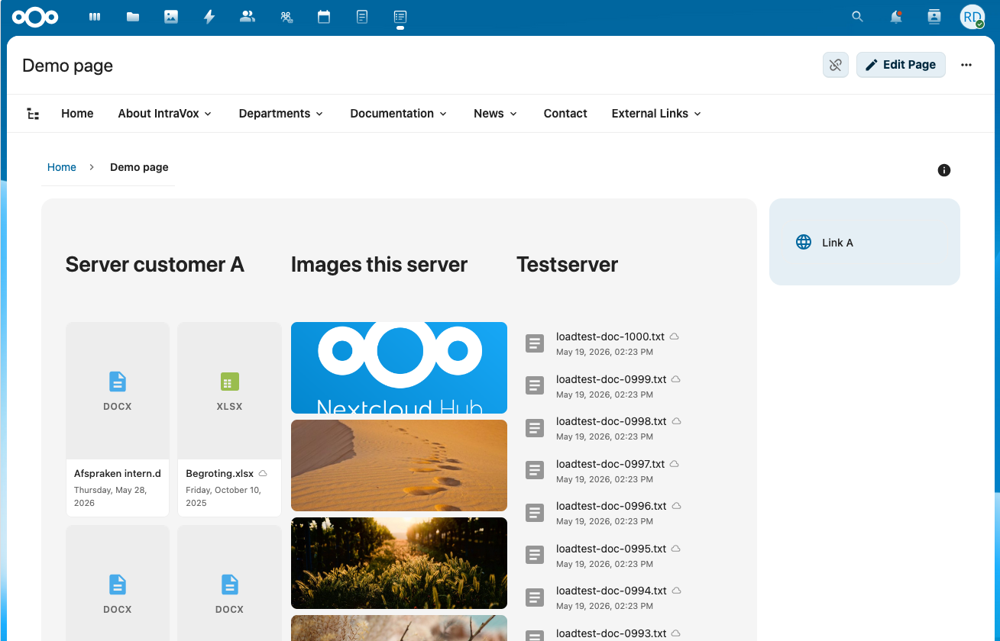
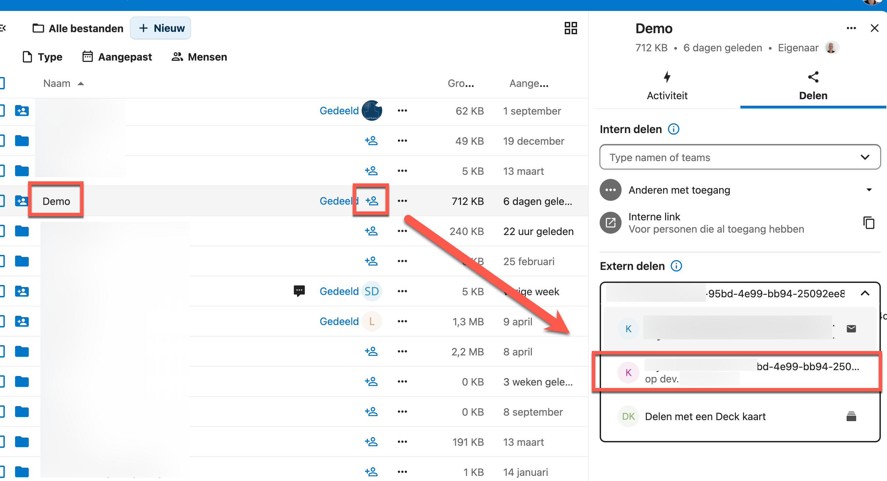
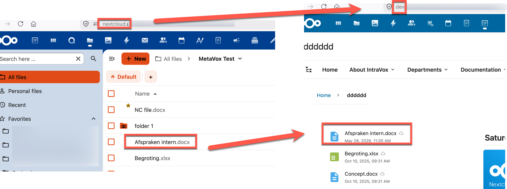

# File Story Widget

The File Story Widget renders the documents in a Nextcloud folder as a rich, sortable, filterable story on an IntraVox page. It is the documents-centric counterpart to the [Photo Story Widget](photo-story-widget.md): both stream content directly from a folder, but File Story is optimised for office documents, PDFs, spreadsheets, and other non-image files.

## Features

- **Four layout modes**: Timeline, Tiles, List, Grouped
- **Timeline granularity**: group by day, month or year
- **Preview thumbnails**: Tile mode renders first-page previews of PDFs, Office documents, etc., with mime-icon fallback layered underneath so a missing preview never flashes a broken image
- **MetaVox integration**: filter, sort and group by any MetaVox field (author, project, status, custom fields)
- **Group by**: cluster documents by file category (PDF, Tekstdocumenten, Spreadsheets, Presentaties, Tekst, Overig) or any single-valued MetaVox field
- **Federation-native**: a federated mount from a partner institution renders side-by-side with your own files — one widget can pull documents from multiple Nextcloud instances without copying or syncing them. See [Federation](#federation) below.
- **Configurable columns**: show date, file size, and/or folder path next to the filename
- **Infinite scroll**: documents are paged in batches of 100 with ETag-based 304s
- **Direct open**: clicks open in Nextcloud's native viewer (`OCA.Viewer`) when available, falling back to `/f/<file_id>`

## Layout Modes

### Timeline

Documents are grouped by date with sticky headers per group. Granularity is configurable (default: per month).

| Granularity | Best for |
|-------------|----------|
| **Per day** | Daily reports, meeting notes |
| **Per month** (default) | Monthly newsletters, monthly contracts |
| **Per year** | Archive views, annual reports |

Rows show file-type icon + filename, with a `HH:MM` time, size and folder-path next to it (controlled via **Show columns**).

### Tiles

A visual grid where each document is rendered as a tile with its first-page preview thumbnail. The fallback (mime-icon + uppercase extension badge) is rendered underneath the preview image, so 404s on documents without a registered preview-provider don't flicker.

Tile size is configurable:

| Size | Min tile width | Gap |
|------|----------------|-----|
| **Small** | 120 px | 10 px |
| **Medium** (default) | 180 px | 14 px |
| **Large** | 260 px | 18 px |

Best for browsable document libraries where a visual hint helps recognition.

### List

A flat sortable list — no grouping. Rows use a longer `day month year, HH:MM` date format (unlike Timeline mode, which shows only the time, because the date already lives in the section header).

A common pattern: point the source at `/`, sort on **Date modified — Newest first**, hide the file-size and folder-path columns, and cap at 10 documents — instant "Recent files" widget for the homepage.

### Grouped

Documents are clustered into sections. Sections are ordered by count (desc), then by label (case-insensitive ascending).

The grouping key is configurable:

- **Category (file type)** — synthesised buckets: `PDF`, `Tekstdocumenten`, `Spreadsheets`, `Presentaties`, `Tekst`, `Overig` (these labels are currently hard-coded NL)
- **Any single-valued MetaVox field** — author, project, status, department, …

Multiselect / tag MetaVox fields are not eligible for grouping. Items without a value are grouped under `(geen waarde)`.

## Configuration

To add a File Story Widget to your page:

1. Click **+ Add Widget** in edit mode
2. Select **File Story** from the widget picker

   

3. Pick a source folder (multi-folder / cross-folder mode is not available — the server returns 400 for an empty folder)
4. Tune layout, sorting, and display options

### Source

| Setting | Config key | Description |
|---------|-----------|-------------|
| **Source folder** | `folderPath` | The folder to read documents from |
| **MetaVox capability badge** | — | Three states: *MetaVox: rich metadata available* / *Federated share — MetaVox metadata is not available because the source lives on another Nextcloud instance. Files are shown with name, date and file type only.* / *MetaVox not available — basic file metadata only* |
| **Filters** | `metaVoxFilters` | MetaVox field filters (hidden when MetaVox is unavailable or the source is federated). See [News Widget — MetaVox Integration](news-widget.md#metavox-integration) for filter mechanics. |

### Layout

| Setting | Config key | Description |
|---------|-----------|-------------|
| **Layout mode** | `mode` | Timeline / Tiles / List / Grouped |
| **Tile size** | `tileSize` | Small / Medium / Large — Tiles mode only |
| **Group by** | `groupBy` (default `category`) | Category (file type) or a single-valued MetaVox field — Grouped mode only. Hidden when the source is federated. |
| **Group by date** | `granularity` (default `month`) | Per day / Per month / Per year — Timeline mode only |
| **Order** | `sortBy` + `sortOrder` | Sort by date modified (`mtime`), filename, file size, or any MetaVox field (multiselect/tags/checkbox excluded; federated sources only allow the base file fields). Direction labels adapt to the field type — *Newest/Oldest first*, *A → Z* / *Z → A*, *Largest/Smallest first*. |

### Display

| Setting | Config key | Description |
|---------|-----------|-------------|
| **Show columns** | `visibleColumns` (default `['date']`) | Toggle which extra fields appear next to the filename: Date / File size / Folder path. The filename and file-type icon are always shown. |
| **Maximum documents** | `limit` | Cap the total number of documents (1–500). Leave blank to load everything via infinite scroll. |

The File Story editor does **not** have a Title input — wrap the widget in a [Collapsible Section](../user/editor.md) or add a heading widget above it if you need a label like "Manuals" above the document list.

## Federation

File Story is built around Nextcloud's **federated sharing** — the protocol that lets two independent Nextcloud instances share folders with each other without any data leaving its home. Open Cloud Mesh (OCM) under the hood; same mechanism that powers the SURF research-cloud federation, the GÉANT cloud-federation pilot, and every "Sciebo / Hochschulcloud / Drive @ NRW" cross-institution share.

For an intranet built on IntraVox, federation is what makes a page *live across organisations* without becoming a copy-paste portal.

*One IntraVox page, three File Story widgets, three different Nextcloud instances: a customer's server on the left, files from this server in the middle, and a testserver on the right. Every column streams live from its owner — nothing is duplicated, nothing is synced, no instance has access to the other tenants' data beyond what was explicitly federated.*

### What this unlocks

- **One page per consortium project.** A research group at TU Delft, a partner faculty at RU Nijmegen, and a non-academic partner at TNO each upload their working documents to *their own* Nextcloud. The project intranet, hosted at one of them, mounts the others' folders via federated share and renders all three streams in a single File Story widget. Every partner keeps ownership, retention, GDPR responsibility — but the project page shows one consolidated view.
- **One page per onderzoeksinfrastructuur.** A national facility federates partner-institution drop-zones into its public-facing IntraVox project page. New datasets appear on the page the moment a partner uploads — no webmaster, no manual link list.
- **One page per onderwijsmodule across institutions.** A joint master's programme between Wageningen and Utrecht shows lecture material from both LMSs in one IntraVox curriculum page. Each university keeps its own user accounts and access policy; only the relevant folder is federated.
- **Cross-organisation chain partners** (ketenpartners — a municipality + a housing corporation + a healthcare org) share project documents *without* one of them having to invite the others into their tenancy. The widget shows the partner's documents live; if the partner revokes the share, the row disappears the next time the widget loads. No orphan copies, no stale links.

This is the FAIR/EOSC argument in practice: data stays where its data-steward is, but composition happens at the presentation layer. IntraVox is the presentation layer.

### How to set it up

1. On the **owning** Nextcloud (the side that holds the documents), share the folder with the partner's federated Cloud ID via the Files-app sharing dialog. The federated share appears under **Extern delen** with the partner's `username@partner.example.org` identifier.

   

2. The partner accepts the share on their Nextcloud; the folder appears as a regular mount in their Files tree.
3. In IntraVox, point a File Story widget at that mount. It renders just like a local folder.

   

   *Same `Afspraken intern.docx` file, same widget config, two different Nextcloud instances. The partner-side widget streams the file metadata over OCM in real time.*

### What changes on a federated source

Federated mounts inherit a constraint of the federated-cloud protocol itself: only the basic file fields cross the federation. MetaVox metadata stays on the owner's instance, because it's stored in the owner's database and not part of the OCM payload. The widget detects this and adjusts:

- The capability badge switches to the federated-share state and explains MetaVox metadata cannot cross the federation.
- The filter builder is hidden.
- The Group-by dropdown is restricted to **Category** only.
- The sort dropdown drops MetaVox-field options; only `Date modified` / `Filename` / `File size` remain.
- Per-row, files mounted from a federated source get a small cloud badge next to the filename, tooltip *"From federated share — MetaVox metadata not available"*.

The server re-checks federation status on every `/files` request, so a config saved before the folder became federated will not silently filter out every result.

### What stays local

Rich metadata (MetaVox fields, EXIF, custom indices) lives in the owner's database and does not travel over OCM. The widget never papers over this: if a federated mount has MetaVox metadata on the owner's side, it stays there. The rule is simple — rich metadata for local sources, basic file metadata for federated sources, no broken links either way.

## Performance

- **ETag / 304**: every `/files` response carries a per-user ETag (UID baked into the hash and a `'w' => 'file-story'` discriminator, so it cannot collide with photo-story ETags or leak between tenants). Subsequent requests send `If-None-Match` and the server returns `304 Not Modified` when nothing changed.
- **Paged streaming**: 100 documents per page via an IntersectionObserver with a 600 px root-margin. When you cap with **Maximum documents**, page size is reduced toward the limit and `hasMore` flips to false on the last page.
- **Truncation banner**: when the folder exceeds the 200 000 file hard cap the response is marked `truncated: true` and the widget shows *"Showing first {n} documents. Use filters or a more specific folder."*
- **Debounce**: editor changes are debounced 250 ms before triggering a fetch.

## API

The widget calls the following endpoints (all under `/apps/intravox/api/file-story/`):

| Endpoint | Verb | Purpose |
|----------|------|---------|
| `/files` | GET | List documents. Params: `folder` (required), `mode` (timeline/tiles/list/grouped), `filters` (JSON), `limit`, `offset`, `pageSize` (default 100, max 500), `sortOrder`, `sortBy`, optional `total` hint, `granularity` (timeline only), `groupBy` (grouped only). |
| `/capabilities` | GET | `{ capabilities, metaVoxAvailable, sourceIsFederated, sourceFederatedInfo: { remote, mount_point } \| null }`. Optional `folder` param. |
| `/metavox-fields` | GET | List of MetaVox fields available for the filter, sort and group-by dropdowns |

The `/files` endpoint reuses the shared `PhotoStoryService::listPhotosPaged()` machinery with a `mimeCategory='documents'` filter — same SQL + MetaVox path, just a different mime set.

## Tips

- **Tiles for libraries, Timeline for streams**: if users are *browsing*, Tiles wins. If they are *catching up* on what's new, Timeline wins.
- **Show folder path** when the source folder contains subfolders and the same filename may exist in multiple places.
- **Combine Grouped + MetaVox** to render a per-author or per-project overview without manually pre-sorting the folder.
- **Cap the limit** on busy intranet homepages to avoid loading hundreds of documents up-front.
- **Federated mounts** are a first-class source — combine a local folder widget with a federated-folder widget on the same page to render one consolidated stream of partner documents alongside your own.

## Requirements

- IntraVox 1.5.0 or higher (File Story widget is shipping in a 1.5.x preview build)
- MetaVox app (optional, recommended for filtering, sorting, and grouping by author/project/status)
- Nextcloud preview-providers enabled for the document types you want thumbnails for (PDF, Office)
- `OCA.Viewer` (built into Nextcloud) for the in-page document preview when clicking a row/tile — falls back to a `/f/<file_id>` redirect

## Limitations (current preview)

- The widget is still in active development; layouts and option names may change.
- Sorting on a MetaVox field is best-effort across infinite-scroll pages.
- Tile previews depend on Nextcloud's preview-provider chain; documents without a registered provider fall back to the mime-icon placeholder.
- Multi-folder mode (the equivalent of Photo Story's cross-folder search) is not yet available — pick a concrete source folder.
- Category labels in Grouped mode are hard-coded Dutch (`Tekstdocumenten`, `Spreadsheets`, `Presentaties`, `Tekst`, `Overig`) and not yet translated.
- A `dateField` config key exists in the default config (`mtime` / `taken_at` / `created`) and is consumed by the Tiles long-date renderer, but is not yet surfaced in the editor UI — leave at the default for now.

## Related

- [Photo Story Widget](photo-story-widget.md) — photos-centric counterpart
- [News Widget](news-widget.md) — page-centric counterpart with publication dates
- [Feed Widget](feed-widget.md) — for external document sources (SharePoint, Moodle, …)
