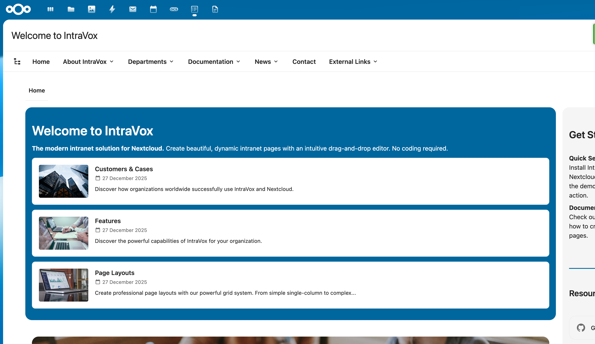
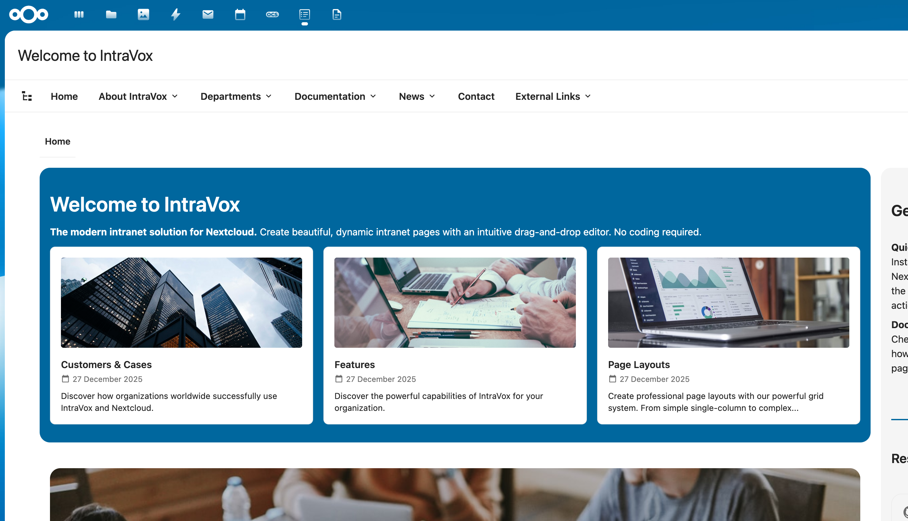
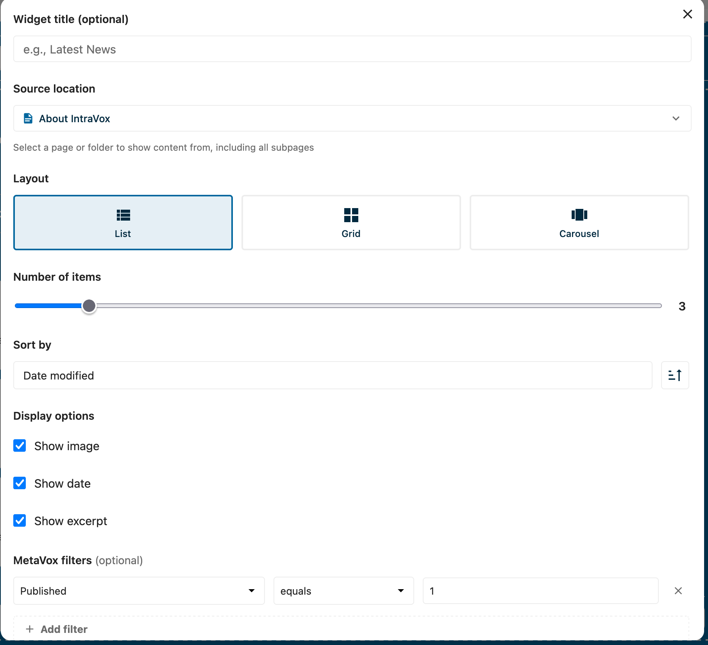
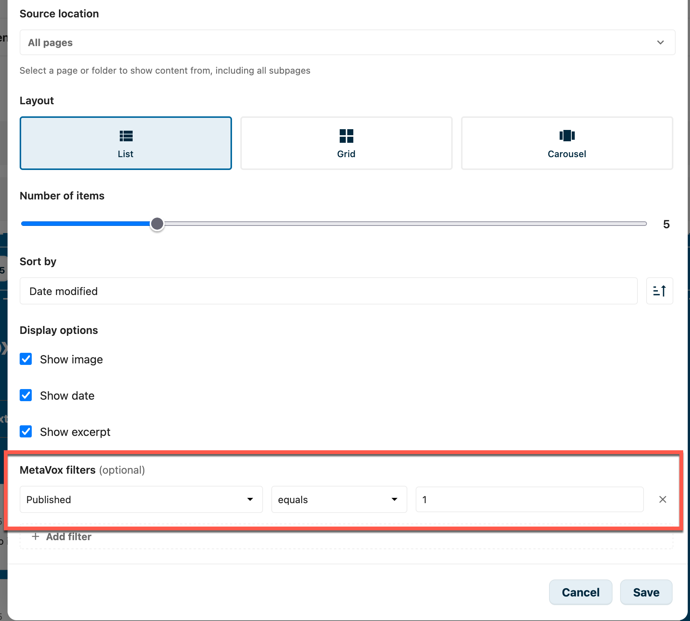
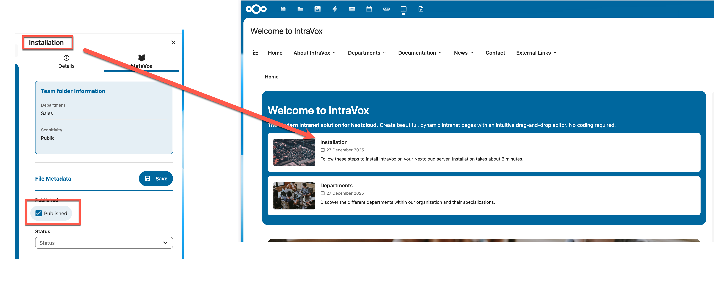
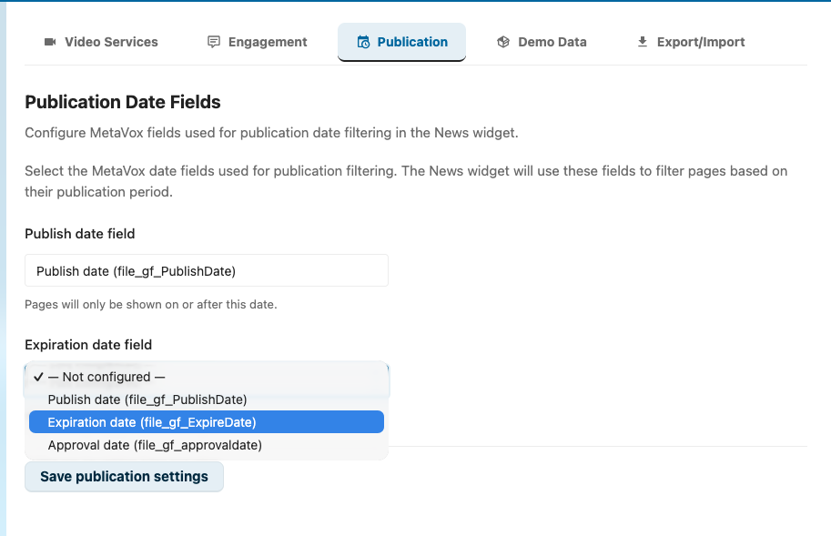
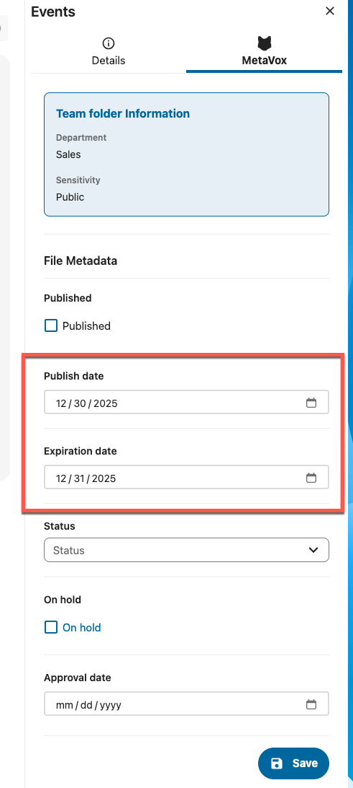
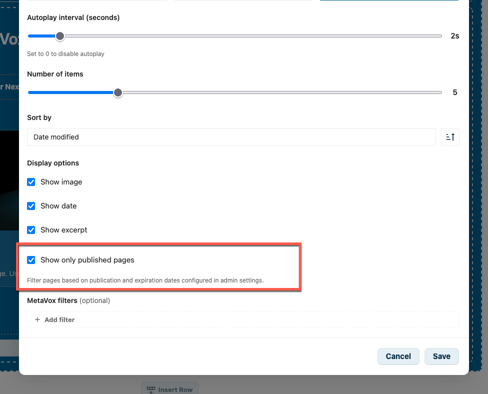

# News-widget

De News-widget toont een dynamische lijst van pagina's vanuit een geselecteerde locatie in je IntraVox-site. Perfect voor nieuwsartikelen, blog-posts, aankondigingen of elke verzameling gerelateerde content.

## Features

- **Meerdere layouts**: lijst, grid of carousel
- **Bron-selectie**: toon pagina's vanuit elke map of sectie
- **MetaVox-filtering**: filter pagina's op basis van metadata-velden (vereist MetaVox-app)
- **Aanpasbare weergave**: schakel afbeelding, datum en samenvatting in of uit
- **Sorteer-opties**: sorteer op wijzigingsdatum of titel
- **Autoplay-carousel**: configureerbaar interval voor automatische rotatie

## Layouts

### Lijst-layout

Toont items in een verticale lijst met thumbnail, titel, datum en samenvatting.

### Grid-layout

Toont items in een responsive grid met 2, 3 of 4 kolommen.

### Carousel-layout

Een roterende slideshow met navigatie-pijlen en dot-indicators. Ondersteunt autoplay met configureerbaar interval.

## Configuratie

Om een News-widget aan je pagina toe te voegen:

1. Klik op **+ Widget toevoegen** in bewerk-modus
2. Selecteer **News** uit de widget-picker
3. Configureer de widget-instellingen

### Instellingen

| Instelling | Beschrijving |
|------------|--------------|
| **Widget-titel** | Optionele titel boven de widget |
| **Bron-locatie** | Selecteer een pagina of map om content uit te tonen (inclusief alle subpagina's) |
| **Layout** | Kies tussen lijst, grid of carousel |
| **Kolommen** | Voor grid-layout: 2, 3 of 4 kolommen |
| **Autoplay-interval** | Voor carousel-layout: seconden tussen slides (0 = uit) |
| **Aantal items** | Maximum items om te tonen (1-20) |
| **Sorteer op** | Wijzigingsdatum of titel |
| **Sorteer-volgorde** | Oplopend of aflopend |
| **Toon afbeelding** | Toon de uitgelichte afbeelding van de pagina |
| **Toon datum** | Toon de wijzigingsdatum |
| **Toon samenvatting** | Toon een tekst-samenvatting van de pagina |

## MetaVox-integratie

Wanneer de [MetaVox](https://apps.nextcloud.com/apps/metavox)-app is geïnstalleerd en geconfigureerd, kun je News-widget-resultaten filteren op basis van metadata-velden.

### Filters toevoegen

1. Klik op **+ Filter toevoegen** in de MetaVox-filter-sectie
2. Selecteer een metadata-veld uit de dropdown
3. Kies een operator (gelijk aan, bevat, is niet leeg)
4. Voer een waarde in om op te filteren

### Filter-operators

| Operator | Beschrijving |
|----------|--------------|
| **gelijk aan** | Exacte match |
| **bevat** | Gedeeltelijke match (tekst-velden) |
| **is niet leeg** | Veld heeft een waarde |

### Checkbox-velden

Voor checkbox/boolean-metadata-velden:

- Gebruik `1` voor aangevinkt/true
- Gebruik `0` voor niet-aangevinkt/false

### Meerdere filters

Bij meerdere filters kun je kiezen:

- **Match all**: alle filters moeten matchen (AND-logica)
- **Match any**: minstens één filter moet matchen (OR-logica)

## Publicatie-datum-filtering

De News-widget kan pagina's automatisch filteren op basis van publicatie- en vervaldatums. Dit maakt het mogelijk om content automatisch te laten verschijnen en verdwijnen.

### Hoe het werkt

Indien ingeschakeld worden pagina's gefilterd op basis van twee MetaVox-datum-velden:

- **Publicatiedatum**: de pagina wordt zichtbaar op deze datum
- **Vervaldatum**: de pagina wordt verborgen na deze datum

Een pagina is zichtbaar wanneer:

- De publicatiedatum leeg is OF vandaag of in het verleden ligt
- EN de vervaldatum leeg is OF in de toekomst ligt

| Publicatiedatum | Vervaldatum | Vandaag    | Zichtbaar? |
|-----------------|-------------|------------|------------|
| (leeg)          | (leeg)      | -          | Ja         |
| 2025-01-01      | (leeg)      | 2025-01-15 | Ja         |
| 2025-02-01      | (leeg)      | 2025-01-15 | Nee        |
| (leeg)          | 2025-01-20  | 2025-01-15 | Ja         |
| (leeg)          | 2025-01-10  | 2025-01-15 | Nee        |
| 2025-01-01      | 2025-01-31  | 2025-01-15 | Ja         |

### Setup

#### Stap 1: maak MetaVox-velden aan

Maak eerst twee datum-velden aan in MetaVox:

1. Open de MetaVox-app
2. Maak een nieuw veld voor de publicatiedatum (bv. "Publicatiedatum")
3. Maak een nieuw veld voor de vervaldatum (bv. "Vervaldatum")
4. Zet beide velden op type "Datum"

#### Stap 2: configureer veldnamen in beheerinstellingen

1. Ga naar **Instellingen** → **IntraVox**
2. Open het **Publicatie**-tabblad
3. Voer de exacte MetaVox-veldnamen in:
   - **Publicatiedatum-veld**: de naam van je publicatiedatum-veld
   - **Vervaldatum-veld**: de naam van je vervaldatum-veld
4. Klik op **Publicatie-instellingen opslaan**

*Beheerinstellingen — wijs IntraVox op de MetaVox-datum-velden die je in stap 1 hebt aangemaakt. De dropdowns tonen alle datum-velden die MetaVox momenteel beschikbaar stelt.*

> **Let op**: de veldnamen moeten exact matchen met de namen in MetaVox, inclusief hoofdletters.

#### Stap 3: stel publicatie-/vervaldatums in op elke pagina

Voor pagina's die gefilterd moeten worden, vul je de publicatie- en vervaldatums in via de MetaVox-sidebar:

*Open een pagina, klik op het MetaVox-tabblad in de sidebar en stel **Publicatiedatum** / **Vervaldatum** in. Pagina's buiten dat venster worden automatisch verborgen door de News-widget zodra publicatie-filtering aan staat.*

#### Stap 4: schakel in bij de News-widget

1. Bewerk een pagina met een News-widget
2. Klik op de News-widget om de editor te openen
3. Vink **Toon alleen gepubliceerde pagina's** aan
4. Sla de pagina op

*Weergave-opties-sectie: vink **Toon alleen gepubliceerde pagina's** aan om publicatie-filtering te activeren voor deze News-widget.*

### Waarschuwingen

De News-widget-editor toont waarschuwingen wanneer:

- **MetaVox niet geïnstalleerd**: publicatie-filtering vereist de MetaVox-app
- **Velden niet geconfigureerd**: de beheerder moet de publicatie-datum-velden configureren via Instellingen → IntraVox → Publicatie

### Datum-formaten

De volgende datum-formaten worden ondersteund:

- `YYYY-MM-DD` (bv. 2025-01-15)
- `DD-MM-YYYY` (bv. 15-01-2025)
- `MM/DD/YYYY` (bv. 01/15/2025)
- `DD/MM/YYYY` (bv. 15/01/2025)
- ISO 8601 met tijd (bv. 2025-01-15T10:30:00)

### Meertalige veldnamen

Als je IntraVox in meerdere talen gebruikt, hier zijn aanbevolen veldnamen:

| Taal | Publicatiedatum | Vervaldatum |
|------|-----------------|-------------|
| Nederlands | Publicatiedatum | Vervaldatum |
| Engels | Publish date | Expiration date |
| Duits | Veröffentlichungsdatum | Ablaufdatum |
| Frans | Date de publication | Date d'expiration |

## Tips

- **Performance**: beperk het aantal items voor betere laadtijden
- **Afbeeldingen**: pagina's hebben een uitgelichte afbeelding nodig (eerste image-widget) om thumbnails te tonen
- **Samenvattingen**: samenvattingen worden automatisch geëxtraheerd uit de eerste tekst-content op elke pagina
- **Donkere achtergronden**: de widget past tekst-kleuren automatisch aan op donkere rij-achtergronden
- **Publicatie-planning**: gebruik publicatiedatums voor tijdsgevoelige content zoals aankondigingen of evenementen

## Vereisten

- IntraVox 0.8.0 of hoger
- MetaVox-app (optioneel, voor filtering en publicatiedatums)
