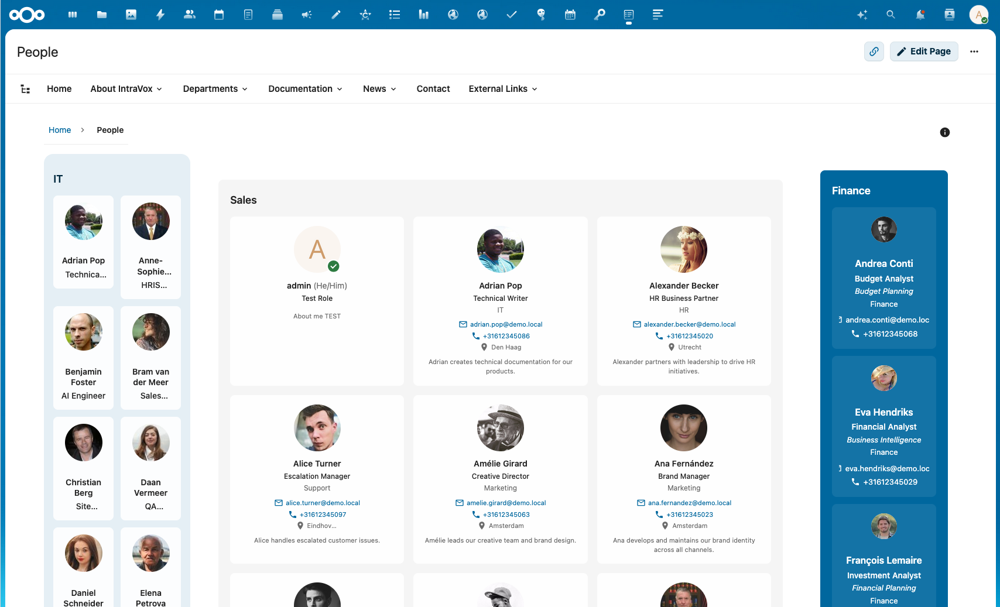
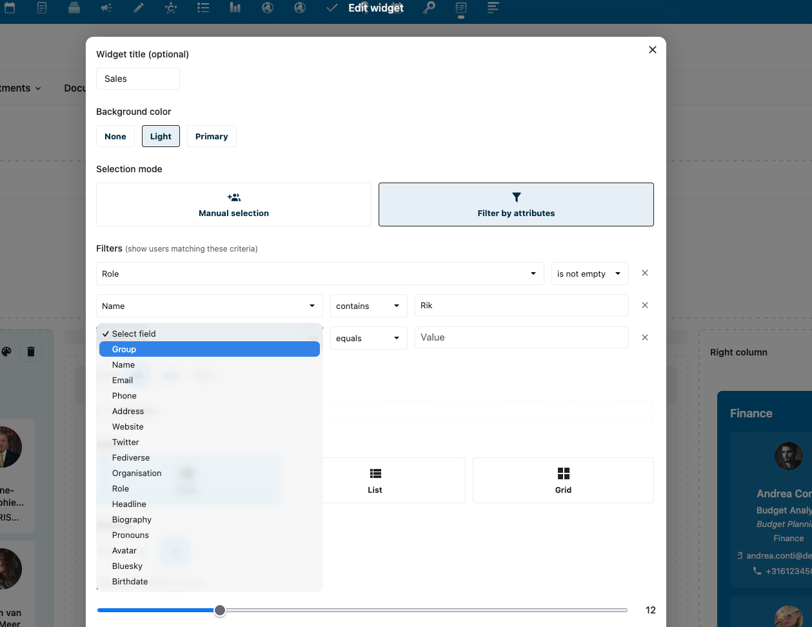
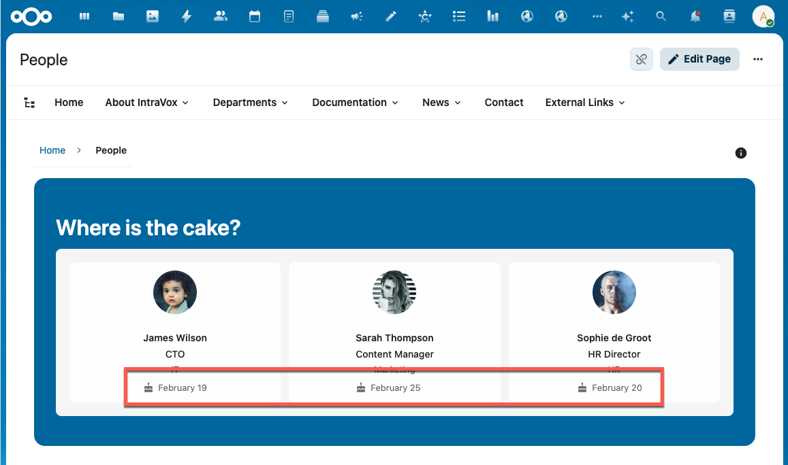
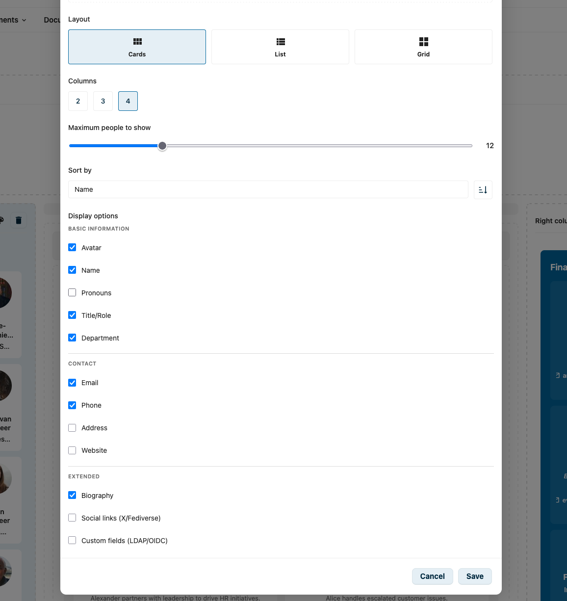
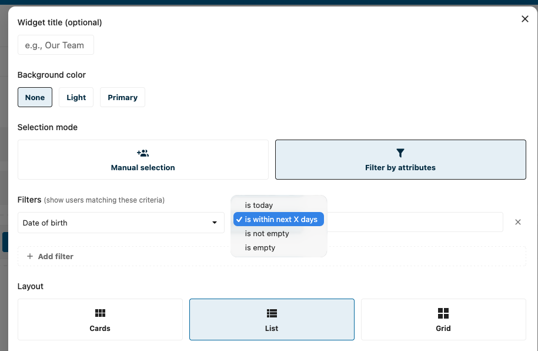
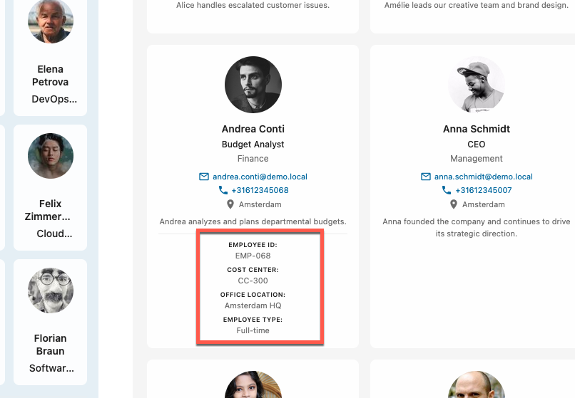

# People-widget

De People-widget toont gebruikers-profielen uit je Nextcloud-instantie. Perfect voor team-pagina's, organisatie-gidsen, afdelings-overzichten of elke pagina waar je mensen wilt presenteren.

## Features

- **Meerdere layouts**: card, lijst of grid
- **Uniforme weergave-opties**: alle weergave-opties werken consistent over alle layouts
- **Selectie-modes**: handmatige selectie of filter-gebaseerd
- **Groep-filtering**: toon gebruikers uit specifieke groepen
- **Veld-filtering**: filter op elk gebruikersprofiel-veld, inclusief datum-gebaseerde filters
- **Aanpasbare weergave**: kies welke profiel-velden te tonen
- **Verjaardags-ondersteuning**: toon verjaardagen met een taart-icoon
- **Social-links**: Twitter/X-, Fediverse- en Bluesky-profielen
- **Sorteer-opties**: sorteer op naam of e-mail
- **Paginering**: "Toon meer"-knop wanneer er meer mensen zijn dan de geconfigureerde limiet
- **Nextcloud-integratie**: klik op avatars om profielen, e-mail en beschikbaarheid te zien
- **LDAP-/OIDC-ondersteuning**: custom velden uit LDAP of OIDC worden automatisch gedetecteerd

## Layouts

### Card-layout

Toont gebruikers in gedetailleerde cards met avatar, naam, titel, contact-info en optionele biografie. Het beste voor het uitlichten van individuele teamleden met rijke informatie.

### Lijst-layout

Compacte horizontale layout met avatar, naam en belangrijkste details op een rij. Ideaal voor langere lijsten waar ruimte-efficiëntie telt.

### Grid-layout

Grid-layout met avatars en belangrijkste details. Alle weergave-opties (contact-info, social-links, custom velden, etc.) worden in elke layout ondersteund, inclusief Grid. Perfect voor snelle visuele overzichten van teams of afdelingen.

## Configuratie

Om een People-widget aan je pagina toe te voegen:

1. Klik op **+ Widget toevoegen** in bewerk-modus
2. Selecteer **People** uit de widget-picker
3. Configureer de widget-instellingen

### Instellingen

| Instelling | Beschrijving |
|------------|--------------|
| **Widget-titel** | Optionele titel boven de widget |
| **Achtergrond-kleur** | Geen, licht of primary-kleur-achtergrond |
| **Selectie-modus** | Handmatige selectie of filter op attributen |
| **Layout** | Card, lijst of grid |
| **Kolommen** | Voor card-/grid-layouts: 2, 3 of 4 kolommen |
| **Maximum mensen** | Limiteer het aantal getoonde gebruikers (1-50) |
| **Sorteer op** | Naam of e-mail |
| **Sorteer-volgorde** | Oplopend of aflopend |

## Selectie-modes

### Handmatige selectie

Selecteer specifieke gebruikers om te tonen:

1. Kies "Handmatige selectie"-modus
2. Zoek gebruikers op naam of e-mail
3. Klik om gebruikers aan de selectie toe te voegen
4. Sleep om de volgorde aan te passen (volgorde blijft behouden wanneer sortering uit staat)

### Filter op attributen

Toon automatisch gebruikers die aan bepaalde criteria voldoen:

1. Kies "Filter op attributen"-modus
2. Klik op **+ Filter toevoegen**
3. Selecteer een veld (Groep, Naam, E-mail, Organisatie, Rol, enz.)
4. Kies een operator en waarde
5. Voeg meer filters toe naar wens

#### Beschikbare filter-velden

Velden zijn georganiseerd in logische volgorde die matched met de weergave-opties:

| Categorie | Velden |
|-----------|--------|
| **Groep** | Nextcloud-groep-lidmaatschap |
| **Basis-informatie** | Naam, voornaamwoorden, rol, headline, organisatie |
| **Contact** | E-mail, telefoon, adres, website |
| **Uitgebreid** | Biografie, geboortedatum, Twitter/X, Fediverse, Bluesky |
| **Custom** | Aanvullende LDAP-/OIDC-velden |

#### Filter-operators

| Operator | Beschrijving | Beschikbaar voor |
|----------|--------------|-------------------|
| **gelijk aan** | Exacte match | Alle velden |
| **bevat** | Gedeeltelijke match | Tekst-velden |
| **bevat niet** | Sluit gedeeltelijke match uit | Tekst-velden |
| **is één van** | Match elk van meerdere waarden | Groep-veld |
| **is niet leeg** | Veld heeft een waarde | Alle velden |
| **is leeg** | Veld heeft geen waarde | Alle velden |
| **is vandaag** | Datum matched met vandaag (maand + dag) | Datum-velden (bv. geboortedatum) |
| **binnen N dagen** | Datum valt binnen de komende N dagen | Datum-velden (bv. geboortedatum) |

#### Meerdere filters

Bij meerdere filters kies je hoe ze combineren:

- **Match all**: alle filters moeten matchen (AND-logica)
- **Match any**: minstens één filter moet matchen (OR-logica)

#### Voorbeeld: toon marketing-team

1. Voeg filter toe: **Groep** → **is één van** → selecteer "Marketing"
2. Resultaat: toont alle gebruikers in de Marketing-groep

#### Voorbeeld: toon managers

1. Voeg filter toe: **Rol** → **bevat** → "Manager"
2. Resultaat: toont gebruikers met "Manager" in hun rol-veld

#### Voorbeeld: sluit stagiairs uit

1. Voeg filter toe: **Rol** → **bevat niet** → "Stagiair"
2. Resultaat: toont gebruikers zonder "Stagiair" in hun rol

#### Voorbeeld: toon verjaardagen van vandaag

1. Voeg filter toe: **Geboortedatum** → **is vandaag**
2. Resultaat: toont gebruikers die vandaag jarig zijn

#### Voorbeeld: toon aankomende verjaardagen

1. Voeg filter toe: **Geboortedatum** → **binnen N dagen** → "7"
2. Resultaat: toont gebruikers die de komende 7 dagen jarig zijn

> **Let op**: de "is vandaag"- en "binnen N dagen"-operators vergelijken alleen maand en dag (jaar wordt genegeerd), wat ideaal is voor terugkerende events zoals verjaardagen. Jaar-wisseling wordt automatisch afgehandeld (bv. een filter ingesteld op 30 december met "binnen 7 dagen" zal januari-verjaardagen correct meenemen).

## Weergave-opties

Controleer welke informatie per gebruiker wordt getoond. Alle weergave-opties zijn beschikbaar in elke layout (card, lijst en grid).

### Basis-informatie

| Veld | Beschrijving | Default |
|------|--------------|---------|
| **Avatar** | Profielfoto | Aan |
| **Naam** | Weergavenaam | Aan |
| **Voornaamwoorden** | Voornaamwoorden van de gebruiker (indien ingesteld) | Uit |
| **Rol** | Officiële functietitel | Aan |
| **Headline** | Persoonlijke tagline | Uit |
| **Afdeling** | Afdeling of team | Aan |

### Contact

| Veld | Beschrijving | Default |
|------|--------------|---------|
| **E-mail** | E-mailadres (klikbaar) | Aan |
| **Telefoon** | Telefoonnummer (klikbaar) | Uit |
| **Adres** | Fysiek adres | Uit |
| **Website** | Persoonlijke website | Uit |

### Uitgebreid

| Veld | Beschrijving | Default |
|------|--------------|---------|
| **Biografie** | Gebruikers-bio | Uit |
| **Geboortedatum** | Verjaardag met taart-icoon | Uit |
| **Social-links** | Twitter/X-, Fediverse- en Bluesky-links | Uit |
| **Custom velden** | Aanvullende LDAP-/OIDC-velden | Uit |

### Verjaardag-weergave

Wanneer het **Geboortedatum**-veld is ingeschakeld, wordt de verjaardag van elke gebruiker getoond met een taart-icoon. De datum wordt geformatteerd volgens de locale van de gebruiker. Dit combineert goed met de datum-filter-operators om verjaardag-widgets te maken (zie [Toon verjaardagen van vandaag](#voorbeeld-toon-verjaardagen-van-vandaag)).

## Custom velden (LDAP/OIDC)

Wanneer je Nextcloud verbonden is met LDAP, Active Directory of OIDC, zijn er mogelijk aanvullende gebruikersprofiel-velden beschikbaar. De People-widget detecteert deze velden automatisch en maakt ze beschikbaar voor weergave.

Veelvoorkomende custom velden zijn:

- Employee ID
- Cost Center
- Office Location
- Employee Type
- Manager

Schakel "Custom velden (LDAP/OIDC)" in bij weergave-opties om deze velden op gebruikers-cards te tonen. De widget formatteert veldnamen automatisch voor leesbaarheid (bv. `employee_id` wordt "Employee Id").

> **Let op**: Geboortedatum en Bluesky zijn nu first-class velden met dedicated weergave-opties en vereisen de custom-velden-toggle niet.

## Paginering

Wanneer er meer gebruikers matchen met je filters dan de geconfigureerde "Maximum mensen te tonen"-limiet, toont de widget een paginerings-footer:

- Toont het aantal: "Toont 12 van 47 mensen"
- **Toon meer**-knop om extra gebruikers te laden
- Gaat door tot alle matchende gebruikers zijn getoond

Dit laat je een redelijke initiële limiet instellen terwijl je nog steeds toegang biedt tot de volledige lijst.

## Avatar-popup-menu

Klikken op de avatar van een gebruiker opent het standaard Nextcloud-contact-menu, met:

- **Profiel bekijken**: opent de Nextcloud-profiel-pagina van de gebruiker
- **E-mail**: stuur een e-mail naar de gebruiker
- **Beschikbaarheid tonen**: bekijk de agenda-beschikbaarheid van de gebruiker (vereist Calendar-app)
- **Gebruikers-status**: zie huidige status en custom bericht

Dit is standaard Nextcloud-functionaliteit en werkt hetzelfde als avatar-klikken elders in Nextcloud.

## Gebruikersprofiel-velden

De People-widget toont data uit Nextcloud-gebruikersprofielen. De beschikbare velden zijn afhankelijk van je Nextcloud-configuratie:

### Standaard-velden

Deze velden zijn beschikbaar in alle Nextcloud-installaties:

- Weergavenaam
- E-mail
- Telefoon
- Adres
- Website
- Twitter-/X-handle
- Fediverse-handle
- Bluesky-handle
- Organisatie
- Rol (functietitel)
- Headline (persoonlijke tagline)
- Biografie
- Voornaamwoorden
- Geboortedatum

### LDAP-/Active-Directory-velden

Als je Nextcloud verbonden is met LDAP of Active Directory, kunnen aanvullende velden beschikbaar zijn afhankelijk van je LDAP-configuratie. Veelvoorkomende voorbeelden:

- Employee ID
- Afdeling
- Manager
- Office-locatie
- Cost-center

### OIDC-velden

Bij gebruik van OpenID Connect voor authenticatie kunnen aanvullende profile-claims gemapped worden naar gebruikers-velden.

## Groep-gebaseerde filtering

De meest voorkomende use-case is filteren op groep-lidmaatschap:

### Enkele groep

Toon alle gebruikers uit één groep:

1. Voeg filter toe: **Groep** → **gelijk aan** → selecteer groep

### Meerdere groepen

Toon gebruikers uit één van meerdere groepen:

1. Voeg filter toe: **Groep** → **is één van** → selecteer meerdere groepen

### Gecombineerd met andere filters

Toon gebruikers uit een groep met aanvullende criteria:

1. Voeg filter toe: **Groep** → **gelijk aan** → "Engineering"
2. Voeg filter toe: **Rol** → **bevat** → "Lead"
3. Zet op **Match all**
4. Resultaat: toont alleen Engineering-Leads

## Achtergrond-kleuren

De People-widget ondersteunt drie achtergrond-kleur-opties:

| Optie | Beschrijving |
|-------|--------------|
| **Geen** | Transparante achtergrond, mengt met de pagina |
| **Licht** | Lichtgrijze achtergrond voor subtiele scheiding |
| **Primary** | Donkerblauwe achtergrond (gebruikt Nextcloud's primary-kleur) |

Bij gebruik van een donkere achtergrond (Primary) passen tekst-kleuren zich automatisch aan voor goede contrast.

## Tips

- **Performance**: limiteer het aantal gebruikers voor betere laadtijden, vooral met veel profiel-velden ingeschakeld
- **Privacy**: overweeg welke velden je publiekelijk toont. Telefoonnummers en adressen staan standaard uit
- **Groepen**: maak Nextcloud-groepen specifiek voor widget-weergave (bv. "Leadership Team", "Support Staff")
- **Profiel-volledigheid**: moedig gebruikers aan om hun Nextcloud-profielen aan te vullen voor rijkere People-widgets
- **Layouts**: gebruik Grid voor grote teams, Cards voor kleine featured teams, Lijst voor directories
- **Paginering**: stel een redelijke limiet in (12-20) en laat gebruikers meer laden indien nodig

## Vereisten

- IntraVox 0.9.14 of hoger
- Gebruikers moeten Nextcloud-accounts hebben
- Groep-filtering vereist dat gebruikers lid zijn van Nextcloud-groepen
- Calendar-app vereist voor "Beschikbaarheid tonen" in avatar-popup
