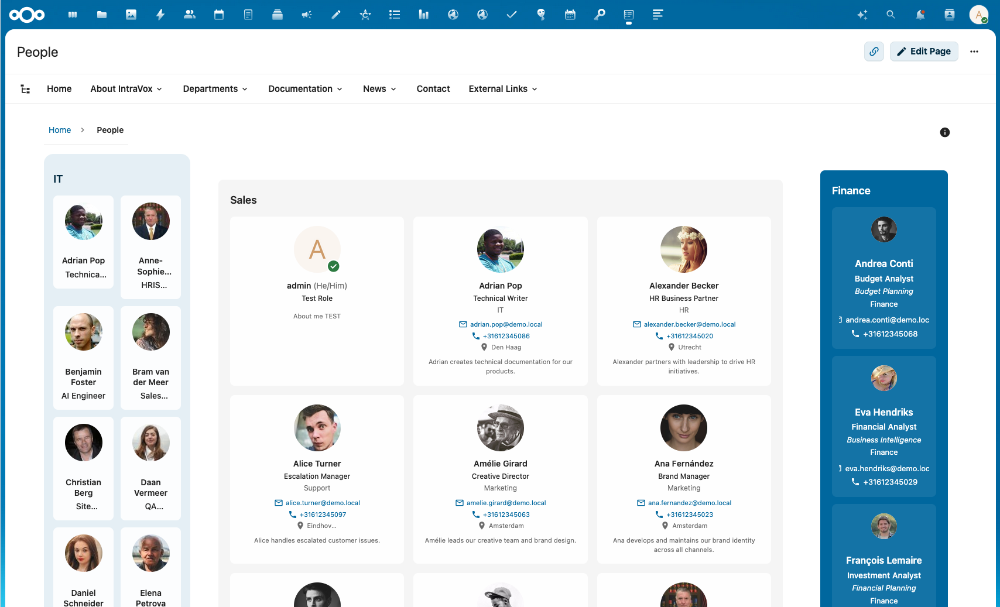
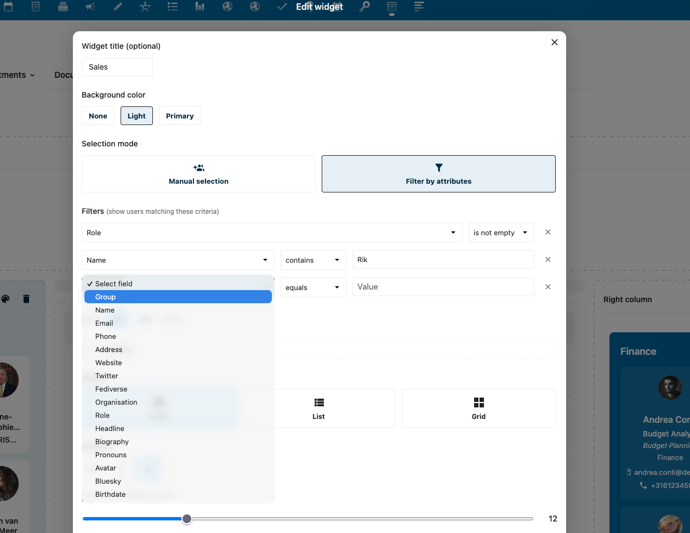
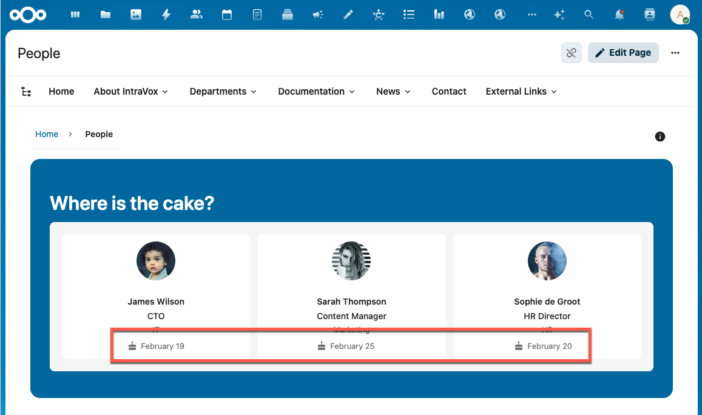
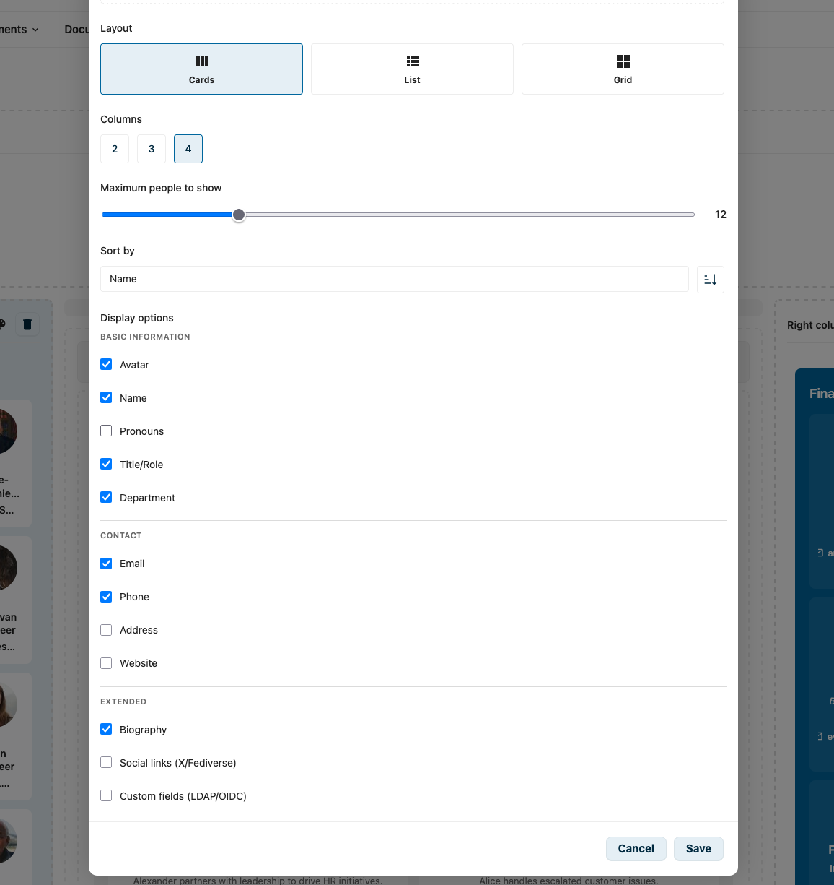
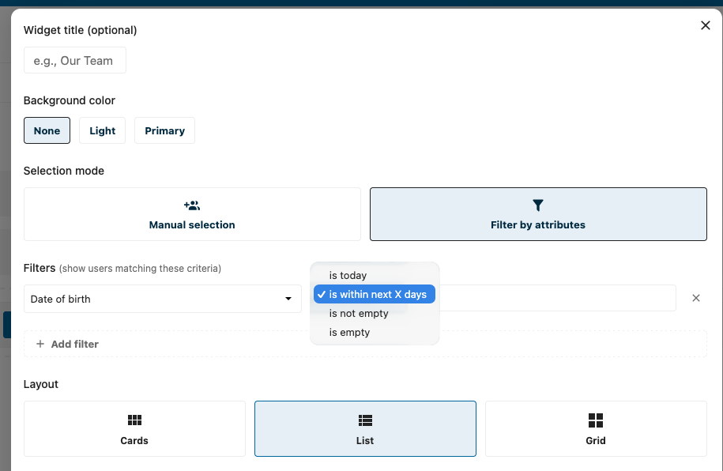
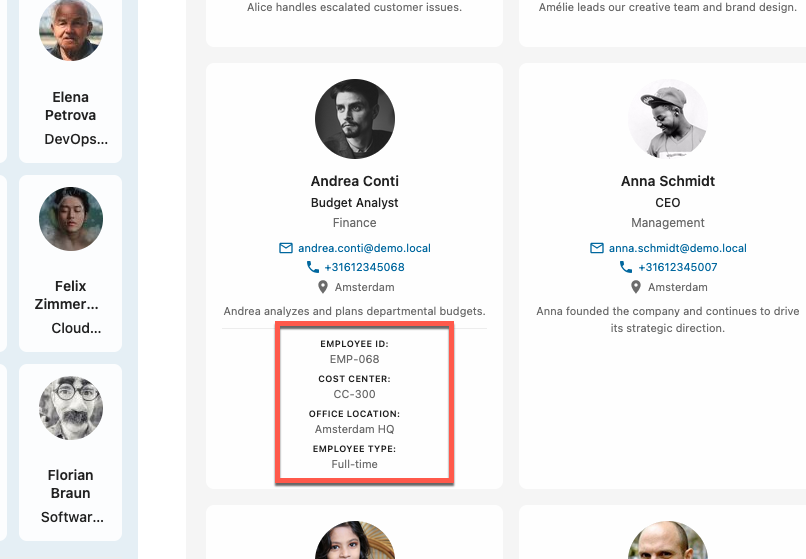

# People-widget

De People-widget toont gebruikers-profielen uit je Nextcloud-instantie. Perfect voor team-pagina's, organisatie-gidsen, afdelings-overzichten of elke pagina waar je mensen wilt presenteren.

## Features

- **Meerdere layouts**: card, lijst of grid
- **Uniforme weergave-opties**: alle weergave-opties werken consistent over alle layouts
- **Selectie-modes**: handmatige selectie of filter-gebaseerd
- **Groep-filtering**: toon gebruikers uit specifieke groepen
- **Veld-filtering**: filter op elk gebruikersprofiel-veld, inclusief datum-gebaseerde filters
- **Aanpasbare weergave**: kies welke profiel-velden te tonen
- **Verjaardags-ondersteuning**: toon verjaardagen met een taart-icoon
- **Social-links**: Twitter/X-, Fediverse- en Bluesky-profielen
- **Sorteer-opties**: sorteer op naam of e-mail
- **Paginering**: "Toon meer"-knop wanneer er meer mensen zijn dan de geconfigureerde limiet
- **Nextcloud-integratie**: klik op avatars om profielen, e-mail en beschikbaarheid te zien
- **Bezoekersfilters**: laat lezers de lijst zelf verfijnen met facetten en live aantallen
- **Privacybewust**: respecteert de zichtbaarheid die elke gebruiker per veld instelt; standaard verborgen op publieke sharelinks
- **LDAP-/OIDC-ondersteuning**: directory-gegevens verschijnen in de standaard Nextcloud-profielvelden waaraan je ze koppelt

## Layouts

### Card-layout

Toont gebruikers in gedetailleerde cards met avatar, naam, titel, contact-info en optionele biografie. Het beste voor het uitlichten van individuele teamleden met rijke informatie.

### Lijst-layout

Compacte horizontale layout met avatar, naam en belangrijkste details op een rij. Ideaal voor langere lijsten waar ruimte-efficiëntie telt.

### Grid-layout

Grid-layout met avatars en belangrijkste details. Alle weergave-opties (contact-info, social-links, custom velden, etc.) worden in elke layout ondersteund, inclusief Grid. Perfect voor snelle visuele overzichten van teams of afdelingen.

## Configuratie

Om een People-widget aan je pagina toe te voegen:

1. Klik op **+ Widget toevoegen** in bewerk-modus
2. Selecteer **People** uit de widget-picker
3. Configureer de widget-instellingen

### Instellingen

| Instelling | Beschrijving |
|------------|--------------|
| **Widget-titel** | Optionele titel boven de widget |
| **Achtergrond-kleur** | Geen, licht of primary-kleur-achtergrond |
| **Selectie-modus** | Handmatige selectie of filter op attributen |
| **Layout** | Card, lijst of grid |
| **Kolommen** | Voor card-/grid-layouts: 2, 3 of 4 kolommen |
| **Maximum mensen** | Limiteer het aantal getoonde gebruikers (1-50) |
| **Sorteer op** | Naam of e-mail |
| **Sorteer-volgorde** | Oplopend of aflopend |

## Selectie-modes

### Handmatige selectie

Selecteer specifieke gebruikers om te tonen:

1. Kies "Handmatige selectie"-modus
2. Zoek gebruikers op naam of e-mail
3. Klik om gebruikers aan de selectie toe te voegen
4. Sleep om de volgorde aan te passen (volgorde blijft behouden wanneer sortering uit staat)

### Filter op attributen

Toon automatisch gebruikers die aan bepaalde criteria voldoen:

1. Kies "Filter op attributen"-modus
2. Klik op **+ Filter toevoegen**
3. Selecteer een veld (Groep, Naam, E-mail, Organisatie, Rol, enz.)
4. Kies een operator en waarde
5. Voeg meer filters toe naar wens

#### Beschikbare filter-velden

Velden zijn georganiseerd in logische volgorde die matched met de weergave-opties:

| Categorie | Velden |
|-----------|--------|
| **Groep** | Nextcloud-groep-lidmaatschap |
| **Basis-informatie** | Naam, voornaamwoorden, rol, headline, organisatie |
| **Contact** | E-mail, telefoon, adres, website |
| **Uitgebreid** | Biografie, geboortedatum, Twitter/X, Fediverse, Bluesky |
| **Custom** | Extra velden uit de gebruikersvoorkeuren (zie [Custom velden](#custom-velden-ldapoidc)) |

#### Filter-operators

| Operator | Beschrijving | Beschikbaar voor |
|----------|--------------|-------------------|
| **gelijk aan** | Exacte match | Alle velden |
| **bevat** | Gedeeltelijke match | Tekst-velden |
| **bevat niet** | Sluit gedeeltelijke match uit | Tekst-velden |
| **is één van** | Match elk van meerdere waarden | Groep-veld |
| **is niet leeg** | Veld heeft een waarde | Alle velden |
| **is leeg** | Veld heeft geen waarde | Alle velden |
| **is vandaag** | Datum matched met vandaag (maand + dag) | Datum-velden (bv. geboortedatum) |
| **binnen N dagen** | Datum valt binnen de komende N dagen | Datum-velden (bv. geboortedatum) |

#### Meerdere filters

Bij meerdere filters kies je hoe ze combineren:

- **Match all**: alle filters moeten matchen (AND-logica)
- **Match any**: minstens één filter moet matchen (OR-logica)

#### Voorbeeld: toon marketing-team

1. Voeg filter toe: **Groep** → **is één van** → selecteer "Marketing"
2. Resultaat: toont alle gebruikers in de Marketing-groep

#### Voorbeeld: toon managers

1. Voeg filter toe: **Rol** → **bevat** → "Manager"
2. Resultaat: toont gebruikers met "Manager" in hun rol-veld

#### Voorbeeld: sluit stagiairs uit

1. Voeg filter toe: **Rol** → **bevat niet** → "Stagiair"
2. Resultaat: toont gebruikers zonder "Stagiair" in hun rol

#### Voorbeeld: toon verjaardagen van vandaag

1. Voeg filter toe: **Geboortedatum** → **is vandaag**
2. Resultaat: toont gebruikers die vandaag jarig zijn

#### Voorbeeld: toon aankomende verjaardagen

1. Voeg filter toe: **Geboortedatum** → **binnen N dagen** → "7"
2. Resultaat: toont gebruikers die de komende 7 dagen jarig zijn

> **Let op**: de "is vandaag"- en "binnen N dagen"-operators vergelijken alleen maand en dag (jaar wordt genegeerd), wat ideaal is voor terugkerende events zoals verjaardagen. Jaar-wisseling wordt automatisch afgehandeld (bv. een filter ingesteld op 30 december met "binnen 7 dagen" zal januari-verjaardagen correct meenemen).

## Weergave-opties

Controleer welke informatie per gebruiker wordt getoond. Alle weergave-opties zijn beschikbaar in elke layout (card, lijst en grid).

### Basis-informatie

| Veld | Beschrijving | Default |
|------|--------------|---------|
| **Avatar** | Profielfoto | Aan |
| **Naam** | Weergavenaam | Aan |
| **Voornaamwoorden** | Voornaamwoorden van de gebruiker (indien ingesteld) | Uit |
| **Rol** | Officiële functietitel | Aan |
| **Headline** | Persoonlijke tagline | Uit |
| **Afdeling** | Afdeling of team | Aan |

### Contact

| Veld | Beschrijving | Default |
|------|--------------|---------|
| **E-mail** | E-mailadres (klikbaar) | Aan |
| **Telefoon** | Telefoonnummer (klikbaar) | Uit |
| **Adres** | Fysiek adres | Uit |
| **Website** | Persoonlijke website | Uit |

### Uitgebreid

| Veld | Beschrijving | Default |
|------|--------------|---------|
| **Biografie** | Gebruikers-bio | Uit |
| **Geboortedatum** | Verjaardag met taart-icoon | Uit |
| **Social-links** | Twitter/X-, Fediverse- en Bluesky-links | Uit |
| **Custom velden** | Extra velden uit de gebruikersvoorkeuren | Uit |

### Verjaardag-weergave

Wanneer het **Geboortedatum**-veld is ingeschakeld, wordt de verjaardag van elke gebruiker getoond met een taart-icoon. De datum wordt geformatteerd volgens de locale van de gebruiker. Dit combineert goed met de datum-filter-operators om verjaardag-widgets te maken (zie [Toon verjaardagen van vandaag](#voorbeeld-toon-verjaardagen-van-vandaag)).

## Custom velden (LDAP/OIDC)

> **Belangrijk**: Nextcloud kan geen willekeurige directory-attributen opslaan. `IAccountManager::ALLOWED_PROPERTIES` is een vaste allowlist van 16 properties; alles daarbuiten wordt bij het opslaan weggegooid. Een LDAP-attribuut als `employeeNumber` heeft dus geen plek om te landen, en geen enkele app — ook IntraVox niet — kan het terugleren. **Wil je directory-gegevens tonen, koppel ze dan aan een van de bestaande profielvelden.**

### Directory-attributen koppelen aan profielvelden

Onder **Instellingen → Beheer → LDAP-/AD-integratie → Geavanceerd → Speciale attributen** kun je elk profielveld aan een LDAP-attribuut koppelen. Alles wat je daar mapt verschijnt automatisch in de People-widget, met een eigen weergave-optie en filter — de custom-velden-toggle is daar niet voor nodig.

| Wat je wilt tonen | Koppel je LDAP-attribuut aan |
|-------------------|------------------------------|
| Afdeling, business unit | **Organisatie** |
| Functietitel, employee type | **Rol** |
| Kantoorlocatie, werkplek | **Adres** |
| Korte tagline, team | **Headline** |
| Telefoon / toestelnummer | **Telefoon** |
| Langere vrije tekst (bv. manager, kostenplaats) | **Biografie** |

De velden die je kunt koppelen zijn: telefoon, website, adres, twitter, fediverse, organisatie, rol, headline, biografie, geboortedatum en voornaamwoorden.

### De custom-velden-toggle

De weergave-optie **Custom velden (LDAP/OIDC)** toont extra sleutel/waarde-paren uit de gebruikersvoorkeur `intravox`/`custom_fields`. De widget formatteert veldnamen automatisch voor leesbaarheid (bv. `employee_id` wordt "Employee Id").

IntraVox léést deze voorkeur, maar **schrijft hem momenteel niet** — er is geen ingebouwde LDAP- of OIDC-synchronisatie die hem vult. Hij wordt gevuld door het commando `occ intravox:add-demo-fields` voor demodata, of door je eigen provisioning-script. Zet je de toggle aan zonder zo'n bron, dan verschijnen er geen extra velden. Zie [issue #106](https://github.com/nextcloud/IntraVox/issues/106).

> **Let op**: Geboortedatum en Bluesky zijn nu first-class velden met dedicated weergave-opties en vereisen de custom-velden-toggle niet.

## Paginering

Wanneer er meer gebruikers matchen met je filters dan de geconfigureerde "Maximum mensen te tonen"-limiet, toont de widget een paginerings-footer:

- Toont het aantal: "Toont 12 van 47 mensen"
- **Toon meer**-knop om extra gebruikers te laden
- Gaat door tot alle matchende gebruikers zijn getoond

Dit laat je een redelijke initiële limiet instellen terwijl je nog steeds toegang biedt tot de volledige lijst.

## Avatar-popup-menu

Klikken op de avatar van een gebruiker opent het standaard Nextcloud-contact-menu, met:

- **Profiel bekijken**: opent de Nextcloud-profiel-pagina van de gebruiker
- **E-mail**: stuur een e-mail naar de gebruiker
- **Beschikbaarheid tonen**: bekijk de agenda-beschikbaarheid van de gebruiker (vereist Calendar-app)
- **Gebruikers-status**: zie huidige status en custom bericht

Dit is standaard Nextcloud-functionaliteit en werkt hetzelfde als avatar-klikken elders in Nextcloud.

## Gebruikersprofiel-velden

De People-widget toont data uit Nextcloud-gebruikersprofielen. De beschikbare velden zijn afhankelijk van je Nextcloud-configuratie:

### Standaard-velden

Deze velden zijn beschikbaar in alle Nextcloud-installaties:

- Weergavenaam
- E-mail
- Telefoon
- Adres
- Website
- Twitter-/X-handle
- Fediverse-handle
- Bluesky-handle
- Organisatie
- Rol (functietitel)
- Headline (persoonlijke tagline)
- Biografie
- Voornaamwoorden
- Geboortedatum

### LDAP-/Active-Directory-velden

LDAP en Active Directory voegen geen nieuwe velden toe. Ze vullen de standaardvelden hierboven, volgens de attribuut-mapping die je instelt onder **Speciale attributen** in de LDAP-instellingen. Directory-gegevens als afdeling of functietitel worden dus filterbaar zodra je ze koppelt aan Organisatie, Rol, Adres, Headline of Biografie.

### OIDC-velden

Hetzelfde geldt voor OpenID Connect: profile-claims zijn filterbaar zodra ze gekoppeld zijn aan een van de standaardvelden hierboven.

## Groep-gebaseerde filtering

De meest voorkomende use-case is filteren op groep-lidmaatschap:

### Enkele groep

Toon alle gebruikers uit één groep:

1. Voeg filter toe: **Groep** → **gelijk aan** → selecteer groep

### Meerdere groepen

Toon gebruikers uit één van meerdere groepen:

1. Voeg filter toe: **Groep** → **is één van** → selecteer meerdere groepen

### Gecombineerd met andere filters

Toon gebruikers uit een groep met aanvullende criteria:

1. Voeg filter toe: **Groep** → **gelijk aan** → "Engineering"
2. Voeg filter toe: **Rol** → **bevat** → "Lead"
3. Zet op **Match all**
4. Resultaat: toont alleen Engineering-Leads

## Bezoekersfilters

Alles hierboven bepaalt wát de widget toont. Met **bezoekersfilters** kunnen de mensen die de pagina *lezen* die lijst zelf verfijnen — zonder dat een redacteur een pagina per afdeling hoeft te bouwen.

Naast de resultaten verschijnt een filterpaneel met één groep per veld dat je kiest. Elke waarde heeft een live aantal, en die aantallen krimpen mee: kies een afdeling en de gebouwenlijst toont meteen alleen gebouwen waar die afdeling zit, met echte getallen. Wat een aantal belooft, levert een klik erop precies op.

Actieve keuzes verschijnen als verwijderbare chips boven de resultaten, en de selectie staat in de URL van de pagina — een gefilterde weergave is dus te bookmarken of te delen, en opent gefilterd.

### Aanzetten

1. Bewerk de pagina en open de instellingen van de People-widget
2. Ga naar **Bezoekersfilters** en zet **Laat bezoekers deze resultaten filteren** aan
3. Kies op welke velden bezoekers mogen filteren — de eerste drie worden voor je gekozen
4. Hernoem eventueel een filter (het label is wat bezoekers zien) en sleep om de volgorde te wijzigen

Elk profielveld kan een facet worden. De schermafbeelding hierboven gebruikt drie velden met directory-gegevens: *Werking*, *Thema* en *Gebouw* — elk gekoppeld aan een standaard profielveld in de LDAP-instellingen.

### Instellingen

| Instelling | Beschrijving |
|------------|--------------|
| **Filterbare velden** | Welke velden filtergroepen worden, in de getoonde volgorde. Sleep om te ordenen; hernoem per veld. |
| **Toon een zoekveld** | Voegt een vrije-tekstzoekveld toe over namen (en eventuele extra velden die je instelt). |
| **Paneelpositie** | *Naast de resultaten* past bij een pagina over de volle breedte; *Boven de resultaten* past beter in een smalle kolom. |

### Twee gedragingen die je moet kennen

**Een waarde kiezen maakt de eigen groep nooit leeg.** In de schermafbeelding staan *Woongericht welzijnswerk* én *Straatzorg* aangevinkt onder Werking. Als het kiezen van de eerste elke andere waarde op nul had gezet, was "dit **of** dat" nooit uit te drukken geweest. Andere groepen krimpen wél — dat is juist de bedoeling — maar een groep beperkt zichzelf niet.

**Een gekozen waarde blijft zichtbaar, ook op nul.** *Straatzorg* toont `0` omdat niemand eraan voldoet *in combinatie met* de andere actieve filters. Hij blijft staan én aangevinkt, zodat je hem weer uit kunt zetten. Een waarde die verdwijnt laat een filter achter dat je niet meer kwijtraakt.

### Wat een bezoeker niet kan

Een bezoeker kan alleen beperken wat de widget al toont. Heb je een widget op één afdeling ingesteld, dan komt geen enkele filtercombinatie daarbuiten — die beperking zit in de manier waarop de resultaten worden opgebouwd, niet als controle achteraf. Een veld waarop de widget zelf al filtert wordt daarom niet als facet aangeboden: dat zou alleen lege opties tonen, en de editor legt uit waarom in plaats van je keuze stil te negeren.

### Grote instances

Filteraantallen zijn exact zolang het bereik van de widget onder de scanlimiet blijft (standaard 5.000 accounts). Daarboven toont de editor een waarschuwing en verschijnen aantallen als `~12` in plaats van `12` — een gedeeltelijk getal wordt altijd als gedeeltelijk gemarkeerd. Een **Groep**-filter toevoegen begrenst de widget, maakt de aantallen weer exact en laadt bovendien sneller.

## Privacy

### Zichtbaarheid van velden

De widget respecteert de zichtbaarheid die elke gebruiker zelf instelt onder **Instellingen → Persoonlijk → Persoonlijke gegevens**:

| Zichtbaarheid | Ingelogde bezoekers | Publieke sharelinks |
|---------------|---------------------|---------------------|
| **Privé** | verborgen | verborgen |
| **Lokaal** | zichtbaar | verborgen |
| **Gefedereerd** / **Gepubliceerd** | zichtbaar | zichtbaar |

Velden die gebruikers op privé hebben gezet worden nooit getoond, ongeacht wat de widget zou moeten weergeven. IntraVox custom velden (uit de gebruikersvoorkeur `custom_fields`) hebben geen eigen zichtbaarheidsinstelling en worden behandeld als **Lokaal**: beschikbaar voor ingelogde gebruikers, nooit op een publieke share.

> **Upgrade je vanaf een versie vóór IntraVox 1.9.4?** Eerdere versies controleerden deze instellingen niet, dus velden die op privé stonden werden tóch getoond. Na de upgrade verdwijnen ze — dat is de fix, maar het is een zichtbare verandering. Draai `occ intravox:people:scope-report` om precies te zien welke velden dit op jouw instance raakt en voor hoeveel accounts.

### Publieke sharelinks

**People-widgets zijn standaard verborgen op publieke sharelinks.**

Een publieke share wordt meestal gemaakt om iemand een set documenten te geven. Staat er ook een People-widget op de pagina, dan zou het delen van die documenten een personeelsgids publiceren — namen en foto's — naar iedereen met de link, zonder dat de mensen op die lijst daarmee hebben ingestemd, en vaak zonder dat de deler doorhad dat de widget er stond.

De rest van de pagina wordt gewoon gedeeld; alleen de People-widget blijft weg. Bezoekersfilters verschijnen sowieso niet op een sharelink, omdat de filterwaarden zelf de structuur van je organisatie zouden prijsgeven.

Een beheerder kan het instance-breed toestaan onder **Instellingen → Beheer → IntraVox → Publicatie**:

Zet dit alleen aan waar er een echte reden voor is — bijvoorbeeld een externe projectpagina met een genoemd aanspreekpunt. De zichtbaarheid per veld blijft gelden, dus privé- en lokale velden blijven verborgen, maar namen en foto's worden zichtbaar voor iedereen met de link.

## Achtergrond-kleuren

De People-widget ondersteunt drie achtergrond-kleur-opties:

| Optie | Beschrijving |
|-------|--------------|
| **Geen** | Transparante achtergrond, mengt met de pagina |
| **Licht** | Lichtgrijze achtergrond voor subtiele scheiding |
| **Primary** | Donkerblauwe achtergrond (gebruikt Nextcloud's primary-kleur) |

Bij gebruik van een donkere achtergrond (Primary) passen tekst-kleuren zich automatisch aan voor goede contrast.

## Tips

- **Performance**: limiteer het aantal gebruikers voor betere laadtijden, vooral met veel profiel-velden ingeschakeld
- **Privacy**: overweeg welke velden je publiekelijk toont. Telefoonnummers en adressen staan standaard uit, en velden die gebruikers op privé zetten worden nooit getoond
- **Bezoekersfilters**: het meest zinvol op een aparte smoelenboek-pagina. Drie tot vijf facetten is meestal genoeg — meer wordt een formulier in plaats van een filter
- **Eerst een groepsfilter**: op een grote instance maakt het begrenzen tot een groep de filteraantallen exact en de pagina sneller
- **Groepen**: maak Nextcloud-groepen specifiek voor widget-weergave (bv. "Leadership Team", "Support Staff")
- **Profiel-volledigheid**: moedig gebruikers aan om hun Nextcloud-profielen aan te vullen voor rijkere People-widgets
- **Layouts**: gebruik Grid voor grote teams, Cards voor kleine featured teams, Lijst voor directories
- **Paginering**: stel een redelijke limiet in (12-20) en laat gebruikers meer laden indien nodig

## Vereisten

- IntraVox 0.9.14 of hoger (bezoekersfilters en het hierboven beschreven privacygedrag vereisen 1.9.4)
- Gebruikers moeten Nextcloud-accounts hebben
- Groep-filtering vereist dat gebruikers lid zijn van Nextcloud-groepen
- Calendar-app vereist voor "Beschikbaarheid tonen" in avatar-popup
