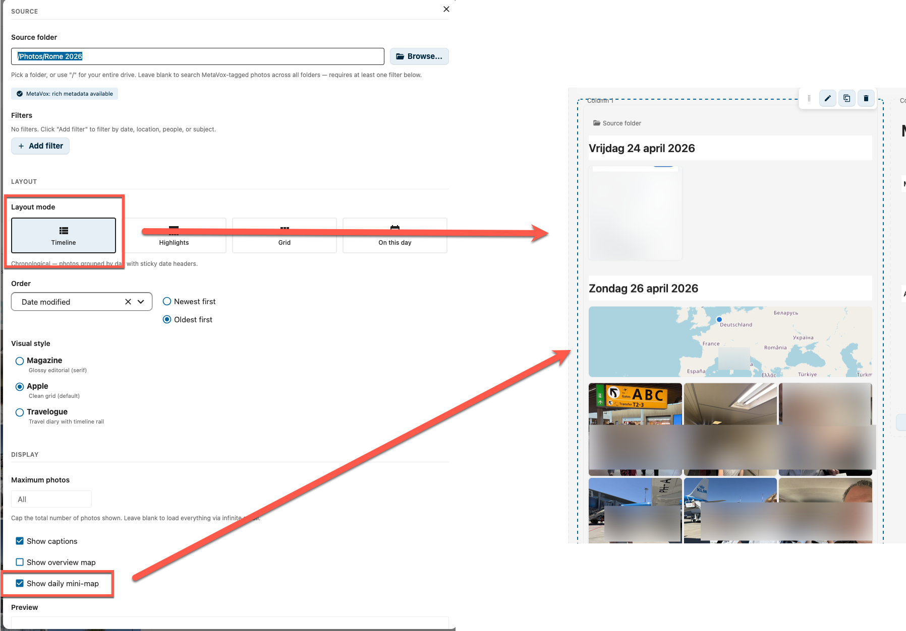
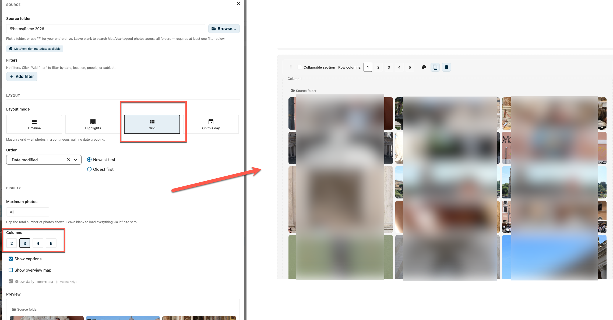
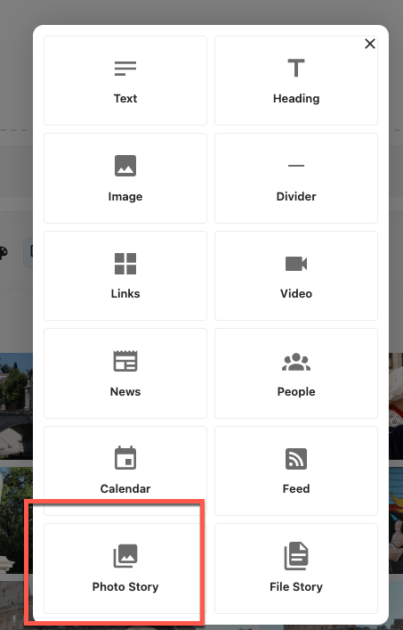

# Photo Story Widget

> **Status:** In development. Behavior, configuration options and visual styles may still change before the first stable release. This page documents the current shape so admins and editors can start experimenting.

The Photo Story Widget turns a folder of photos (and videos) into a rich visual story on an IntraVox page. It reads EXIF metadata and optional MetaVox fields to group photos by day, place them on a map, and surface the most interesting ones automatically.

It is the photo-centric counterpart to the [File Story Widget](file-story-widget.md): both stream content directly from a Nextcloud folder, but Photo Story is optimised for images.

## Features

- **Four layout modes**: Timeline, Highlights, Grid, On this day
- **Three timeline visual styles**: Magazine (serif editorial), Apple (clean grid, default), Travelogue (Polarsteps-like rail)
- **EXIF-driven**: photos can be grouped by date taken, not just file modification date
- **Optional maps**: an overview map for the whole story and a mini-map per day
- **MetaVox integration**: filter and sort on any MetaVox field (people, subjects, locations, custom fields)
- **Cross-folder search**: leave the source folder blank and use filters to pull MetaVox-tagged photos from anywhere
- **Infinite scroll**: folder mode pages photos in batches; a floating year-jump scrubber appears when the story spans multiple years
- **Video & RAW support**: tiles fall back to a typed placeholder (`VIDEO` / `RAW` / extension) when Nextcloud cannot render a preview; videos get a play-button overlay
- **Lightbox**: full-screen viewer with keyboard navigation, opened from any tile or day-map photo
- **Live preview** inside the widget editor: see your changes apply immediately while you tweak

## Layout Modes

### Timeline

Photos are grouped by the day they were taken, with sticky date headers. The default mode for narratives like trips, projects, or events.

Three visual styles are available:

| Style | Look | Best for |
|-------|------|----------|
| **Apple** (default) | Clean square tiles in a tight 5-column grid | General-purpose timelines |
| **Magazine** | Editorial serif typography (Georgia), large varied tiles, 4:3 aspect, deterministic 1–3 column spans per tile | Glossy photo stories, annual reports |
| **Travelogue** | 60 px timeline rail with bullets per day, 2-column photo grid | Trip diaries, multi-day events |

Timeline is the only mode where the visual-style picker and the per-day mini-map toggle apply. It also gets a floating year-jump scrubber on the right when the story spans more than one year.

### Highlights

Automatically curates the most interesting photos using a scoring model based on people, subjects, location, file size and EXIF cues, collapsing near-duplicates from photo bursts. The top photo is rendered as a 16:9 hero (up to 45vh tall) with overlay caption; the rest fill a two-column grid below.

Highlights has its own internal scorer and **does not show the sort dropdown** in the editor — order is computed for you.

### Grid

A continuous masonry wall — no date grouping. Use this when chronology is less important than visual impact. Choose between 2, 3, 4 or 5 columns; roughly one in three photos spans two rows for a varied rhythm.

### On this day

Photos taken on today's date in earlier years, grouped per year (newest first). Requires a concrete source folder — it is not available in cross-folder mode.

## Configuration

To add a Photo Story Widget to your page:

1. Click **+ Add Widget** in edit mode
2. Select **Photo Story** from the widget picker

   

3. Pick a source folder (or leave blank for cross-folder MetaVox search)
4. Tune layout, sorting, and display options
5. The bottom of the editor shows a **live preview** that updates as you change settings

### Source

| Setting | Config key | Description |
|---------|-----------|-------------|
| **Source folder** | `folderPath` | The folder to read photos from. Use `/` for your entire drive. Leave blank with at least one filter for cross-folder MetaVox search. |
| **MetaVox capability badge** | — | Read-only: shows *MetaVox: rich metadata available* or *MetaVox: basic EXIF only*, based on whether the app is installed and the folder has metadata. |
| **Filters** | `metaVoxFilters` | MetaVox field filters (only shown when MetaVox is available). Operators: `equals`, `contains`, `in`, `year_equals`. Value inputs adapt to the field type (date / year / number / checkbox / select / text). Only EXIF-namespaced fields (`exif_*`) are accepted by the server. |

If you leave **Source folder** empty without adding a filter, the widget shows a warning: *"Cross-folder mode (empty source folder) requires at least one filter"*.

### Layout

| Setting | Config key | Description |
|---------|-----------|-------------|
| **Layout mode** | `mode` | Timeline, Highlights, Grid, or On this day |
| **Order** | `sortBy` + `sortOrder` | Sort by date taken (`taken_at`), date modified (`mtime`), filename, file size, or any MetaVox field (multiselect/tags/checkbox excluded). Direction labels adapt to the field type — *Newest/Oldest first*, *A → Z* / *Z → A*, *Largest/Smallest first*. Hidden for Highlights. |
| **Visual style** | `style` | `magazine` / `apple` (default) / `travelogue` — Timeline only |
| **Columns** | `columns` | 2 / 3 / 4 / 5 — Grid only |

When you sort on a MetaVox field, the editor shows the hint *"Sorting on a MetaVox field reorders within each loaded page (best-effort across infinite scroll)."*

### Display

| Setting | Config key | Description |
|---------|-----------|-------------|
| **Maximum photos** | `limit` | Cap the total number of photos (1–500). Leave blank to load everything via infinite scroll. |
| **Show captions** | `showCaptions` (default `true`) | Show location or filename caption on tile hover |
| **Show overview map** | `showMap` (default `false`) | Show a Leaflet map of all photos at the top of the widget. Disabled when the folder has no GPS or when the administrator has turned maps off globally. |
| **Show daily mini-map** | `showDayMaps` (default `true`) | Show a per-day mini-map above each timeline day-header. Only applies to Timeline. |

There is no Title input in the editor — the widget derives a title from the folder name and date range on the server. A small **Source folder** link icon appears at the top of the rendered widget, opening the folder in Nextcloud Files.

## Maps

The widget can render OpenStreetMap-based maps via Leaflet when:

1. Photos have GPS coordinates in their EXIF (or via the MetaVox EXIF backfill)
2. The administrator has not disabled maps globally
3. The widget option is enabled

The administrator controls map availability via these IConfig keys (see [Admin Settings](../admin/settings.md)):

| Key | Purpose |
|-----|---------|
| `photostory.map.enabled` | Master switch — disables all maps when set to `no` |
| `photostory.tiles.url` | Tile-server URL (default `https://tile.openstreetmap.org/{z}/{x}/{y}.png`) |
| `photostory.tiles.attribution` | Attribution text shown on the map |
| `photostory.tiles.max_zoom` | Maximum zoom level |

If the global toggle is off, the **Show overview map** / **Show daily mini-map** controls in the editor are disabled with the hint *"(Disabled by administrator)"*.

## Cross-folder MetaVox search

Leaving the **Source folder** field blank switches the widget into cross-folder mode: it ignores folder structure and pulls every photo that matches the MetaVox filters. This requires at least one filter — without filters the widget shows an empty state with the hint *"Add a filter to start"*.

Cross-folder mode is **emergent**: there is no explicit toggle, the legacy `allMetaVoxFolders` flag is synced automatically from an empty source folder so older saved pages keep working. Cross-folder mode currently runs through the legacy in-memory path; it is not paginated.

Typical use cases:

- *"All photos tagged with `Person = Anna`"*
- *"All photos where `Country = Italy` and `Year = 2025`"*
- *"All photos with subject `Sunset`"*

## Performance

- **ETag / 304**: every `/photos` response carries a per-user ETag (UID baked into the hash, so it cannot leak across tenants). Subsequent requests send `If-None-Match` — when nothing changed the server returns `304 Not Modified` without recomputing.
- **Client-side payload cache**: the widget keeps an in-memory LRU of 8 payloads keyed by source folder + mode + filters + sort. Switching modes (Grid → Timeline → Grid) restores instantly without a round-trip. Paged mode (folder Timeline + Grid) skips this cache to preserve infinite-scroll state.
- **Paged path**: folder-mode Timeline + Grid stream in pages of 200 photos via an IntersectionObserver with an 800 px root-margin. Highlights, On this day, and cross-folder mode use the legacy in-memory path.
- **Hard cap**: 200 000 files per folder tree. Beyond that the response is marked `truncated: true` and a yellow banner appears: *"Showing first {n} photos. Use filters or a more specific folder to narrow the selection."*
- **Debounce**: editor changes are debounced 250 ms before triggering a fetch.
- **`requestIdleCallback`** is used on mount so the first fetch doesn't block initial page render.

## API

The widget calls the following endpoints (all under `/apps/intravox/api/photo-story/`):

| Endpoint | Verb | Purpose |
|----------|------|---------|
| `/photos` | GET | List photos with grouping, sorting, pagination, ETag. Params: `folder`, `mode`, `filters` (JSON), `limit`, `offset`, `pageSize` (max 500), `sortOrder`, `sortBy`, optional `total` hint. |
| `/clusters` | GET | Map cluster aggregates for the overview map. Params: `folder`. |
| `/capabilities` | GET | `{ capabilities: { hasDate, hasLocation, hasPeople, hasSubjects }, metaVoxAvailable, map: { enabled, tile_url, attribution, max_zoom } }` |
| `/photo-exif` | GET | Per-photo EXIF for the lightbox detail panel. Params: `file_id`. |
| `/video` | GET | HTTP-Range-aware video stream (`Accept-Ranges: bytes`, 206 responses). Params: `file_id`. |
| `/metavox-fields` | GET | List of available MetaVox fields (used for the filter and sort dropdowns) |

## Requirements

- IntraVox 1.5.0 or higher (Photo Story widget is shipping in a 1.5.x preview build)
- MetaVox app (optional, strongly recommended for filtering, sorting, and people/place metadata)
- Photos with EXIF metadata (date taken, GPS) for the richest experience
- Leaflet-compatible map tiles configured by the administrator (optional, for maps)
- Server-side `ffmpeg` in Nextcloud's preview chain for video tile previews (optional, falls back to typed placeholder)

## Limitations (current preview)

- The widget is still in active development; layouts and option names may change.
- Sorting on a MetaVox field is best-effort across infinite-scroll pages — within each page the sort is exact, but across page boundaries some interleaving can occur.
- Cross-folder mode is **not paginated** — it loads the full result set into memory. Add filters to keep the result set reasonable.
- Highlights and On this day always use the legacy in-memory path; they ignore the 200-photo page size and load everything up to the 200 k hard cap.
- Video previews require server-side `ffmpeg` in Nextcloud; without it videos fall back to a typed placeholder tile with a play-button overlay.
- Map rendering depends on Leaflet; admins can disable maps globally if they do not want third-party tile traffic.
- The year scrubber is hidden when the widget is narrower than 500 px.

## Related

- [File Story Widget](file-story-widget.md) — documents-centric counterpart
- [News Widget](news-widget.md) — page-centric counterpart with publication dates
- [MetaVox EXIF backfill](../admin/settings.md) — how to fill MetaVox fields from EXIF for legacy photos
