# IntraVox editor-gids

Voor content-editors die pagina's in IntraVox maken en onderhouden.

## Vereisten

Om content te bewerken heb je nodig:

- Een Nextcloud-account
- Editor-rechten (toegewezen door je beheerder)
- Toegang tot de relevante IntraVox-secties

## Bewerken — basis

### Edit-modus openen

1. Navigeer naar de pagina die je wilt bewerken
2. Klik op de **Bewerk**-knop (potlood-icoon) in de toolbar
3. De pagina schakelt naar edit-modus

### Edit-modus-interface

```
┌─────────────────────────────────────────────────────────────┐
│  [Opslaan] [Annuleren]                        Edit-modus    │
├─────────────────────────────────────────────────────────────┤
│  ┌──────────────┐  ┌────────────────────────────────────┐   │
│  │   Widget-    │  │                                    │   │
│  │   palet      │  │      Pagina-canvas                 │   │
│  │              │  │                                    │   │
│  │  [Kop]       │  │  [Rij 1]                           │   │
│  │  [Tekst]     │  │  ┌─────────────────────────┐       │   │
│  │  [Beeld]     │  │  │  Widget (bewerkbaar)    │       │   │
│  │  [Links]     │  │  └─────────────────────────┘       │   │
│  │  [Scheider]  │  │                                    │   │
│  │              │  │  [Rij 2]                           │   │
│  │  [Rij +]     │  │  ┌──────────┐ ┌──────────┐         │   │
│  └──────────────┘  │  │ Widget 1 │ │ Widget 2 │         │   │
│                    │  └──────────┘ └──────────┘         │   │
│                    └────────────────────────────────────┘   │
└─────────────────────────────────────────────────────────────┘
```

### Wijzigingen opslaan

- Klik **Opslaan** om je wijzigingen te bewaren
- Klik **Annuleren** om wijzigingen te verwerpen en edit-modus te verlaten
- Wijzigingen zijn pas zichtbaar voor anderen na opslaan

De Opslaan- en Annuleren-knoppen blijven vast bovenaan de pagina tijdens scrollen, ook op lange pagina's.


*De toolbar blijft zichtbaar bovenaan tijdens het scrollen door een lange pagina in edit-modus*

> **Een pagina in een andere taal bewerken.** Heeft je intranet inhoud in meerdere talen, dan kun je elke pagina bewerken die je kunt openen — het opslaan gaat terug naar de taal waar de pagina bij hoort. Je hoeft dus nooit eerst je persoonlijke Nextcloud-taalinstelling te wijzigen. Nieuwe pagina's volgen de structuur waarin je werkt: een subpagina komt in de taal van de ouderpagina, en een pagina op hoofdniveau in de taal die je op dat moment bekijkt. Zie [Taalbeheer](../admin/language-management.nl.md#in-welke-taal-schrijven-redacteuren).

### Pagina-locking

Wanneer je een pagina begint te bewerken, lockt IntraVox hem automatisch om te voorkomen dat andere gebruikers tegelijk wijzigingen maken. Andere gebruikers zien wie aan het bewerken is en kunnen pas in edit-modus na jouw opslaan, annuleren, of na het verlopen van de lock.

- Locks verlopen automatisch na **15 minuten** inactiviteit
- Een heartbeat houdt de lock actief tijdens bewerken
- Locks worden vrijgegeven bij opslaan, annuleren, weg-navigeren of tabblad sluiten
- Verloopt je lock (bv. verbinding kwijt)? Dan krijg je een waarschuwing om je werk op te slaan

**IntraVox-beheerders** kunnen een pagina force-unlocken als een lock is blijven hangen (bv. na browser-crash). Zij zien een "Ontgrendelen"-knop naast de lock-indicator.

### Concept- en gepubliceerd-status

Pagina's hebben een status: **Concept** of **Gepubliceerd**. Dit bepaalt wie de pagina kan zien.

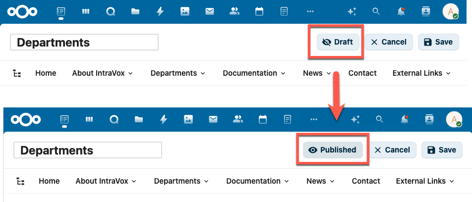

*In edit-modus staat de Concept/Gepubliceerd-knop in de toolbar. Klik om te wisselen.*

**Hoe het werkt:**

| Status | Zichtbaar voor editors | Zichtbaar voor lezers | In zoeken | In RSS-feed | Via publieke link |
|--------|--------------------------|------------------------|-----------|--------------|---------------------|
| **Gepubliceerd** | Ja | Ja | Ja | Ja | Ja |
| **Concept** | Ja | Nee | Nee | Nee | Nee |

- **Editors** zijn gebruikers met schrijfrechten op de pagina-folder (IntraVox-beheerders, IntraVox-editors, en gebruikers met schrijftoegang via GroupFolder-ACL)
- **Lezers** zijn gebruikers met alleen-lezen-rechten (reguliere IntraVox-gebruikers)
- Binnen IntraVox verschijnt een concept-pagina nergens voor lezers: niet in navigatie, zoekresultaten, page-tree, RSS-feeds of publieke share-links

> **Belangrijk — Concept is een zichtbaarheidsfilter, geen recht.**
>
> Concept bepaalt wat IntraVox *toont*. Het verandert niets aan de toegangsrechten op het onderliggende bestand. Elke pagina wordt opgeslagen als JSON-bestand in de IntraVox-teammap, en dat bestand houdt de normale Nextcloud-rechten van die map. Iedereen die de map mag lezen, kan de inhoud van een concept-pagina dus nog steeds bereiken via:
>
> - de **Files-app** of **WebDAV** (rechtstreeks naar de paginamap bladeren)
> - **Unified Search / Fulltextsearch** op de bestandsinhoud
> - de **activiteitenstroom** en notificaties ("… heeft page-x.json aangepast")
> - **Versiegeschiedenis** en de **prullenbak**
> - **Collabora/Office** als iemand het bestand direct opent
> - **desktop- en mobiele sync-clients**
> - eventuele **MetaVox-metadata** naast de pagina
>
> **Gebruik Concept niet voor vertrouwelijke inhoud.** Moet een pagina echt onleesbaar zijn voor een groep mensen, beperk dan de toegang op de map zelf met geavanceerde rechten (Team folder/GroupFolder-ACL), of houd de inhoud buiten IntraVox tot hij klaar is.

**Nieuwe pagina's beginnen als Concept.** Wanneer je een nieuwe pagina maakt (leeg of vanuit template), staat hij automatisch op Concept en opent in edit-modus. Zo kun je je pagina opbouwen voor je hem zichtbaar maakt.

**Status wisselen:**

1. Open edit-modus
2. Klik de **Concept**- of **Gepubliceerd**-knop in de toolbar (met oog-icoon)
3. De status wijzigt direct — sla op om toe te passen

**Best practices:**

- Gebruik Concept om nieuwe pagina's of grote updates voor te bereiden vóór publicatie
- Onthoud dat een gepubliceerde pagina op Concept zetten hem direct onzichtbaar maakt voor lezers *binnen IntraVox*
- Alleen editors (gebruikers met schrijfrechten) kunnen de pagina-status zien en wijzigen
- Voor echt vertrouwelijk materiaal: vertrouw op maprechten, niet op Concept

### Geplande publicatie (Publish on / Expire on)

In plaats van handmatig publiceren kun je een **datum** laten beslissen. Als je beheerder publicatie-datumvelden heeft ingesteld (zie [News-widget → Publicatie-datum-filtering](../features/news-widget.nl.md#publicatie-datum-filtering)), krijgt elke pagina een veld **Publish on** en eventueel **Expire on** in het tabblad **MetaVox** van de detailzijbalk (de ⓘ-knop, beschikbaar in zowel weergave- als bewerkmodus).

**Een pagina heeft altijd precies één van drie statussen:**

| Status | Wanneer | Zichtbaar voor lezers |
|--------|---------|------------------------|
| **Concept** | Geen publicatiedatum, en jij zet de pagina op Concept | Nee |
| **Gepland** | De publicatiedatum ligt in de toekomst | Nee — tot dat moment |
| **Gepubliceerd** | De publicatiedatum is verstreken, of de pagina is gepubliceerd zonder datum | Ja |

Editors zien de pagina altijd, met een **Gepland**- of **Verlopen**-badge naast de titel.

**De datum wint.** Zodra een pagina een Publish on-datum heeft, bepaalt die datum de publicatie en wordt de handmatige Concept/Gepubliceerd-knop genegeerd — de knop wordt vervangen door een alleen-lezen chip met de effectieve status. Zo kan de tegenstrijdige situatie niet meer ontstaan waarin een pagina "Concept" heet terwijl de publicatiedatum allang verstreken is.

**Wil je weer handmatig sturen? Maak de Publish on-datum leeg.** De Concept/Gepubliceerd-knop wordt dan weer actief.

**Een pagina inplannen:**

1. Open de pagina en klik op **ⓘ** om de detailzijbalk te openen
2. Ga naar het tabblad **MetaVox**
3. Zet **Publish on** op de datum *en tijd* waarop de pagina live moet gaan — vul **beide** in; MetaVox toont zijn **Opslaan**-knop pas als het veld een volledige datum én tijd bevat
4. Sla de metadata op. De pagina toont **Gepland** tot dat moment en wordt daarna automatisch zichtbaar

Er is geen achtergrondtaak nodig — de status wordt bepaald op het moment dat iemand de pagina bekijkt. Het tijdstip telt mee: een pagina die om 15:00 vandaag gepland staat, blijft verborgen tot 15:00.

> **Beheerders — stel de tijdzone van de instance in.** Publicatie- en vervaltijden zijn "naïef" (ze dragen zelf geen tijdzone), dus IntraVox interpreteert ze in de tijdzone van de instance: de systeeminstelling `logtimezone`, met terugval op de tijdzone van de kijker en daarna die van de server. Veel servers draaien op **UTC**, waardoor anonieme share-bezoekers — die geen persoonlijke tijdzone hebben — een pagina op het verkeerde lokale moment zien verschijnen (twee uur te laat bij CEST). Stel het één keer in, dan krijgt iedere bezoeker hetzelfde moment:
> ```bash
> occ config:system:set logtimezone --value=Europe/Amsterdam
> ```

**Vervallen** werkt omgekeerd hetzelfde: zodra de Expire on-datum verstreken is, is de pagina weer verborgen voor lezers en zien editors een **Verlopen**-badge.

> Dezelfde kanttekening als bij Concept geldt hier: Gepland en Verlopen zijn zichtbaarheidsfilters binnen IntraVox, geen toegangsrechten. Het paginabestand blijft leesbaar voor iedereen met toegang tot de map.

## Pagina-structuur

### Rijen

Pagina's zijn georganiseerd in rijen. Elke rij kan hebben:

- 1–5 kolommen
- Een achtergrondkleur
- Meerdere widgets
- Inklapbare sectie (met titel, standaard ingeklapt/uitgeklapt)

Pagina's kunnen ook een **header-rij** (full-width banner bovenaan) en optionele **zij-kolommen** (linker- of rechter-sidebar) hebben.

**Rij toevoegen:**

1. Klik "Rij toevoegen" onderaan de pagina
2. Selecteer het aantal kolommen
3. De nieuwe rij verschijnt onderaan

**Rij configureren:**

1. Hover over de rij
2. Klik op het instellingen-icoon
3. Wijzig kolommen of achtergrondkleur

#### Inklapbare secties

Rijen kunnen inklapbaar worden gemaakt, zodat gebruikers content-secties kunnen uit- en inklappen. Handig voor FAQ-pagina's, lange content, of optionele details.

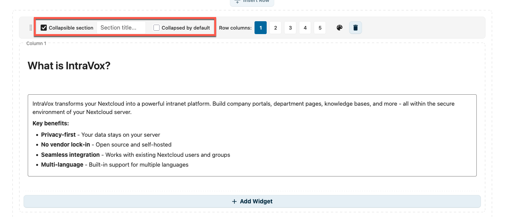

*Edit-modus: activeer "Inklapbare sectie", stel een sectie-titel in, en vink optioneel "Standaard ingeklapt" aan*

**Inklapbare rij opzetten:**

1. Hover over de rij en klik op het instellingen-icoon
2. Vink **Inklapbare sectie** aan
3. Voer een **Sectie-titel** in (verschijnt als klikbare header)
4. Vink optioneel **Standaard ingeklapt** aan om content bij page-load te verbergen

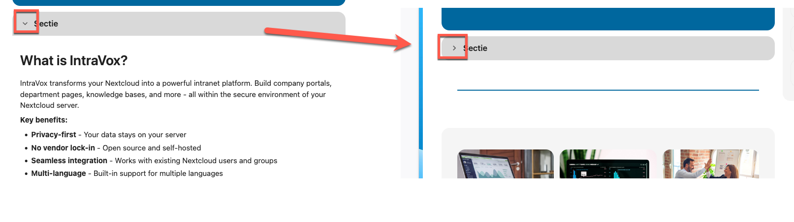

*View-modus: gebruikers klikken op de pijl om de sectie open/dicht te toggelen*

**Best practices:**

- Gebruik beschrijvende sectie-titels zodat gebruikers weten wat te verwachten
- Gebruik "Standaard ingeklapt" voor aanvullende content die niet iedereen nodig heeft
- Houd vaak-bezochte content standaard uitgeklapt

**Praktijkvoorbeeld — FAQ-pagina met meerdere inklapbare secties:**

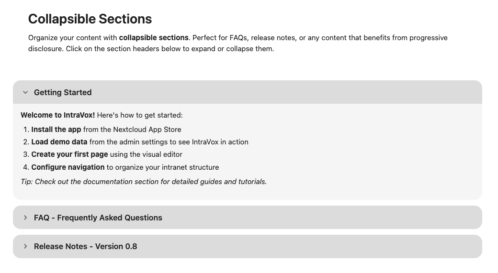

*Typische FAQ-pagina: de eerste sectie is uitgeklapt met inhoud, de rest blijven ingeklapt tot ze worden aangeklikt.*

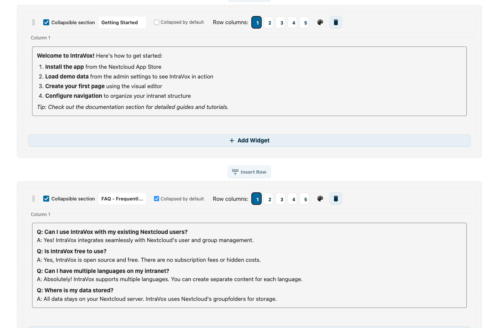

*Edit-modus: stack meerdere inklapbare rijen. Elk heeft eigen titel en "Standaard ingeklapt"-instelling.*

**Een rij dupliceren:**

Je kunt een complete rij dupliceren, inclusief alle kolommen en widgets.

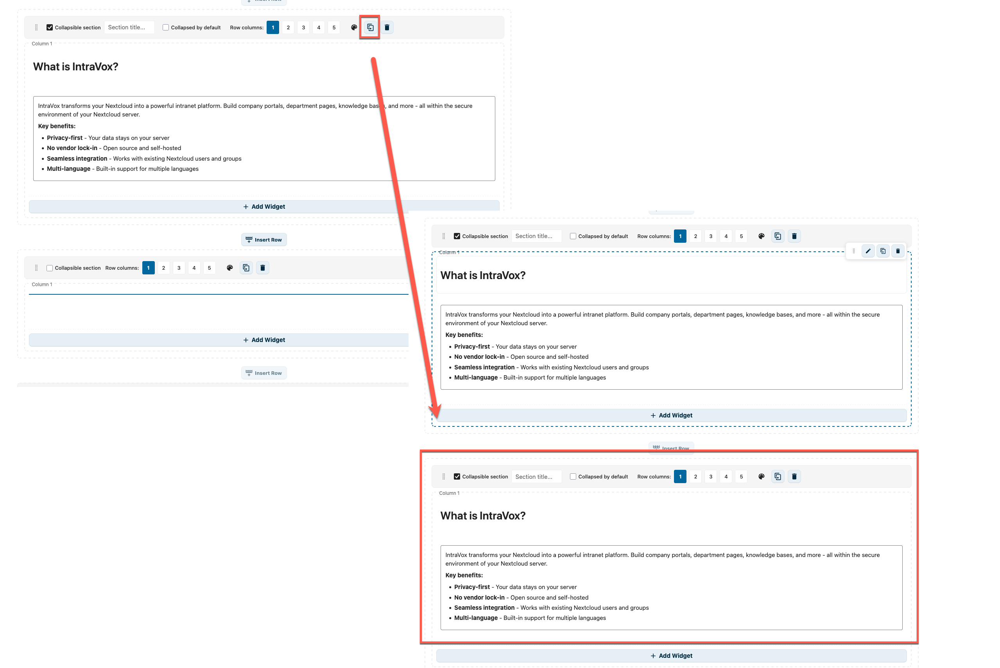

*Klik op het kopieer-icoon in de rij-controls om de rij te dupliceren*

1. Hover over de rij
2. Klik op het kopieer-icoon (naast het delete-icoon)
3. Een kopie van de rij verschijnt direct eronder, met alle widgets gedupliceerd
4. Bewerk de kopie onafhankelijk — wijzigingen raken de origineel niet

Handig voor pagina's met repeterende layouts, zoals afdelings-cards of FAQ-secties.

**Een rij verwijderen:**

1. Hover over de rij
2. Klik op het delete-icoon
3. Bevestig verwijdering

### Kolommen

Rijen kunnen 1–5 kolommen hebben:

| Layout | Beschrijving |
|--------|--------------|
| 1 kolom | Full-width content |
| 2 kolommen | Split 50/50 |
| 3 kolommen | Drie gelijke kolommen |
| 4 kolommen | Vier gelijke kolommen |
| 5 kolommen | Vijf gelijke kolommen |

### Zij-kolommen

Pagina's kunnen optionele zij-kolommen hebben:

- Linker-sidebar
- Rechter-sidebar

In te schakelen via pagina-instellingen.

## Widgets

Widgets zijn de bouwblokken van pagina-content.

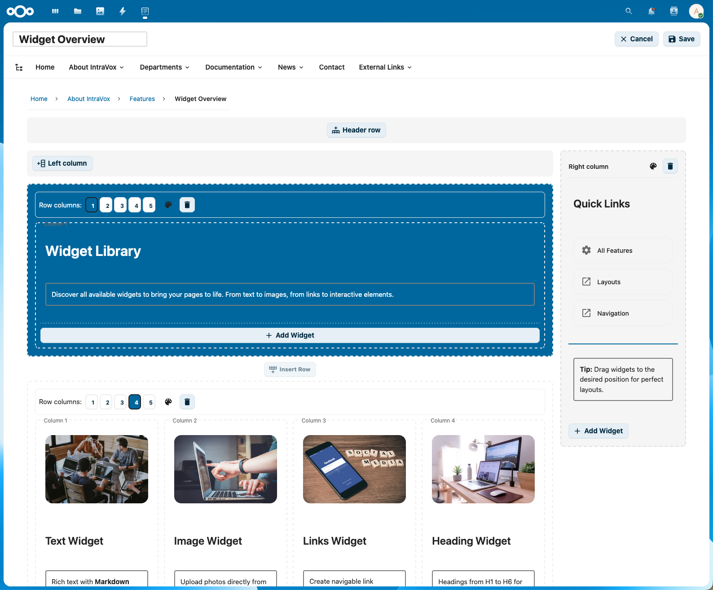

*Het widget-palet toont alle beschikbare widget-typen*

### Widgets toevoegen

1. Klik in het widget-palet op het widget-type
2. Sleep het naar de gewenste plek op de pagina
3. Of klik om toe te voegen aan de eerste beschikbare kolom

### Widget-typen

#### Kop

Titels en sectie-headers.

**Opties:**

- Niveau: H1 (grootst) tot H6 (kleinst)
- Inhoud: de kop-tekst

**Best practices:**

- Gebruik H1 voor pagina-titel (één per pagina)
- Gebruik H2 voor hoofdsecties
- Gebruik H3–H4 voor subsecties

**Link naar een sectie.** Elke kop is ook een anker. Beweeg je muis over een kop (in weergavemodus) en er verschijnt een klein link-icoontje; klik erop om een directe link naar die sectie te kopiëren — bijvoorbeeld `…?page=…#h-vakantierooster`. Wie die link opent, komt op de pagina en springt direct naar de kop. Dit werkt ook voor koppen bínnen een tekstwidget en in publieke deellinks, zodat je collega's naar één specifiek deel van een lange pagina kunt verwijzen.

#### Tekst

Rich-text content met opmaak.

**Opmaak-opties:**

- **Vet** (`Ctrl+B`)
- *Italic* (`Ctrl+I`)
- Onderstrepen (`Ctrl+U`)
- Bullet-lijsten
- Genummerde lijsten
- Links

**Dummy-tekst-generator (easter egg):**

Heb je placeholder-tekst nodig tijdens ontwerpen? Typ een speciaal commando op een lege regel en druk **Enter** voor dummy-content — geïnspireerd op Microsoft Word's `=rand()`.

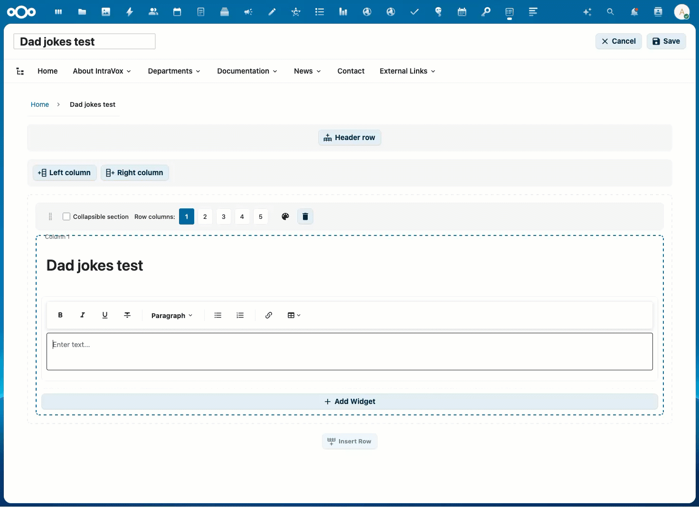

*Flauwe grappen met rijke opmaak: koppen, genummerde lijsten, vet voor de setup en cursief voor de clou*

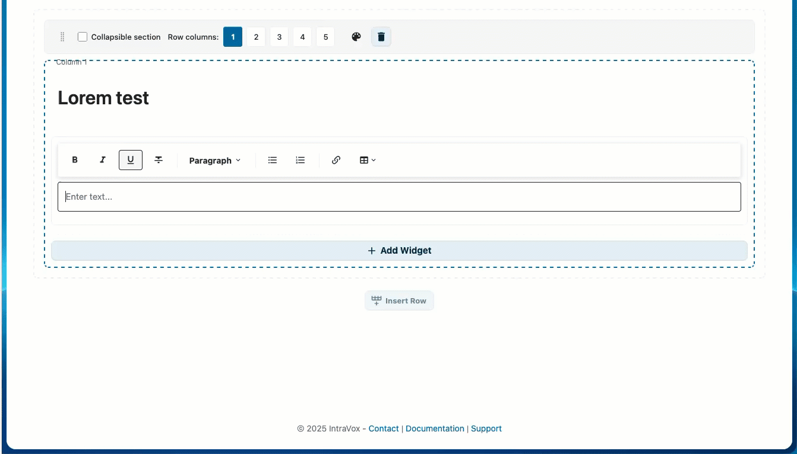

*Lorem Ipsum-showcase: koppen, paragrafen, blockquotes, lijsten, tabellen en inline-marks*

| Commando | Beschrijving | Voorbeeld |
|----------|--------------|-----------|
| `=dadjokes()` | Genereer flauwe grappen | `=dadjokes(3,5)` → 3 secties van 5 grappen |
| `=lorem()` | Rich Lorem Ipsum-showcase | `=lorem(6,3)` → 6 secties met gevarieerde opmaak |

**Parameters**: `=(commando)(secties, items)` — beide optioneel, standaard 3 secties van 3 items. Maximum is 20 voor beide waarden.

**Hoe het werkt:**

1. Klik in een tekst-widget in edit-modus
2. Typ `=dadjokes()` of `=lorem()` op een lege regel
3. Druk **Enter**
4. Het commando wordt vervangen door gegenereerde inhoud

**Rich opmaak:**

Beide commando's genereren rijk opgemaakte content die de mogelijkheden van het tekst-widget showcased:

`=dadjokes()` genereert:

- **Sectie-koppen** (bv. "Flauwe Grappen #1", "Flauwe Grappen #2")
- **Genummerde lijsten** met elke grap als list-item
- **Vet** voor de setup en *italic* voor de clou

`=lorem()` roteert door 6 opmaak-patronen om alle widget-features te demonstreren:

| Patroon | Gebruikte elementen |
|---------|---------------------|
| Kop + paragraaf | `<h2>`-kop, **vet** en *italic* tekst |
| Blockquote | Ingesprongen quote-blok |
| Bullet-lijst | `<ul>` met **vet**-fragmenten |
| Tabel | 3-koloms tabel met header, vet voor categorieën, italic voor statussen |
| Genummerde lijst | `<h3>`-kop + `<ol>` met *italic* |
| Mixed inline | `code`, <u>onderstrepen</u>, ~~doorhalen~~, **vet**, *italic* |

Met `=lorem(6,3)` krijg je één van elk patroon — perfect om het volledige tekst-widget aan gebruikers te demonstreren.

**Meertalige ondersteuning:**

Beide commando's passen zich automatisch aan de Nextcloud-taal van de gebruiker aan:

| Taal | Flauwe-grappen-kop | Lorem-koppen |
|------|---------------------|---------------|
| Engels | Dad Jokes | Section, Key Points, Overview, Steps, Additional Notes |
| Nederlands | Flauwe Grappen | Sectie, Kernpunten, Overzicht, Stappen, Aanvullende Opmerkingen |
| Duits | Flachwitze | Abschnitt, Kernpunkte, Übersicht, Schritte, Zusätzliche Hinweise |
| Frans | Blagues de Papa | Section, Points Clés, Aperçu, Étapes, Notes Complémentaires |

Elke taal heeft eigen collectie van ~80 grappen. Tabel-kolom-headers en status-labels zijn ook gelokaliseerd. Geen vertaling beschikbaar voor jouw taal? Dan wordt Engels als fallback gebruikt.

Alle content zit in IntraVox ingebakken (geen internet-verbinding nodig) en wordt elke keer willekeurig geschud, dus krijg je telkens andere content.

#### Afbeelding

Foto's, diagrammen en graphics met optionele klikbare links.

**Opties:**

- Afbeelding-bron: kies uit IntraVox-media-folder of upload nieuwe
- Alt-tekst: beschrijving voor toegankelijkheid
- Object-fit: cover, contain of auto
- Link (optioneel): maak de afbeelding klikbaar
  - Link naar pagina: navigeer naar een IntraVox-pagina
  - Externe URL: open externe website

**Afbeeldings-groottes:**

- Klein: thumbnail-formaat
- Middel: halve breedte
- Groot: volle breedte
- Custom: specificeer pixels-breedte

**Best practices:**

- Gebruik beschrijvende alt-tekst
- Optimaliseer afbeeldingen vóór upload (< 500 KB)
- Gebruik passende aspect-ratio's
- Gebruik klikbare afbeeldingen voor navigatie-cards en banners

#### Video

Embed video's van externe platforms of upload lokale video's.

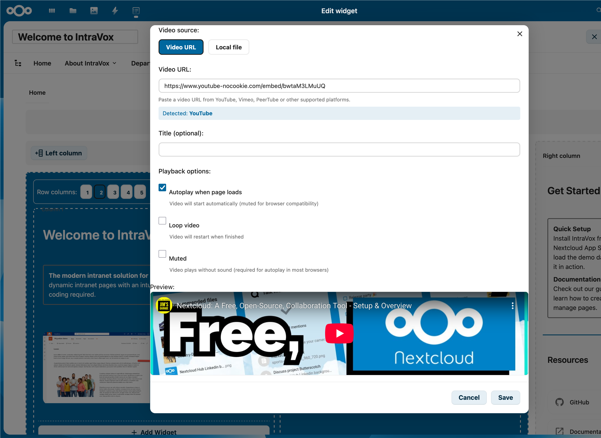

*Plak een YouTube/Vimeo/PeerTube-URL en IntraVox detecteert het platform automatisch. Schakel naar **Lokaal bestand** voor een MP4-upload.*

**Ondersteunde platforms:**

- YouTube (privacy-enhanced modus)
- Vimeo
- PeerTube-instances
- Lokale video-upload (MP4)

**Opties:**

- Video-URL: plak een video-URL van een ondersteund platform
- Upload: upload een video-bestand naar Nextcloud-opslag
- Titel: weergave-titel boven de video
- Autoplay: video automatisch starten (gedempt)
- Loop: herhaal video bij einde

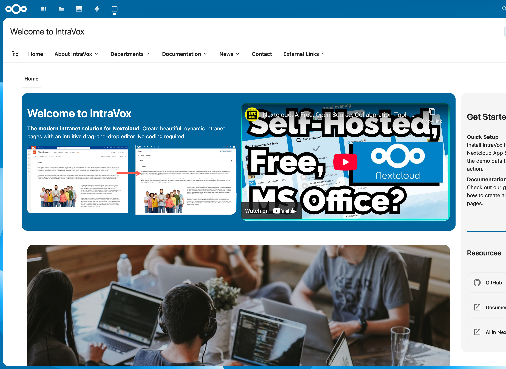

*Een YouTube-embed naast andere widgets op een gepubliceerde homepage.*

**Geblokkeerde domeinen:**

Heeft de beheerder het video-platform niet op de whitelist staan? Dan toont het widget een waarschuwings-placeholder in plaats van de player:

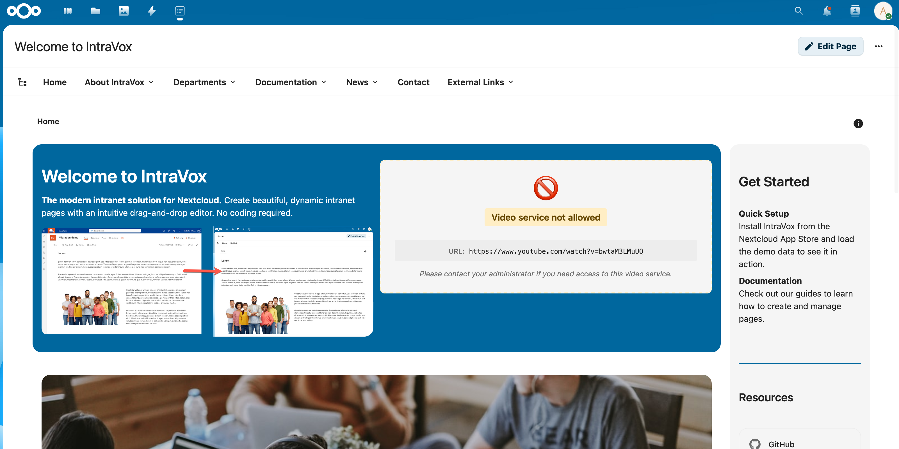

Vraag je beheerder het platform aan te zetten via **Instellingen → IntraVox → Video Services**.

**Best practices:**

- Gebruik waar mogelijk privacy-vriendelijke platforms
- Houd geüploade video's onder 100 MB voor performance
- Voeg altijd een beschrijvende titel toe
- Check dat het video-domein is whitelisted door je beheerder

#### Links

Verzamelingen van links weergegeven als kaarten of lijst.

**Opties:**

- Titel: link-titel
- Beschrijving: korte beschrijving
- URL: bestemming (pagina of extern)
- Icoon: optioneel icoon
- Target: zelfde venster of nieuw tabblad
- Kolommen: 1–4 kolommen voor card-layout

**Best practices:**

- Groepeer gerelateerde links samen
- Gebruik beschrijvende titels
- Geef externe links duidelijk aan

#### Bestand

Link naar een downloadbaar bestand.

**Opties:**

- Pad: bestandspad binnen IntraVox-opslag
- Naam: weergave-naam voor de link

**Best practices:**

- Gebruik beschrijvende bestandsnamen
- Houd bestandspaden georganiseerd in mappen

#### Scheider

Visuele separators tussen content-secties.

**Opties:**

- Stijl: solid, dashed of transparent
- Kleur: lijn-kleur (of inherit)
- Hoogte: lijn-dikte of ruimte-hoogte

#### Spacer

Voegt verticale ruimte toe tussen content-secties.

**Opties:**

- Hoogte: 10–200 pixels (standaard: 20)

#### Nieuws

Dynamische nieuwsfeed die de laatste pagina's toont.

**Layout-opties:**

- Lijst: verticale lijst van artikelen
- Grid: card-grid met configureerbare kolommen
- Carousel: auto-scrollende slider

**Opties:**

- Limiet: maximaal aantal artikelen (standaard: 5)
- Toon afbeelding, datum, samenvatting: zichtbaarheid wisselen
- Samenvatting-lengte: tekens om te tonen
- Sorteer op: gewijzigd-datum, aangemaakt-datum of titel
- Autoplay-interval (alleen carousel): seconden tussen slides

Voor uitgebreide documentatie: zie [News-widget](../features/news-widget.md).

#### Mensen

Gebruikers-directory-widget dat team-leden toont.

**Layout-opties:**

- Card: profile-cards met avatar en details
- Lijst: compacte lijst-weergave
- Grid: avatar-grid met configureerbare kolommen

**Selectie-modi:**

- Filter: toon gebruikers die filter-criteria matchen (aanbevolen voor portabiliteit)
- Handmatig: selecteer specifieke gebruikers op ID

**Opties:**

- Kolommen: 1–4 kolommen
- Limiet: maximaal aantal te tonen gebruikers
- Toon velden: avatar, naam, rol, afdeling, telefoon, e-mail etc. aan/uit
- Sorteer op: weergave-naam, laatste login, etc.

Voor uitgebreide documentatie: zie [People-widget](../features/people-widget.md).

#### Agenda

Toon aankomende afspraken uit gedeelde Nextcloud-agenda's met gekleurde datum-badges en responsieve grid-layout.

**Opties:**

- Agenda's: selecteer één of meer (samengevoegde view met kleur-coding)
- Datum-bereik: toekomst (deze week tot volgend jaar) of verleden (vorige week tot 3 maanden terug)
- Limiet: maximaal aantal te tonen events (1–20)
- Toon tijd: tijdsvermelding aan/uit
- Toon locatie: locatie aan/uit

**Features:**

- Terugkerende afspraken worden automatisch geëxpandeerd naar individuele instances
- Events zijn klikbaar en openen in Nextcloud Calendar
- Layout past zich automatisch aan: 1 kolom in zij-kolommen, 2–3 kolommen in bredere gebieden

Voor uitgebreide documentatie: zie [Calendar-widget](../features/calendar-widget.md).

### Widgets bewerken

1. Klik op een widget om te selecteren
2. Gebruik de toolbar of het properties-paneel om te bewerken
3. Wijzigingen verschijnen direct

### Widgets verplaatsen

**Drag-and-drop:**

1. Klik en houd een widget vast
2. Sleep naar de nieuwe positie
3. Laat los om te plaatsen

**Tussen kolommen:** sleep widgets tussen kolommen in dezelfde rij.

**Tussen rijen:** sleep widgets naar andere rijen.

### Widgets verwijderen

1. Selecteer het widget
2. Klik op het delete-icoon (prullenbak)
3. Widget wordt direct verwijderd

## Werken met media

### Afbeeldingen uploaden

**Via de editor (aanbevolen):**

1. Voeg een afbeelding-widget toe of bewerk een bestaand
2. Klik "Upload" in de afbeelding-editor
3. Selecteer een afbeelding van je computer
4. De afbeelding wordt automatisch naar de `_media/`-folder geüpload

**Via Nextcloud Files:**

1. Open Nextcloud Files
2. Navigeer naar IntraVox-folder → jouw taal → `_media/`
3. Upload je afbeelding
4. Keer terug naar IntraVox en selecteer de afbeelding

**Bestaande afbeelding selecteren — drie tabs:**

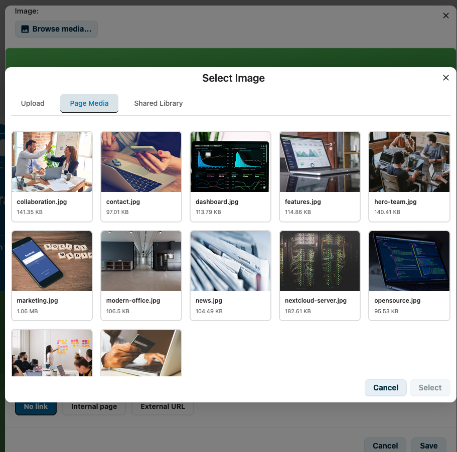

*De afbeelding-picker heeft drie tabs: **Upload** voor nieuwe bestanden, **Pagina-media** voor afbeeldingen in de `_media/`-folder van de huidige pagina, en **Gedeelde bibliotheek** voor site-brede assets.*

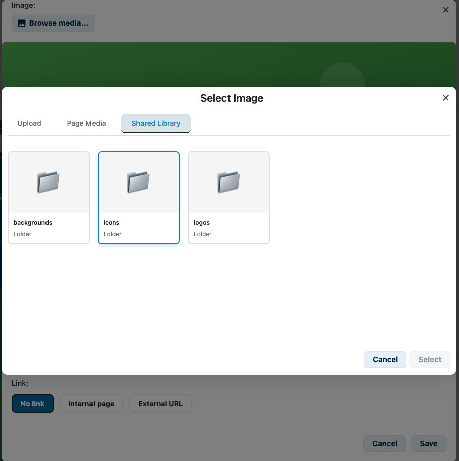

*De **Gedeelde bibliotheek** bewaart herbruikbare assets zoals achtergronden, iconen en logo's die beschikbaar moeten zijn op alle pagina's.*

### Video's uploaden

**Lokale video-upload:**

1. Voeg een video-widget toe
2. Klik "Video uploaden"
3. Selecteer een MP4-bestand van je computer
4. De video wordt geüpload naar de `_media/`-folder

**Externe video:**

1. Voeg een video-widget toe
2. Plak een video-URL (YouTube, Vimeo, PeerTube)
3. De video wordt embedded vanaf het externe platform

### Media-richtlijnen

| Type | Aanbevolen grootte | Format |
|------|---------------------|--------|
| Hero-afbeeldingen | 1920×600 px | JPG |
| Content-afbeeldingen | 800×600 px | JPG/PNG |
| Iconen | 64×64 px | PNG/SVG |
| Logo's | 200×100 px | PNG/SVG |
| Video's | 1920×1080 px max | MP4 (H.264) |

### Media-optimalisatie

Voor je uploadt:

1. Schaal naar passende afmetingen
2. Comprimeer om bestandsgrootte te verkleinen
3. Gebruik JPG voor foto's, PNG voor graphics
4. Houd afbeelding-bestanden onder 500 KB
5. Houd video-bestanden onder 100 MB voor beste performance

## Navigatie

### Paginastructuur

Het **Paginastructuur**-paneel opent via de knop naast de breadcrumb, op dezelfde hoogte als de Details-knop (ℹ️) en daar tegenover gespiegeld: structuur links, details rechts. *Sinds 2.2.0* is het een paneel naast de content in plaats van een pop-up, dus het blijft open terwijl je van pagina naar pagina klikt — het is een inhoudsopgave, geen dialoog die je steeds wegklikt.


*Het paneel blijft open terwijl je navigeert. De twee tabs bovenin schakelen tussen de paginaboom en de koppen van de pagina die je leest.*

Het paneel heeft twee tabs:

- **Pagina's** — al je echte pagina's in een boom. Blader door de hiërarchie en klik een pagina aan om die te openen.
- **Op deze pagina** — de koppen van de pagina die je op dat moment leest. Zie [Op deze pagina](#op-deze-pagina) hieronder.

Of het paneel open staat, en welke van de twee tabs je het laatst gebruikte, wordt onthouden terwijl je navigeert en als je de pagina herlaadt. Op schermen smaller dan 1024px wordt het paneel een overlay over de content in plaats van dat het de content opzij duwt.

> De details-zijbalk rechts (de ⓘ-knop, met de tabs Details, Versies, Vertalingen en MetaVox) gedraagt zich *sinds 2.2.0* net zo: de knop is een echte schakelaar die hem zowel opent als sluit, hij blijft open als je naar een andere pagina gaat — en volgt dan mee met de pagina waar je bent — en hij houdt z'n plek op het scherm terwijl je scrollt.

Zet je **Structuur beheren** aan (beschikbaar waar je bewerkrechten hebt), dan wordt elke rij van de tab **Pagina's** een set knoppen om de echte pagina's te ordenen — dit is iets anders dan **Navigatie bewerken**, dat alleen de links in de navigatiebalk en hun volgorde wijzigt.

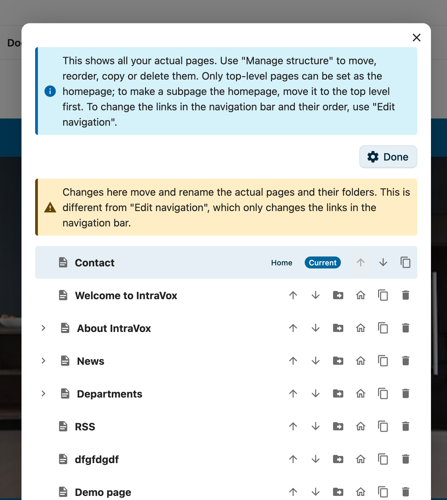

*Beheer-modus: elke pagina heeft knoppen voor hernoemen, verplaatsen, herordenen, als-startpagina-instellen, kopiëren en verwijderen. De huidige startpagina (badge "Home") kan niet verplaatst of verwijderd worden.*

#### Wat je per pagina kunt doen

- **Herordenen** — de pijltjes omhoog (↑) en omlaag (↓) verplaatsen een pagina tussen z'n broers en zussen. De pijltjes zijn uitgeschakeld boven- en onderaan een lijst.
- **Naar andere pagina verplaatsen** — de map-pijl opent een inline-paneel waar je een nieuwe ouder kiest, of zet **Naar het hoogste niveau** aan om de pagina naar de root te promoveren. De sub-pagina's gaan mee. Een pagina kan niet in zichzelf of een eigen sub-pagina worden geplaatst, en de maximale nesting-diepte (5 niveaus) wordt gerespecteerd.
- **Hernoemen** — het potlood-icoon opent een klein dialoog om de titel van de pagina te wijzigen. Standaard verandert alleen de titel en blijft elke link naar de pagina werken. *Sinds 2.0.1* biedt het dialoog daarnaast **Ook de map van de pagina hernoemen**, met een voorbeeld van de oude en nieuwe naam: vink je dat aan, dan volgt de map in de Team-map de titel, zodat rechtenbeheer leesbaar blijft. De optie staat voorgeselecteerd zolang de map nog z'n van-de-titel-afgeleide naam draagt, en uit wanneer iemand de map bewust anders heeft genoemd; de startpagina biedt hem nooit aan. Sub-pagina's, afbeeldingen en bestanden reizen mee, en links op pagina-ID, deellinks en versiegeschiedenis blijven allemaal werken — alleen heel oude links die de *mapnaam* in het adres gebruiken, stoppen met werken. Als het navigatie-menu-label nog gelijk was aan de oude titel, wordt het meebijgewerkt; een label dat je bewust anders hebt gezet, blijft staan. Je kunt de pagina die je bekijkt ook hernoemen via **Pagina hernoemen** in het pagina-acties (⋯) menu.
- **Als startpagina instellen** — het huis-icoon maakt een pagina de landingspagina voor de huidige taal. Alleen **pagina's op het hoogste niveau** kunnen de startpagina zijn; wil je een sub-pagina als startpagina, verplaats die dan eerst naar het hoogste niveau.
- **Kopiëren** — dupliceert de pagina als een nieuw **Concept** met de titel "… (copy)", inclusief media, zodat je die kunt aanpassen zonder het origineel te raken. De kopie is een zelfstandige pagina: hij begint ongekoppeld en wordt dus nooit aan lezers aangeboden als taalversie van het origineel. Wil je een versie in een andere taal, gebruik dan de tab [Vertalingen](#vertalingen).
- **Verwijderen** — verwijdert de pagina na een bevestiging.

#### De startpagina is beschermd

De huidige startpagina draagt een **Home**-badge en kan niet verplaatst of verwijderd worden — wijs eerst een andere pagina als startpagina aan, daarna wordt het origineel een gewone pagina die je kunt verplaatsen of verwijderen. Zie [De startpagina instellen](#de-startpagina-instellen) hieronder.

> Al deze knoppen respecteren je rechten: je ziet ze alleen voor pagina's die je mag bewerken, en de server dwingt dezelfde regels af — er kan dus niets buiten je rechten worden herordend, verplaatst, gekopieerd of verwijderd. De knop **Structuur beheren** verschijnt zodra je *enige* pagina in de boom mag beheren, niet alleen pagina's op het hoogste niveau.

#### Speciale tekens in titels

Pagina-titels mogen elk teken bevatten, inclusief apostrofs en ampersands (`Collega's`, `R&D`), aanhalingstekens en letters met accenten of niet-Latijnse tekens (`Müller`, `Café`, `naïef`). De titel wordt exact getoond zoals je 'm typt — op de pagina, in het kruimelpad en in de navigatie. Het map-adres van de pagina wordt apart afgeleid en translitereert accenten zodat de URL schoon blijft (`Müller` → `muller`, `Café` → `cafe`).

> Werk je bij vanaf een oudere versie en zie je een titel met een letterlijke HTML-entiteit zoals `Collega&apos;s` of `Caf&eacute;`? Je beheerder kan de opgeslagen data in één stap opschonen — zie [Entity-gecodeerde titels repareren](../admin/guide.md#entity-gecodeerde-titels-repareren) in de beheerdersgids.

#### Dubbele mapnamen

Een mapnaam hoeft alleen uniek te zijn **tussen z'n directe buren** — de pagina's onder dezelfde ouder. Twee pagina's op verschillende plekken mogen dus dezelfde naam dragen: een pagina "Team" onder *Over ons* en een tweede onder *Sales* krijgen allebei het schone adres `team`. Is de naam naast de deur écht bezet, dan zet IntraVox er een nummer achter: `team-2`, `team-3`.

Omdat elke taal een eigen boom is, houdt een vertaling de naam van de pagina waaruit hij is gemaakt. Titels blijven altijd ongemoeid — alleen het map-adres verandert, en alleen als twee buren anders zouden botsen.

### Op deze pagina

*Sinds 2.2.0.* De tweede tab van het Paginastructuur-paneel toont de koppen van de pagina die je leest, zodat een lange pagina een inhoudsopgave krijgt zonder dat iemand die hoeft bij te houden. Klik op een kop om naar die sectie te springen. De kop die je op dat moment leest is gemarkeerd, en die markering loopt mee terwijl je scrollt.

Het inspringen is relatief aan de pagina: een pagina waarvan de hoogste kop een H2 is begint links uitgelijnd in plaats van één stap ingesprongen, zodat de lijst de vórm van de pagina toont en niet de kopniveaus die je toevallig gebruikt hebt.

De lijst wordt gelezen uit de pagina zoals die getoond wordt, niet uit de opgeslagen indeling. Dát is wat hem compleet maakt: IntraVox kent twee soorten koppen — losse **Kop**-widgets en koppen die in een **Tekst**-blok geschreven zijn — en alleen de getoonde pagina heeft ze allebei, in leesvolgorde. Daar volgen twee dingen uit:

- **Koppen in een ingeklapte sectie blijven buiten de lijst** totdat je die sectie openklapt. Je kunt niet springen naar iets wat niet op het scherm staat, dus zo'n kop vermelden zou een doodlopend spoor zijn.
- **Een versie-preview toont de koppen van díe versie**, omdat de lijst simpelweg volgt wat er op dat moment getoond wordt.

Kop-widgets worden op elk niveau vermeld (H1 tot en met H6). Koppen die in een tekstblok geschreven zijn, worden vermeld van H1 tot en met H4 — diepere koppen binnen een tekstblok gelden als gewone nadruk en krijgen geen anker om naartoe te springen. Een pagina zonder koppen toont een korte melding.

Terwijl je een pagina bewerkt, valt het paneel terug op de tab **Pagina's**: koppen krijgen hun ankers pas in de getoonde pagina, dus er zou niets te tonen zijn. Je tabkeuze is niet vergeten — verlaat je de bewerkmodus, dan staat de inhoudsopgave er weer.

#### Naar een sectie linken

Klik je een kop in de lijst aan, dan komt er een link naar die sectie in de adresbalk te staan, die je kunt kopiëren en delen. Het adres benoemt zowel de pagina als de sectie (`#<paginaId>#h-<sectie>`), zodat de link de juiste pagina opent én naar de juiste plek scrollt.

> Links die je vóór 2.2.0 deelde gebruikten een korter formaat dat alleen de sectie benoemde. Die blijven werken op de pagina die al open staat, maar ze kunnen zelf geen pagina benoemen — kopieer de link opnieuw als je er een wilt die het delen overleeft.

### De startpagina instellen

Elke pagina op het hoogste niveau kan de startpagina voor een taal zijn. Klik in **Structuur beheren** op het huis-icoon van de gewenste pagina; die wordt meteen de landingspagina op `…/apps/intravox/`. De wijziging is een verwijzing — de pagina wordt nooit hernoemd of verplaatst — dus bestaande links blijven werken.

### Navigatie bewerken

1. Klik **Navigatie bewerken** in de toolbar (vereist beheerder-rechten)
2. De navigatie-editor opent

### Navigatie-structuur

```
Navigatie
├── Home (link naar homepage)
├── Over
│   ├── Ons bedrijf
│   └── Team
├── Afdelingen (dropdown)
│   ├── HR
│   ├── Sales
│   └── IT
└── Externe links
    └── Bedrijfssite (externe URL)
```

### Navigatie-items toevoegen

1. Klik "Item toevoegen"
2. Voer titel in
3. Selecteer bestemming:
   - Pagina: link naar IntraVox-pagina (op uniqueId)
   - URL: externe website
   - Geen: alleen ouder-menu
4. Stel target in (zelfde venster of nieuw tabblad)
5. Sla navigatie op

### Navigatie-typen

**Megamenu**: groot dropdown dat alle items tegelijk toont.
**Dropdown**: cascading menu's die uitklappen bij hover.

### Best practices

- Houd navigatie-diepte tot maximaal 5 niveaus
- Gebruik heldere, korte labels
- Groepeer gerelateerde items samen
- Test op mobiele apparaten

## Footer

### Footer bewerken

1. Klik **Footer bewerken** in de toolbar
2. Voer footer-content in via Markdown
3. Sla wijzigingen op

### Footer-inhoud

Een typische footer bevat:

- Copyright-vermelding
- Links naar juridische pagina's
- Contact-informatie

Voorbeeld:

```markdown
© 2025 Bedrijfsnaam — [Contact](#) | [Privacy](#) | [Help](#)
```

## Nieuwe pagina's maken

Nieuwe pagina's worden altijd aangemaakt als **Concept** en openen direct in edit-modus, zodat je meteen kunt beginnen met content-bouwen. De pagina is onzichtbaar voor lezers totdat je de status op Gepubliceerd zet en opslaat.

### Vanuit navigatie

1. Bewerk navigatie
2. Voeg nieuw item toe met gewenste titel
3. Laat uniqueId leeg
4. Sla navigatie op
5. Navigeer naar het nieuwe item
6. IntraVox maakt de pagina automatisch aan (als Concept, in edit-modus)

### Pagina-bestanden

Elke pagina is een map met daarin een JSON-bestand van dezelfde naam, plus een eigen `_media`-map voor de afbeeldingen die erop staan:

```
IntraVox/
└── nl/
    └── sectie/
        └── nieuwe-pagina/
            ├── nieuwe-pagina.json
            └── _media/
```

De mapnaam is het adres van de pagina. Subpagina's zijn mappen binnen de map van hun ouder, en elke taal is een aparte boom — `en/` en `nl/` mogen dus allebei een `nieuwe-pagina` bevatten.

## Vertalingen

*Sinds 2.0.* Een pagina kan gekoppeld worden aan zijn versies in andere talen. Open de paginazijbalk (de ⓘ-knop, of **…-menu → Vertalingen**) en gebruik de tab **Vertalingen**. Op een eentalig intranet verschijnt dit alles niet.

### Deze pagina in een andere taal aanmaken

1. Kies een taal onder **Maak deze pagina in een andere taal**
2. Klik op **Aanmaken**


De inhoud wordt als startpunt gekopieerd — inclusief de afbeeldingen van de pagina — en als **concept** opgeslagen op dezelfde plek in de boom van de doeltaal, onder **dezelfde mapnaam** als de pagina waaruit hij is gemaakt. Vanaf dat moment zijn beide pagina's volledig onafhankelijk: de één vertalen verandert nooit de ander. De nieuwe pagina wordt automatisch aan de bron gekoppeld, zodat lezers van beide versies de ander kunnen vinden.

Bestaan bovenliggende pagina's nog niet in de doeltaal, dan meldt het paneel dat vóór het aanmaken. De nieuwe pagina landt evengoed op de juiste plek; de ontbrekende niveaus verschijnen in de paginaboom als grijze, niet-klikbare mapnamen tot je die pagina's ook vertaalt.


### Bestaande pagina's koppelen

Ooit beide versies handmatig geschreven? Koppel ze onder **Koppel een bestaande pagina als vertaling**. Alleen pagina's die niet al bij een andere vertaalset horen worden aangeboden, zodat koppelen nooit stilletjes een pagina uit een bestaande set trekt. Koppelen vereist bewerkrechten op **beide** pagina's.

### Ontkoppelen

**Ontkoppelen** haalt *deze* pagina uit zijn set; de andere versies blijven aan elkaar gekoppeld. Er wordt niets verwijderd.

### Wat lezers zien


Een lezer die een pagina in een andere taal opent, krijgt een korte melding boven de inhoud — en een één-klik-wissel **Lees in het …** wanneer er een versie in de eigen taal bestaat. Concept-vertalingen worden nooit aan lezers aangeboden; een onaffe vertaling blijft van jou tot je hem publiceert.

## MetaVox-metadata


Wanneer de app [MetaVox](https://apps.nextcloud.com/apps/metavox) geïnstalleerd is, krijgt de paginazijbalk een tab **MetaVox** met de metadatavelden die voor de Teammap zijn ingesteld — dezelfde velden, met hetzelfde gedrag, als het MetaVox-paneel van het bestand in de Bestanden-app. **Opslaan** verschijnt pas zodra je echt iets wijzigt.

Een kopie of vertaling van een pagina begint met eigen, lege metadata: metadata beschrijft één pagina, en een nieuwe pagina is nog niet beschreven. Hetzelfde geldt voor reacties en emoji-reacties.

## Best practices

### Content-richtlijnen

1. **Heldere koppen**: gebruik beschrijvende koppen
2. **Korte paragrafen**: breek lange tekst op
3. **Visuele hiërarchie**: gebruik consistente styling
4. **Call to action**: leid gebruikers naar volgende stappen
5. **Verse content**: update regelmatig

### Consistentie

1. Gebruik dezelfde kop-niveaus over pagina's
2. Houd afbeelding-groottes consistent
3. Volg je organisatie-stijlgids
4. Gebruik goedgekeurde terminologie

### Toegankelijkheid

IntraVox voldoet aan [WCAG 2.1 niveau AA](accessibility.md). Als editor kun je toegankelijkheid bewaken:

1. Voeg altijd alt-tekst toe aan afbeeldingen (beschrijft de afbeelding voor screenreaders)
2. Gebruik juiste kop-hiërarchie (H1 → H2 → H3, sla geen niveaus over)
3. Zorg voor voldoende kleurcontrast
4. Maak link-tekst beschrijvend ("Lees het beleid" niet "Klik hier")
5. Voeg titels toe aan video-widgets

### Performance

1. Optimaliseer afbeeldingen vóór upload
2. Overlaad pagina's niet met widgets
3. Gebruik passende afbeelding-groottes
4. Test laadtijden

## Problemen oplossen

### Kan edit-modus niet openen

- Check of je editor-rechten hebt
- Vernieuw de pagina
- Neem contact op met beheerder

### Wijzigingen worden niet opgeslagen

- Check internet-verbinding
- Probeer opnieuw na een paar seconden
- Check op validatie-fouten
- Neem contact op met IT-support

### Afbeeldingen verschijnen niet

- Verifieer dat de afbeelding naar de `_media/`-folder is geüpload
- Check of het afbeelding-pad klopt
- Zorg dat het afbeelding-format ondersteund is
- Probeer opnieuw te selecteren

### Video's spelen niet af

- Check of de video-URL van een whitelisted platform komt
- Lokale video's: verifieer dat het bestand correct is geüpload
- Externe video's: check dat de URL klopt en publiek toegankelijk is
- Geblokkeerd? Neem contact op met je beheerder om het video-domein te whitelisten

### Widget werkt niet

- Check widget-configuratie
- Probeer te verwijderen en opnieuw toe te voegen
- Wis browser-cache
- Meld issue aan beheerder

## Sneltoetsen

| Sneltoets | Actie |
|-----------|-------|
| `Ctrl+S` | Pagina opslaan |
| `Ctrl+B` | Vette tekst |
| `Ctrl+I` | Italic tekst |
| `Ctrl+U` | Onderstreepte tekst |
| `Escape` | Cancel edit / sluit dialoog |
| `Delete` | Verwijder geselecteerde widget |

## Hulp krijgen

- **Technische problemen**: neem contact op met IT-support
- **Content-vragen**: vraag je content-lead
- **Feature-verzoeken**: dien in via het proces van je organisatie
- **Documentatie**: zie andere gidsen in deze documentatie
