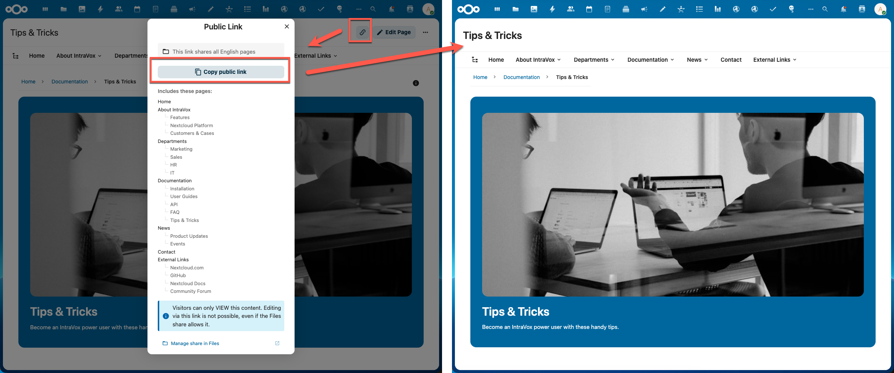
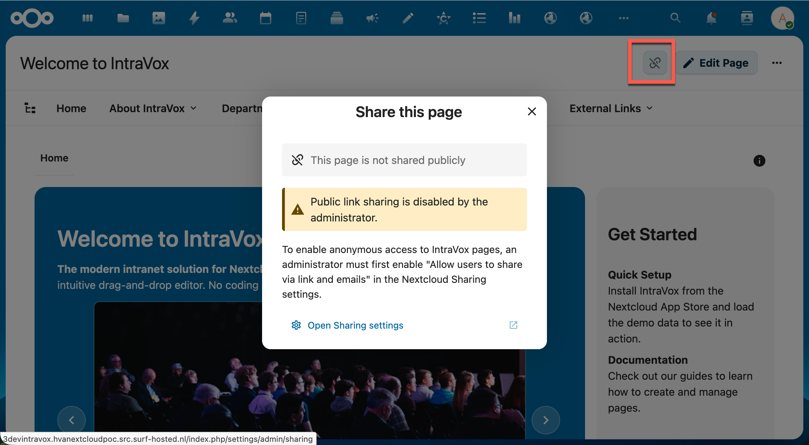
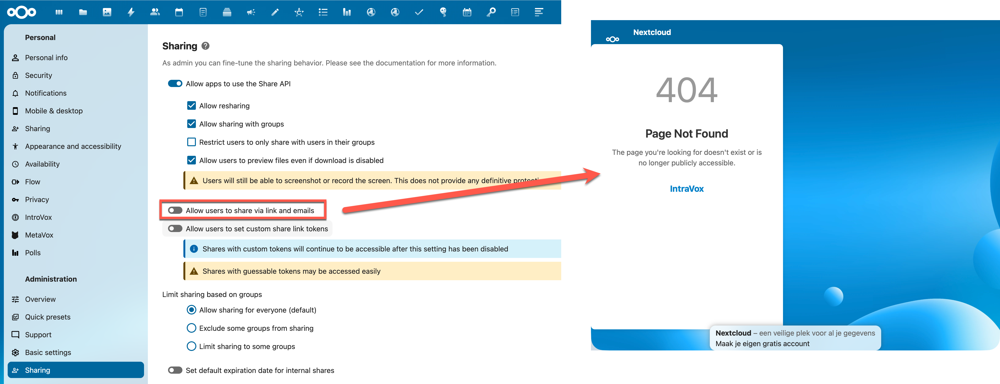
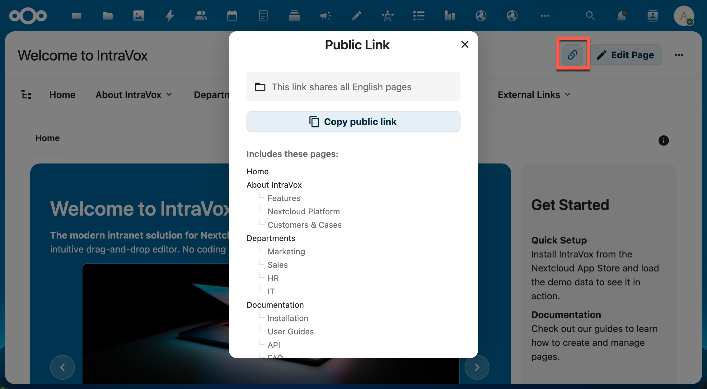
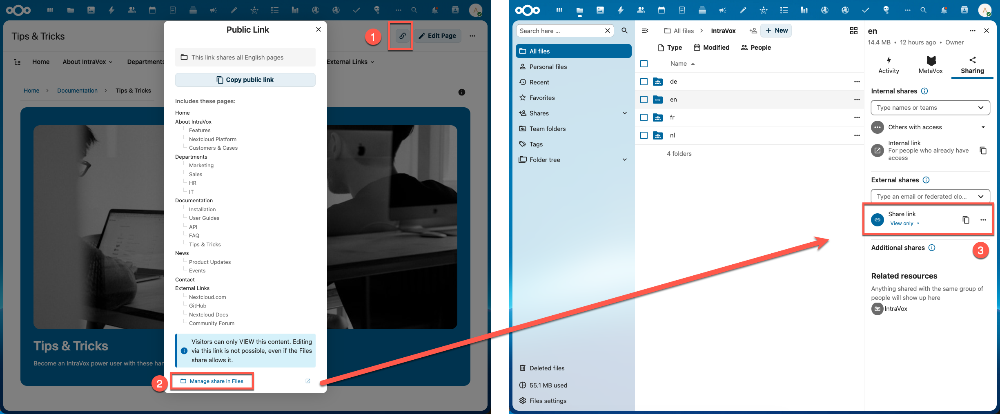
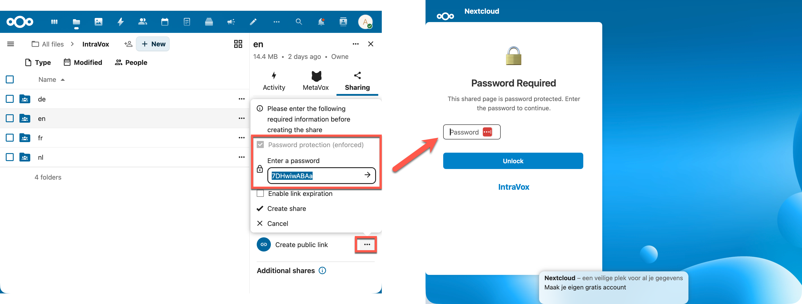
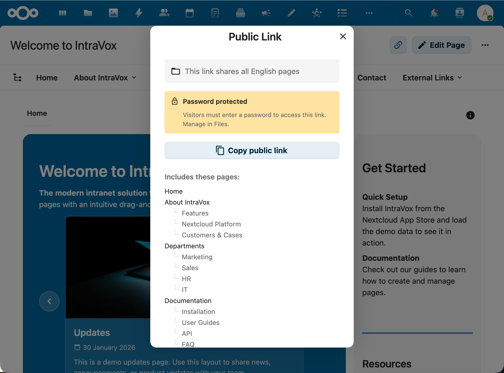
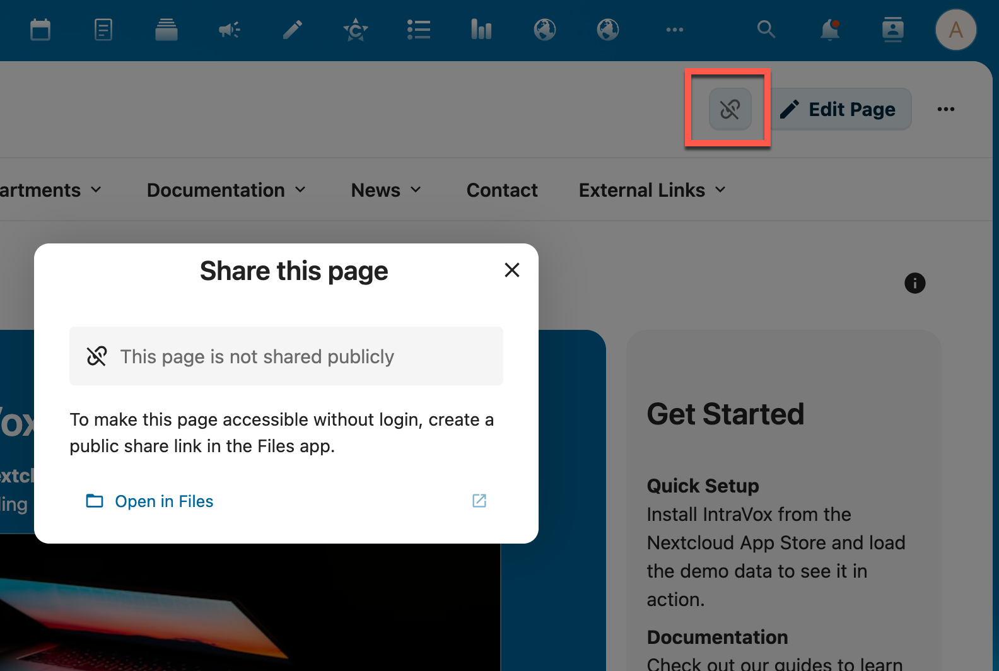

# Publiek delen

IntraVox-pagina's kunnen worden gedeeld met mensen die geen Nextcloud-account hebben. Deze gids legt uit hoe publiek delen werkt, hoe je het opzet en wat anonieme bezoekers kunnen zien.

**Doelgroep**: IntraVox-beheerders en -editors

---

## Overzicht

Publiek delen laat je IntraVox-pagina's toegankelijk maken zonder login. Bezoekers zien een schone, alleen-lezen-weergave van je content — ze kunnen niet bewerken, reageren, of commenten.

IntraVox gebruikt het ingebouwde share-link-systeem van Nextcloud. Je maakt een share-link in de Files-app op de IntraVox-folder, en IntraVox detecteert die automatisch en maakt de content beschikbaar.



*Links: de share-dialoog toont welke pagina's zijn meegenomen. Rechts: de publieke view die bezoekers zien.*

---

## Vereisten

Publiek delen vereist één Nextcloud-instelling:

**Beheer → Delen → "Gebruikers toestaan via link en e-mail te delen"**

Als deze instelling uit staat, toont IntraVox een waarschuwing wanneer je op de share-knop klikt:



*Wanneer link-delen door de beheerder is uitgeschakeld, toont IntraVox een waarschuwing met een link naar de Delen-instellingen.*

Als link-delen uit staat terwijl er al share-links bestaan, werken die links niet meer en zien bezoekers een 404:



*Links: de Nextcloud-admin-instelling. Rechts: bestaande share-links geven 404 wanneer ze uit staan.*

---

## Een share-link maken

Share-links worden gemaakt in de **Nextcloud Files-app**, niet in IntraVox zelf.

### Stap 1: open de IntraVox-folder in Files

Navigeer naar **Files → IntraVox** (je GroupFolder) en zoek de folder of pagina die je wilt delen.

### Stap 2: maak een share-link

1. Klik op het share-icoon op de folder of het bestand
2. Klik **"Share-link"** om een publieke link aan te maken
3. Stel optioneel een wachtwoord, vervaldatum of andere settings in

> **Let op over wachtwoorden**: als je een wachtwoord instelt op de share-link, wordt het slechts één keer getoond bij het aanmaken. Daarna wordt het wachtwoord als bcrypt-hash opgeslagen en kan niet worden teruggehaald. Noteer het wachtwoord vóór je het dialoog sluit. Je kunt altijd een nieuw wachtwoord instellen in de Files-app.

### Stap 3: verifieer in IntraVox

Ga terug naar IntraVox en open een pagina binnen het gedeelde scope. De share-knop rechtsboven verschijnt nu in de thema-kleur, wat aangeeft dat de pagina publiek gedeeld is.



*De share-knop (uitgelicht) toont de thema-kleur wanneer een share-link bestaat. Klik om het Publieke-link-dialoog te zien met "Kopieer publieke link"-knop en een lijst van meegenomen pagina's.*

### De share beheren

Klik **"Share beheren in Files"** onderaan het Publieke-link-dialoog om de Files-app te openen waar je instellingen kunt aanpassen zoals wachtwoord, vervaldatum, of de share helemaal kunt verwijderen.



*Klik "Share beheren in Files" in IntraVox (links) om de share-settings in de Files-app te openen (rechts).*

---

## Share-scope

De scope van een share hangt af van wat je in de Files-app deelt:

| Wat je deelt | Scope | Voorbeeld |
|---|---|---|
| Een enkel pagina-bestand (.json) | Alleen die pagina | Sharing van `over-ons.json` geeft toegang tot alleen de Over-ons-pagina |
| Een submap | Die sectie en alle sub-pagina's | Sharing van `Afdelingen/` geeft toegang tot Afdelingen, Marketing, Sales, HR, IT |
| De taal-root-folder | Alle pagina's in die taal | Sharing van `nl/` geeft toegang tot alles in het Nederlands |

Het Publieke-link-dialoog toont exact welke pagina's zijn meegenomen.

Anonieme bezoekers kunnen alleen tussen pagina's binnen de share-scope navigeren. Ze kunnen geen pagina's buiten die scope bereiken, zelfs niet als ze URLs proberen te raden.

---

## Eigen URL (je eigen domein)

Standaard staat een publieke share onder een lange Nextcloud-URL, bijvoorbeeld:

```
https://nextcloud.example.com/apps/intravox/s/aHxqEjrdf4smg8f
```

Je kunt exact dezelfde pagina serveren onder een korte, eigen URL — zoals `https://intravox.example.com/` — die **in de adresbalk blijft staan** terwijl bezoekers rondklikken. In de schermafbeelding hieronder wordt de IntraVox-documentatie geserveerd onder een eigen `intravox.…`-subdomein in plaats van de Nextcloud-host:


*Dezelfde publieke share, bereikbaar onder een kort eigen domein. De adresbalk toont het eigen domein, niet de lange Nextcloud-URL, en blijft daar staan bij het navigeren naar sub-pagina's.*

Dit werkt omdat de publieke weergave van IntraVox uitsluitend **relatieve URLs** gebruikt — er is geen Nextcloud-hostnaam hardcoded. Daardoor kan de share transparant onder elk (sub)domein worden geserveerd via een reverse proxy. **Er is geen IntraVox-configuratie of code-wijziging nodig** — het is puur een Nextcloud + reverse-proxy-opzet.

> Een reverse proxy (geen redirect) is wat de mooie URL in de adresbalk houdt. Een gewone 301/302-redirect zou de bezoeker doorsturen naar de lange Nextcloud-URL — een reverse proxy serveert de content juist *ónder* de mooie URL.

### Voor editors — kies welke pagina als eerste opent

De share-URL opent altijd de **eerste pagina in de share** (de bovenkant van de pagina-boom van de share). Wil je dat de root van je eigen domein (`https://intravox.example.com/`) één specifieke pagina opent, **deel dan de folder van die pagina** in plaats van iets hogerop in de boom. De pagina waarvan je de folder deelt wordt dan de "home-pagina" van de share, en opent dus standaard zonder extra query.

Dit is dezelfde **share-scope**-regel als hierboven: het delen van `Afdelingen/marketing/` maakt de *Marketing*-pagina het startpunt van die share; het delen van de taal-root maakt de taal-homepagina het startpunt.

### Voor beheerders — de reverse proxy opzetten

Wijs het eigen (sub)domein naar dezelfde Nextcloud-backend en laat de reverse proxy de share op de root serveren. Met **Nginx Proxy Manager** als voorbeeld:

1. **DNS** — maak een A/AAAA-record voor `intravox.example.com` dat naar de server wijst.
2. **Nextcloud trusted domains** — voeg de nieuwe host toe, anders weigert Nextcloud het verzoek als een untrusted domain:
   ```bash
   occ config:system:set trusted_domains 2 --value=intravox.example.com
   ```
   Raak `overwrite.cli.url` / `overwritehost` / `overwriteprotocol` **niet** aan — die horen bij je hoofd-Nextcloud-host; voeg alleen een extra trusted domain toe.
3. **Reverse-proxy-host** — maak een proxy-host voor `intravox.example.com` die doorstuurt naar **dezelfde Nextcloud-backend** (host + poort) als je hoofdsite, met een Let's Encrypt-certificaat en Force SSL.
4. **Share op de root serveren** — laat in de advanced/custom-config van de proxy-host de kale root intern doorproxyen naar de share-URL (een *interne* `proxy_pass`, zodat de adresbalk op je domein blijft):
   ```nginx
   location = / {
       proxy_pass http://<nextcloud-backend>:80/apps/intravox/s/<shareToken>;

       proxy_set_header Host              $host;
       proxy_set_header X-Real-IP         $remote_addr;
       proxy_set_header X-Forwarded-For   $proxy_add_x_forwarded_for;
       proxy_set_header X-Forwarded-Proto $scheme;
   }
   ```
   Elk ander pad (assets, API, media, sub-pagina-navigatie) valt door naar de hoofd-`location /` van de proxy en werkt ongewijzigd, omdat IntraVox relatieve URLs gebruikt. Vervang `<shareToken>` door het token uit je publieke link (het deel na `/s/`).

> **Vereisten:** link-sharing moet aan staan (zie [Vereisten](#vereisten)), de pagina moet **gepubliceerd** zijn (drafts zijn nooit publiek), en de proxy moet alle sub-requests doorlaten — API, media, assets, de sessie-cookie (voor wachtwoord-beschermde shares) en websockets. Een subdomein geeft het schoonste resultaat (eigen cookie-scope, geen path-rewriting).

> **Alternatief — geen root-rewrite:** heb je de kale root niet nodig, sla stap 4 dan over en deel gewoon de volledige share-URL onder de mooie host: `https://intravox.example.com/apps/intravox/s/<shareToken>`. Elk nieuw document is dan simpelweg een nieuwe Nextcloud-share — geen proxy-wijziging en geen nieuw certificaat nodig.

---

## Wachtwoord-beschermde shares

Stel je een wachtwoord in op een share-link in de Files-app, dan respecteert IntraVox dat volledig. Zowel het share-dialoog als de bezoeker-experience reflecteren de wachtwoord-eis.



*Links: een wachtwoord instellen bij het maken van een share-link in de Files-app. Rechts: het wachtwoord-scherm dat bezoekers zien voor toegang tot de content.*

### Indicator in het share-dialoog

Wanneer een share-link een wachtwoord heeft, toont het Publieke-link-dialoog in IntraVox een **"Wachtwoord-beschermd"**-badge tussen de scope-indicator en de kopieer-knop. Zo weten editors dat bezoekers een wachtwoord moeten invoeren.



*De gele **"Wachtwoord-beschermd"**-melding staat direct boven de **Kopieer publieke link**-knop, met een hint om het wachtwoord in Files te beheren.*

Het wachtwoord zelf wordt nooit getoond — het is opgeslagen als bcrypt-hash en niet terug te halen na aanmaken. De badge bevat een hint: *"Bezoekers moeten een wachtwoord invoeren om deze link te openen. Beheer in Files."*

Klik **"Share beheren in Files"** onderaan het dialoog om het wachtwoord te wijzigen of verwijderen.

### Bezoeker-experience

Wanneer een anonieme bezoeker een wachtwoord-beschermde share-link opent, zien ze een wachtwoord-challenge-scherm voor content wordt geladen. Dit scherm wordt server-side gerendered (geen JavaScript vereist) en toont:

- Een slot-icoon
- "Wachtwoord vereist"-kop
- Een wachtwoord-veld met submit-knop
- Een foutmelding bij onjuist wachtwoord

Na het juiste wachtwoord wordt de bezoeker doorgestuurd naar de gedeelde content. Het wachtwoord wordt server-side in de PHP-sessie opgeslagen, dus de bezoeker kan vrij navigeren tussen alle pagina's binnen de share-scope zonder opnieuw het wachtwoord in te voeren.

Bij verlopen sessie (bv. de bezoeker komt later terug) moet het wachtwoord opnieuw worden ingevoerd.

### Beveiliging

- Wachtwoorden worden geverifieerd met Nextcloud's `IHasher` (bcrypt) — het plain-text wachtwoord wordt nooit opgeslagen
- Mislukte wachtwoord-pogingen triggeren brute-force-bescherming (max 10 pogingen per minuut per IP)
- Een willekeurige vertraging (100–300ms) wordt toegevoegd bij mislukte pogingen om timing-attacks te voorkomen
- De sessie-key is scoped per share-token (`intravox_share_pw_{token}`)

---

## Pagina's zonder share-link

Als geen share-link bestaat voor een pagina, verschijnt de share-knop in een gedempte kleur. Klikken opent een dialoog dat uitlegt hoe een share-link te maken:



*Wanneer geen share-link bestaat, toont IntraVox begeleiding met een directe link naar de Files-app.*

---

## Wat anonieme bezoekers zien

Bezoekers die een gedeelde link openen zien een schone, alleen-lezen-pagina:

- Pagina-titel en -content (tekst, afbeeldingen, video's, tabellen, etc.)
- Navigatiebalk met pagina's binnen de share-scope
- Breadcrumb-navigatie
- Het **Paginastructuur**-paneel om pagina's te vinden, met beide tabs: de paginaboom binnen de share-scope, en **Op deze pagina** — de koppen van de pagina die gelezen wordt (*sinds 2.2.0*; zie [Op deze pagina](editor.nl.md#op-deze-pagina))
- Footer-content (indien geconfigureerd)

De volgende features zijn **niet** beschikbaar voor anonieme bezoekers:

- Pagina's bewerken
- Comments en reacties
- Versie-geschiedenis
- Pagina-instellingen
- Pagina's aanmaken of verwijderen
- Toegang tot pagina's buiten de share-scope
- Pagina's die niet gepubliceerd zijn: concepten, pagina's met een toekomstige **Publish on**-datum en pagina's voorbij hun **Expire on**-datum vallen buiten de share — zowel de pagina zelf als het navigatiemenu en de paginaboom (zie [Geplande publicatie](editor.nl.md#geplande-publicatie-publish-on--expire-on))

---

## Beveiliging

- **Read-only-afdwinging**: zelfs als de Nextcloud-share schrijfrechten geeft, hebben anonieme bezoekers in IntraVox altijd alleen-lezen-toegang
- **Wachtwoord-bescherming**: share-link-wachtwoorden worden volledig gerespecteerd — bezoekers moeten authenticeren vóór content wordt geserveerd (zie [Wachtwoord-beschermde shares](#wachtwoord-beschermde-shares))
- **Rate limiting**: publieke endpoints zijn beperkt tot 60 requests per minuut per IP-adres
- **Brute-force-bescherming**: herhaaldelijk mislukte pogingen worden door Nextcloud afgeknepen (zowel ongeldige tokens als verkeerde wachtwoorden)
- **Wachtwoord-brute-force**: wachtwoord-pogingen apart gerate-limit (10 per minuut per IP) met willekeurige vertraging
- **Scope-afdwinging**: elke pagina-request wordt gevalideerd tegen de share-scope — geen toegang buiten de gedeelde folder
- **Sessie-gebaseerde auth**: wachtwoord-verificatie wordt server-side in de PHP-sessie opgeslagen — het wachtwoord wordt nooit naar de browser verstuurd of in API-responses blootgesteld
- **Geen metadata-lek**: interne bestandspaden, auteur-info en permissies worden uit publieke responses gestript

---

## Admin-overzicht

Beheerders zien alle actieve share-links in **IntraVox-beheerinstellingen → Delen**-tab. Dit overzicht toont:

- De scope van elke share (pagina, folder of taal-root)
- Het bestandspad
- Aanmaak- en vervaldata
- Een directe link om elke share in de Files-app te beheren

Handig voor audit van welke content nu toegankelijk is zonder login.

---

## Snelle referentie

| Actie | Waar |
|-------|------|
| Link-delen aan/uit | Beheer → Delen-instellingen |
| Share-link maken | Files-app → IntraVox-folder → Delen |
| Publieke URL kopiëren | IntraVox-pagina → Share-knop → Kopieer publieke link |
| Share onder je eigen domein serveren | Reverse proxy + Nextcloud trusted domain (zie [Eigen URL](#eigen-url-je-eigen-domein)) |
| Share-instellingen beheren | IntraVox-pagina → Share-knop → Beheer in Files |
| Alle actieve shares zien | IntraVox-beheerinstellingen → Delen-tab |
| Wachtwoord instellen/wijzigen | Files-app → Share-settings |
| Vervaldatum instellen | Files-app → Share-settings |
| Check of share wachtwoord heeft | IntraVox-pagina → Share-knop (toont "Wachtwoord-beschermd"-badge) |
